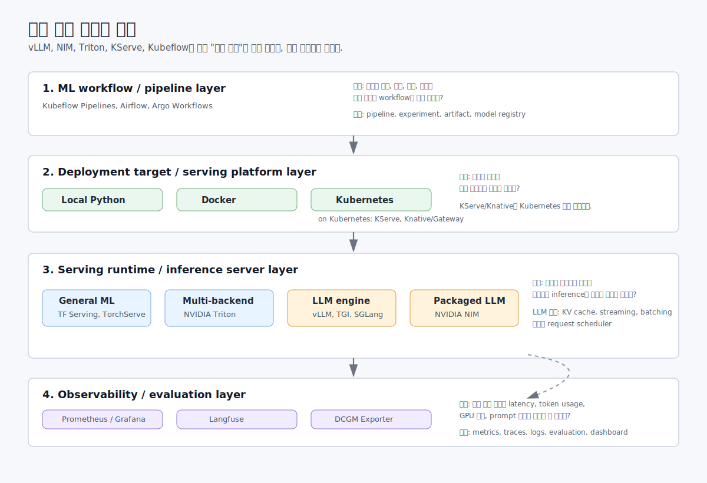
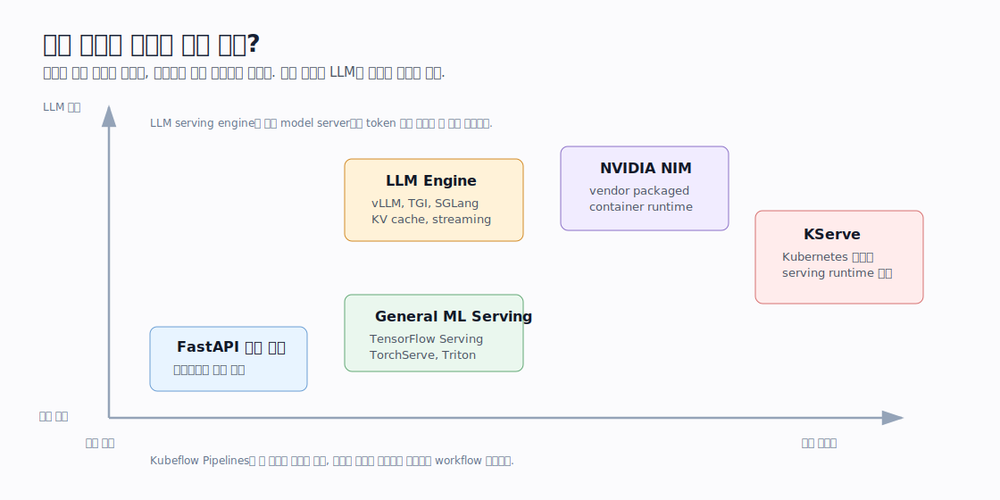

# 1. 모델 서빙 기본 개념

이 단원은 실제 모델을 띄우기 전에 모델 서빙에서 반복해서 등장하는 기본 개념을 정리한다.
아직 모델을 실행하지 않아도 되지만, 이후 실습에서 환경과 결과를 같은 형식으로 기록하기 위한 준비를 함께 한다.

## 학습 목표

- 모델 서버가 하는 일을 설명할 수 있다.
- REST API, gRPC, OpenAI-compatible API의 차이를 구분할 수 있다.
- online inference와 batch inference를 구분할 수 있다.
- latency, throughput, concurrency의 관계를 설명할 수 있다.
- cold start, warmup, model loading time이 왜 중요한지 이해한다.
- TTFT, TTFB, TTFP, TPS, QPS, tokens/sec를 구분한다.
- GPU memory와 KV cache가 LLM serving에서 중요한 이유를 설명할 수 있다.

## 추천 진행 순서

1. [../../GLOSSARY.md](../../GLOSSARY.md)를 읽고 챕터 1 핵심 용어를 확인한다.
2. 아래 "모델 서빙 생태계 지도"를 보고 지금 공부하는 범위를 먼저 잡는다.
3. 아래 핵심 정리를 먼저 읽는다.
4. [scripts/01_collect_env.sh](scripts/01_collect_env.sh)를 실행해서 현재 환경을 기록한다.
5. 확인 질문을 보면서 내가 이해한 내용을 점검한다.
6. 더 깊게 보고 싶은 문서는 [references.md](references.md)에서 확인한다.

## 모델 서빙 생태계 지도

모델 서빙을 공부하다 보면 `vLLM`, `NIM`, `Triton`, `KServe`, `Kubeflow`가 모두 "모델 운영"과 관련 있어 보여서 헷갈릴 수 있다.
하지만 이 도구들은 같은 일을 하는 경쟁 제품이라기보다, 서로 다른 레이어에서 다른 질문에 답하는 경우가 많다.



가장 먼저 아래처럼 나누어 이해한다.

| 레이어 | 대표 도구 | 답하려는 질문 |
| --- | --- | --- |
| ML workflow / pipeline | Kubeflow Pipelines, Airflow, Argo Workflows | 데이터 준비, 학습, 평가, 배포까지의 과정을 어떻게 반복 가능하게 만들 것인가? |
| Deployment target | Local Python process, Docker container, Kubernetes cluster | 모델 서버를 어디에서 실행할 것인가? |
| Serving platform on Kubernetes | KServe, Knative/Gateway, Kubernetes Deployment/Service | Kubernetes 위에서 모델 서버를 어떻게 배포, 확장, 라우팅할 것인가? |
| General ML serving framework | TensorFlow Serving, TorchServe, NVIDIA Triton | 다양한 ML framework의 모델을 API server로 어떻게 띄울 것인가? |
| LLM serving engine | vLLM, TGI, SGLang | LLM의 token 생성, KV cache, batching, streaming을 어떻게 빠르게 처리할 것인가? |
| Packaged/vendor runtime | NVIDIA NIM | vendor가 검증한 container/runtime/API 조합으로 어떻게 빠르게 운영할 것인가? |
| Observability / evaluation | Prometheus, Grafana, Langfuse, DCGM Exporter | 운영 중인 모델의 latency, token usage, GPU 상태, prompt 품질을 어떻게 볼 것인가? |

여기서 중요한 점은 **Kubernetes와 KServe/Knative를 같은 종류로 보면 안 된다**는 것이다.
Kubernetes는 containerized workload를 실행하고 관리하는 기반이고, KServe와 Knative/Gateway는 Kubernetes 위에 설치해서 model serving 배포와 네트워킹을 더 편하게 다루도록 해주는 계층이다.

예를 들어 같은 FastAPI 모델 서버라도 아래처럼 여러 방식으로 올릴 수 있다.

```text
python app/main.py
  -> 로컬 Python process로 직접 실행

docker run model-server
  -> Docker container로 실행

kubectl apply -f deployment.yaml
  -> Kubernetes Deployment/Service로 실행

kubectl apply -f inferenceservice.yaml
  -> Kubernetes 위에서 KServe InferenceService로 실행
```

즉, KServe는 Kubernetes를 대체하는 것이 아니라 Kubernetes 위에서 model serving을 더 높은 수준으로 표현하게 해주는 도구다.
Knative는 KServe가 serverless-style autoscaling, request routing 같은 기능을 사용할 때 함께 등장할 수 있는 Kubernetes 기반 구성요소다.

### 지금 공부 흐름에서의 위치

이 스터디의 앞부분은 **serving runtime**에 집중한다.
챕터 2에서는 FastAPI로 가장 단순한 model server를 직접 만들고, 챕터 3에서는 Docker로 실행 환경을 포장한다.
챕터 4와 5에서는 vLLM으로 LLM serving engine을 다루고, 챕터 6에서는 NVIDIA NIM처럼 vendor가 패키징한 runtime을 본다.

Kubeflow는 조금 더 위쪽 레이어다.
Kubeflow Pipelines는 모델을 직접 serving하는 엔진이라기보다, 데이터 처리, 학습, 평가, 배포 같은 ML workflow를 연결하는 도구다.
그래서 모델 서빙을 먼저 공부한 뒤 Kubeflow로 넘어가면, pipeline의 마지막 단계인 "배포"가 실제로 어떤 runtime이나 platform으로 이어지는지 더 잘 보인다.

공식 Kubeflow 문서의 lifecycle 그림도 이 관점에서 보면 좋다.
아래 그림은 Kubeflow가 모델 개발부터 serving까지 이어지는 더 큰 흐름을 어떻게 보는지 보여준다.


출처: [Kubeflow Architecture 공식 문서](https://www.kubeflow.org/docs/started/architecture/)

### 비슷해 보이는 용어 정리



| 용어 | 쉬운 의미 | 예시 |
| --- | --- | --- |
| Model server | 모델을 메모리에 올리고 API 요청에 응답하는 서버 | 직접 만든 FastAPI app, vLLM server |
| Inference server | model server와 거의 비슷하게 쓰이며, inference 실행에 초점을 둔 말 | Triton, TensorFlow Serving |
| ML serving framework | 여러 종류의 ML 모델을 서빙하기 위한 범용 framework | TensorFlow Serving, TorchServe, Triton |
| LLM serving engine | LLM token generation에 특화된 inference engine | vLLM, TGI, SGLang |
| Packaged runtime | vendor가 runtime, container, API, 최적화 설정을 묶어 제공하는 형태 | NVIDIA NIM |
| Deployment target | 모델 서버를 실행하는 위치나 방식 | Local Python, Docker, Kubernetes |
| Serving platform | runtime을 Kubernetes 위에서 배포하고 운영하는 추상화 | KServe |
| ML pipeline | 데이터 준비부터 학습, 평가, 배포까지의 workflow | Kubeflow Pipelines |

정리하면, vLLM과 NIM은 "모델을 실제로 어떻게 빠르게 실행할 것인가"에 가깝고, Kubeflow는 "모델을 만들고 배포하기까지의 전체 과정을 어떻게 자동화할 것인가"에 가깝다.
KServe는 그 중간에서 Kubernetes 위에 model server를 배포하는 platform 역할을 한다.

## 핵심 개념 요약

### Model Server

모델 서버는 모델을 메모리에 올려두고, 외부 요청을 받아 inference 결과를 반환하는 서비스다.
일반적인 API 서버와 비슷하지만, 모델 로딩 시간, GPU memory, batch 처리, token streaming, request scheduling 같은 문제가 추가된다.

### API 형태

- REST API: HTTP와 JSON을 이용하는 가장 익숙한 형태다.
- gRPC: 다른 서버의 함수를 호출하듯 통신하는 RPC 방식이다. 데이터를 주고받는 형식은 protobuf로 정의하고, HTTP/2 위에서 동작한다.
- OpenAI-compatible API: `/v1/chat/completions` 같은 OpenAI API 형태를 맞춘 인터페이스다. vLLM, NIM 등 여러 서버가 이 방식을 지원한다.

### Online Inference vs Batch Inference

- Online inference: 사용자의 요청에 즉시 응답해야 한다. latency가 중요하다.
- Batch inference: 많은 데이터를 모아서 한꺼번에 처리한다. throughput과 비용 효율이 중요하다.

### Latency, Throughput, Concurrency

- Latency: 한 요청이 완료되기까지 걸린 시간.
- Throughput: 단위 시간당 처리량. LLM에서는 requests/sec와 tokens/sec를 함께 본다.
- Concurrency: 동시에 처리 중인 요청 수.

Concurrency를 높이면 throughput은 좋아질 수 있지만, queueing이 생겨 latency가 증가할 수 있다.

### Cold Start, Model Loading, Warmup

모델 서버에서 "서버가 켜졌다"와 "빠르게 요청을 처리할 준비가 됐다"는 다르다.
이 차이를 이해할 때 cold start, model loading, warmup을 구분하면 좋다.

| 용어 | 쉬운 의미 | 언제 보이나 |
| --- | --- | --- |
| Model loading time | 모델 weight, tokenizer, config를 읽어 CPU/GPU memory에 올리는 시간 | server 시작 시점 |
| Cold start | 준비가 덜 된 상태에서 첫 요청이 들어와 초기화 비용까지 함께 치르는 상황 | 첫 요청 또는 scale-out 직후 |
| Warmup | 실제 traffic 전에 일부러 가벼운 요청을 보내 초기화 비용을 미리 치르는 과정 | benchmark 전, production traffic 연결 전 |

예를 들어 vLLM container나 FastAPI model server를 처음 띄우면 다음 일이 순서대로 일어날 수 있다.

```text
container/process 시작
→ Python package import
→ model config/tokenizer 읽기
→ model weight 다운로드 또는 local cache 확인
→ model weight를 CPU/GPU memory에 로딩
→ CUDA context, kernel, memory allocator 준비
→ 첫 inference에서 내부 buffer/cache 일부 생성
→ 이후 요청부터 더 안정적인 latency로 처리
```

Cold start가 문제인 이유는 첫 사용자가 이 비용을 그대로 기다릴 수 있기 때문이다.
모델이 크거나 GPU 초기화가 필요한 경우 첫 요청 latency가 평소보다 훨씬 길어질 수 있다.

Warmup은 이 비용을 사용자 traffic 전에 미리 지불하는 방법이다.
보통 `/health`로 server가 살아 있는지 확인한 뒤, 짧은 `/generate` 또는 `/v1/chat/completions` 요청을 한두 번 보내서 실제 inference 경로까지 지나가게 한다.
benchmark를 할 때도 warmup을 먼저 하는 이유는 "첫 요청 초기화 비용"과 "평소 처리 성능"을 섞어서 해석하지 않기 위해서다.

이 과정이 전부 KV cache 때문인 것은 아니다.
KV cache는 LLM이 prompt를 처리하고 token을 생성하는 동안 만들어지는 runtime memory다.
따라서 긴 prompt, 긴 output, 높은 concurrency에서는 KV cache가 GPU memory와 latency에 큰 영향을 준다.
하지만 cold start와 warmup에는 KV cache 외에도 model loading, tokenizer loading, CUDA 초기화, kernel 준비, memory allocation, container startup 같은 비용이 함께 들어간다.

### LLM Serving Metrics

- TTFB: Time To First Byte. HTTP 응답의 첫 byte가 도착하기까지 걸린 시간.
- TTFT: Time To First Token. LLM이 첫 token을 생성해서 받을 때까지 걸린 시간.
- TTFP: Time To First Prediction. 문맥에 따라 첫 예측 또는 첫 유의미한 출력까지의 시간으로 쓰인다. 조직/도구마다 정의가 다를 수 있어 사용 전 정의를 맞춰야 한다.
- TPS: Tokens Per Second. 초당 생성 token 수.
- QPS: Queries Per Second. 초당 요청 수.

주의: TTFP는 업계 표준 정의가 완전히 고정된 용어라기보다, 도구와 팀에 따라 의미가 달라질 수 있다. 이 스터디에서는 LLM streaming에서는 TTFT를 우선 사용하고, TTFP를 쓸 때는 문서에 정의를 함께 적는다.

### GPU Memory와 KV Cache

LLM은 autoregressive generation, 즉 자기회귀 생성 과정에서 이전 token의 key/value tensor를 KV cache로 저장한다.
자기회귀 생성은 이전에 생성한 token을 다시 문맥으로 사용하면서 다음 token을 하나씩 이어서 만드는 방식이다.
요청 수, prompt 길이, output 길이가 늘어나면 KV cache가 커지고 GPU memory를 많이 사용한다.
그래서 LLM serving에서는 단순히 모델 weight 크기만 보는 것이 아니라, 동시에 처리할 요청의 KV cache까지 고려해야 한다.

## 이 단원에서 반드시 가져갈 정리

### 1. 모델 서버가 하는 역할

모델 서버는 단순히 `model(input)`을 실행하는 코드가 아니다. 운영 관점에서는 다음 일을 함께 한다.

- 모델과 tokenizer를 로딩하고 메모리 또는 GPU에 올린다.
- HTTP/gRPC 요청을 받아 입력을 검증한다.
- 입력을 model input 형태로 전처리한다.
- inference를 실행한다.
- 결과를 사람이 쓰기 좋은 response schema로 후처리한다.
- health check, logging, metrics, error handling을 제공한다.

관련 레퍼런스:

- KServe는 `InferenceService`가 autoscaling, networking, health checking, server configuration 복잡도를 감싼다고 설명한다. 자세한 배포 추상화는 [references.md](references.md)의 KServe 항목을 본다.
- Hugging Face Transformers pipeline 문서는 모델 호출을 task 단위 pipeline으로 감싸는 방식을 보여준다. 로컬 서빙의 전처리/후처리 감각을 잡을 때 본다.

### 2. REST, gRPC, OpenAI-compatible API 차이

REST API는 HTTP와 JSON을 쓰기 때문에 사람이 읽고 테스트하기 쉽다. `curl`로 바로 확인하기 좋아 첫 실습에 적합하다.

gRPC는 다른 서버의 함수를 호출하듯 통신하는 RPC 방식이다. protobuf로 요청/응답 schema를 명확히 정의하고 HTTP/2 위에서 동작해서 내부 service 간 통신에 강하다. 다만 처음 디버깅할 때는 REST보다 준비물이 많다.

OpenAI-compatible API는 OpenAI API와 비슷한 request/response 형태를 맞춘 것이다. vLLM, NIM, KServe LLM serving처럼 여러 서버가 이 방식을 제공하면 client 코드를 크게 바꾸지 않고 backend만 교체할 수 있다.

관련 레퍼런스:

- vLLM OpenAI-compatible server 문서는 나중에 `/v1/chat/completions` 호출 구조와 server 옵션을 확인할 때 본다.
- KServe는 LLM serving에서 OpenAI protocol 지원을 언급하므로, Kubernetes 위에서 같은 API 형태를 유지하는 이유를 볼 때 참고한다.

### 3. Online Inference와 Batch Inference

Online inference는 사용자가 기다리고 있는 요청에 바로 응답하는 방식이다. chatbot, search reranking, 실시간 추천처럼 p95/p99 latency가 중요하다.

Batch inference는 대량 데이터를 모아서 한꺼번에 처리하는 방식이다. nightly job, offline embedding 생성, 대량 문서 분류처럼 throughput과 비용 효율이 중요하다.

정리하면, online은 "얼마나 빨리 응답하나"가 우선이고 batch는 "얼마나 많이 싸게 처리하나"가 우선이다.

### 4. Latency, Throughput, Concurrency 관계

Latency는 한 요청이 끝날 때까지 걸린 시간이다. Throughput은 단위 시간당 처리량이다. Concurrency는 동시에 들어와 있는 요청 수다.

Concurrency를 높이면 GPU를 더 바쁘게 만들어 throughput이 증가할 수 있다. 하지만 처리 한계를 넘으면 queueing이 생기고 latency, 특히 p95/p99 latency가 나빠진다.

예시:

```text
concurrency 1:  latency 낮음, throughput 낮음
concurrency 16: latency 조금 증가, throughput 증가
concurrency 128: queueing 증가, p95/p99 latency 급증 가능
```

그래서 모델 성능 테스트는 평균 latency 하나만 보면 안 되고, concurrency별 throughput과 percentile latency를 같이 봐야 한다.

### 5. TTFT, TTFB, TTFP, TPS, QPS, tokens/sec

TTFB는 HTTP 관점의 첫 byte 도착 시간이다. API gateway, network, server response 시작 시간을 포함한다.

TTFT는 LLM streaming 관점의 첫 token 도착 시간이다. 사용자가 "응답이 시작됐다"고 느끼는 시간에 가깝다.

TTFP는 Time To First Prediction으로 쓰이지만 도구마다 의미가 다를 수 있다. 이 스터디에서는 TTFP를 사용할 때 반드시 "첫 예측"이 무엇인지 정의한다.

TPS 또는 tokens/sec는 초당 token 처리량이다. **LLM에서는 requests/sec보다 tokens/sec가 더 중요한 경우가 많다. 요청 하나가 10 token을 생성하는 경우와 1000 token을 생성하는 경우는 같은 1 request라도 부하가 완전히 다르기 때문이다.**

QPS는 초당 요청 수다. 짧고 균일한 요청이 많을 때 유용하지만, LLM에서는 prompt length와 output length를 함께 봐야 한다.

관련 레퍼런스:

- vLLM benchmarking 문서는 serving benchmark와 latency/throughput 측정 흐름을 볼 때 중요하다.
- vLLM production metrics 문서는 실제 운영에서 어떤 metric을 노출하는지 확인할 때 본다.

### 6. GPU Memory와 KV Cache 관계

LLM serving에서 GPU memory는 모델 weight만으로 결정되지 않는다. 동시에 처리하는 요청의 prompt와 생성 중인 token이 늘어날수록 KV cache가 커진다.

KV cache는 Transformer decoder가 이미 계산한 key/value tensor를 저장해 다음 token 생성 때 재계산을 줄이는 메모리 영역이다. 이 cache 덕분에 생성은 빨라지지만, 긴 context와 많은 동시 요청에서는 GPU memory를 빠르게 소비한다.

PagedAttention 논문은 vLLM이 KV cache memory를 더 효율적으로 관리하려는 배경을 설명한다. vLLM을 공부할 때 반드시 다시 보게 될 핵심 배경이다.

## 실습

이번 단원은 모델 실행 대신 기록 체계를 준비한다.

```bash
cd ~/study/model-serving/chapters/01-basic-concepts
bash scripts/01_collect_env.sh
```

결과는 `env-summary.txt`에 저장된다.

기록할 내용:

- OS
- Python version
- Docker version
- GPU 종류
- NVIDIA driver version
- CUDA version

## 확인 질문

아래 질문은 외워서 맞히는 용도가 아니라, 챕터 1의 핵심 정리를 내 말로 다시 설명하기 위한 것이다.

| 질문 | 정리 방향 |
| --- | --- |
| 모델 서버와 일반 API 서버의 차이는 무엇인가? | 모델 서버는 API 처리 외에도 모델 로딩, GPU memory, inference scheduling, token streaming, metrics를 다룬다. |
| vLLM과 TensorFlow Serving은 같은 종류의 도구인가? | 둘 다 모델 서빙에 쓰일 수 있지만, vLLM은 LLM token generation에 특화된 serving engine이고 TensorFlow Serving은 TensorFlow 모델 중심의 범용 serving framework다. |
| Kubeflow Pipelines는 vLLM이나 NIM과 같은 레이어인가? | 아니다. Kubeflow Pipelines는 ML workflow를 자동화하는 pipeline 계층이고, vLLM/NIM은 모델 요청을 실제로 처리하는 serving runtime 계층이다. |
| KServe는 어디에 위치하는가? | Kubernetes 위에서 model server/runtime을 배포하고 라우팅, autoscaling 같은 운영 기능을 제공하는 serving platform에 가깝다. |
| REST API와 gRPC의 차이는 무엇인가? | REST는 HTTP/JSON 중심이라 테스트가 쉽고, gRPC는 RPC/protobuf/HTTP2 기반이라 내부 고성능 통신에 적합하다. RPC는 다른 서버의 함수를 호출하듯 통신하는 방식이다. |
| OpenAI-compatible API가 있으면 왜 편한가? | client 코드를 크게 바꾸지 않고 vLLM, NIM, KServe 같은 backend를 교체할 수 있다. |
| chatbot에는 online inference와 batch inference 중 무엇이 맞는가? | 사용자가 기다리는 대화형 서비스이므로 online inference가 맞다. latency, 특히 TTFT와 p95/p99가 중요하다. |
| latency와 throughput은 왜 항상 같이 좋아지지 않는가? | 동시 요청을 늘리면 GPU 활용률과 throughput은 오를 수 있지만 queueing 때문에 latency가 증가할 수 있다. |
| concurrency를 높이면 왜 p95 latency가 나빠질 수 있는가? | 일부 요청이 대기열에서 오래 기다리기 때문이다. 평균보다 tail latency가 먼저 나빠지는 경우가 많다. |
| cold start는 왜 문제인가? | 첫 요청에서 모델 로딩, CUDA 초기화, cache 준비가 발생하면 사용자는 긴 지연을 경험한다. |
| TTFT와 TTFB의 차이는 무엇인가? | TTFB는 HTTP 첫 byte 기준이고, TTFT는 LLM이 첫 token을 생성해 전달한 시점 기준이다. |
| requests/sec와 tokens/sec를 왜 함께 봐야 하는가? | 요청 수가 같아도 prompt/output token 길이에 따라 실제 연산량이 크게 달라지기 때문이다. |
| prompt가 길어지면 KV cache와 GPU memory는 어떻게 되는가? | 저장해야 할 key/value tensor가 늘어나므로 KV cache와 GPU memory 사용량이 증가한다. |

## 다음 챕터에서 이어질 내용

다음 챕터에서는 여기서 배운 모델 서버 개념을 바탕으로, FastAPI로 아주 작은 모델 서버를 직접 만든다.
그때 `/health`, `/generate`, `/metrics` 같은 endpoint가 실제로 왜 필요한지 확인한다.

## 실습 기록

- 실행한 명령어: `bash scripts/01_collect_env.sh`
- 생성된 환경 기록: [env-summary.txt](env-summary.txt)
- 기준 학습 기록: [templates/lab-notes.md](templates/lab-notes.md)

## 실습 마무리

챕터 1은 실행 중인 server나 `.venv`가 없다.
아래 항목만 확인하고 다음 챕터로 넘어간다.

```bash
cat env-summary.txt
```

확인할 것:

- OS와 Python version을 확인했는가?
- Docker, kubectl, nvidia-smi가 현재 환경에서 보이는지 확인했는가?
- [templates/lab-notes.md](templates/lab-notes.md)의 기준 정리를 읽었는가?
- 다음 챕터에서 사용할 실행 환경이 host Python `.venv`인지, Docker/container인지 구분했는가?
