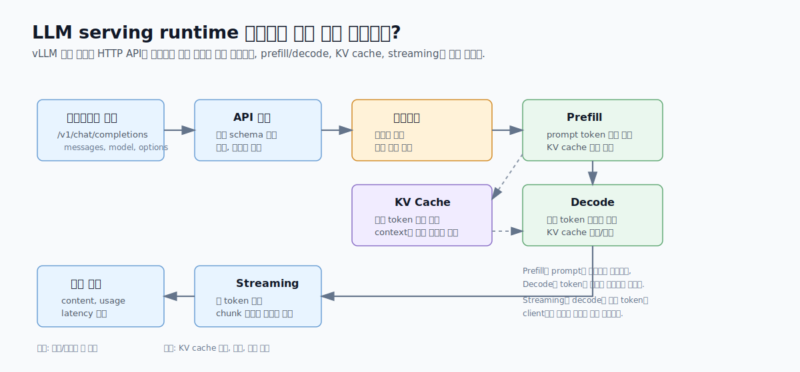

# 4. vLLM 입문

이 단원에서는 직접 FastAPI app을 짜서 모델을 서빙하는 방식에서 한 단계 넘어가, LLM serving에 특화된 vLLM server를 실행한다.  
핵심은 "모델 서버를 직접 구현하는 것"과 "vLLM 같은 serving engine을 사용하는 것"의 차이를 이해하는 것이다.

vLLM은 업데이트가 빠른 프로젝트다.  
이 문서는 2026년 6월 기준 공식 stable 문서를 바탕으로 작성했다.  
설치 방법, Docker image tag, 지원 model, 옵션 이름은 바뀔 수 있으므로 핵심 공식 문서는 본문에 바로 연결해 두고, 전체 목록은 [references.md](references.md)에 모아 둔다.

## 학습 목표

- vLLM이 해결하려는 문제를 이해한다.  
- PagedAttention, KV cache 관리, continuous batching을 쉬운 말로 설명할 수 있다.  
- vLLM Online Serving의 endpoint 구조를 이해한다.  
- `--model`, `--served-model-name`, `--gpu-memory-utilization`, `--max-model-len` 옵션의 의미를 안다.
- Docker로 vLLM server를 실행하고, `curl`과 OpenAI SDK client로 호출한다.
- streaming 응답에서 첫 token과 이후 token이 어떻게 도착하는지 관찰한다.

## 추천 진행 순서

1. [../../GLOSSARY.md](../../GLOSSARY.md)에서 챕터 4 용어를 확인한다.
2. 아래 핵심 개념 요약을 읽는다.
3. [공식 문서 바로가기](#공식-문서-바로가기)에서 vLLM Docker, OpenAI-compatible API, model 확인 위치를 본다.
4. [scripts/01_check_env.sh](scripts/01_check_env.sh)로 Docker/GPU/client 환경을 확인한다.
5. [scripts/02_run_vllm_docker.sh](scripts/02_run_vllm_docker.sh)로 vLLM server를 실행한다.
6. [scripts/03_list_models.sh](scripts/03_list_models.sh)로 OpenAI-compatible server가 뜬 것을 확인한다.
7. [scripts/04_curl_chat.sh](scripts/04_curl_chat.sh)로 non-streaming chat completions를 호출한다.
8. [scripts/05_curl_chat_stream.sh](scripts/05_curl_chat_stream.sh)로 streaming 응답을 확인한다.
9. client `.venv`를 만든 뒤 [client/06_openai_client.py](client/06_openai_client.py)를 실행한다.
10. [scripts/07_collect_runtime_info.sh](scripts/07_collect_runtime_info.sh)로 server 상태를 기록한다.
11. [scripts/08_stop_server.sh](scripts/08_stop_server.sh)로 container를 종료한다.
12. 결과를 [templates/lab-notes.md](templates/lab-notes.md)와 비교한다.

## 공식 문서 바로가기

| 문서 | 바로 볼 부분 |
| --- | --- |
| [vLLM stable docs](https://docs.vllm.ai/en/stable/) | 현재 stable 문서와 latest 문서 차이 |
| [vLLM Docker deployment](https://docs.vllm.ai/en/stable/deployment/docker/) | `vllm/vllm-openai`, `--gpus all`, cache mount, `--ipc=host` |
| [vLLM Online Serving](https://docs.vllm.ai/en/stable/serving/online_serving/) | `/v1/models`, `/v1/chat/completions`, OpenAI SDK 연결 |
| [vLLM engine arguments](https://docs.vllm.ai/en/stable/configuration/engine_args/) | `--model`, `--served-model-name`, `--gpu-memory-utilization`, `--max-model-len` |
| [vLLM supported models](https://docs.vllm.ai/en/stable/models/supported_models/) | 사용하려는 Hugging Face model architecture 지원 여부 |
| [Hugging Face Models](https://huggingface.co/models) | model repository id, model card, license, gated/private 여부 |

## 실행 환경 기준

vLLM server는 Docker container 안에서 실행한다.
따라서 server 실행에는 host `.venv`가 필요 없다.

다만 OpenAI SDK client 실습은 Python client code를 host에서 실행하므로, 이 챕터 안에 별도 `.venv`를 만든다.

```bash
cd ~/study/model-serving/chapters/04-vllm-intro
python3 -m venv .venv
source .venv/bin/activate
pip install -r requirements.txt
```

client 실습이 끝나면:

```bash
deactivate
```

## 챕터 2, 3과의 차이

챕터 2에서는 FastAPI app 안에서 직접 Transformers pipeline을 로딩했다.
즉, 우리가 `/health`, `/generate`, `/metrics` endpoint를 만들고, request/response schema도 직접 정의했다.

챕터 3에서는 그 FastAPI app을 Docker image로 감쌌다.
실행 환경은 좋아졌지만, 모델 serving logic 자체는 여전히 우리가 만든 app 안에 있었다.

챕터 4에서는 vLLM이 모델 서버 역할을 맡는다.
우리는 FastAPI app을 직접 작성하지 않고, vLLM이 제공하는 OpenAI-compatible server를 실행한다.
client는 OpenAI API와 비슷한 `/v1/chat/completions` endpoint를 호출한다.

| 구분 | 챕터 2/3 | 챕터 4 |
| --- | --- | --- |
| 서버 구현 | 직접 FastAPI app 작성 | vLLM server 사용 |
| 모델 호출 | Transformers pipeline | vLLM engine |
| API 형태 | `/generate` 직접 설계 | `/v1/chat/completions` |
| batching | 직접 구현하지 않음 | vLLM scheduler가 처리 |
| KV cache 관리 | Transformers 내부 동작에 맡김 | vLLM이 serving 최적화 관점에서 관리 |
| 주요 목적 | 모델 서버 구조 이해 | LLM serving engine 사용법 이해 |

아래 그림처럼 vLLM은 단순한 HTTP wrapper가 아니라, LLM 요청을 scheduling하고 GPU에서 prefill/decode를 수행하며 KV cache를 관리하는 runtime에 가깝다.



## 모델 이름은 어디서 가져오는가

이 챕터에서 쓰는 `Qwen/Qwen3-0.6B`는 사람이 임의로 지은 별명이 아니라 Hugging Face Hub의 model repository id다.  
Hugging Face model page 주소를 보면 repository id를 알 수 있다.

```text
https://huggingface.co/Qwen/Qwen3-0.6B
                      └─┬─┘└────┬────┘
                 organization  model name
```

따라서 vLLM에서 `--model Qwen/Qwen3-0.6B`라고 쓰면, vLLM은 Hugging Face Hub의 `Qwen/Qwen3-0.6B` repository에서 model config, tokenizer, weight files를 가져오려고 한다.

주의: `gwen3`가 아니라 `Qwen3`다.
대소문자와 spelling이 틀리면 Hugging Face repository를 찾지 못하거나 다른 모델을 가리킬 수 있다.

모델 이름을 찾는 기본 순서:

1. [Hugging Face Models](https://huggingface.co/models)에서 사용하려는 모델을 검색한다.
2. model page의 상단 이름을 확인한다. 예: [Qwen/Qwen3-0.6B](https://huggingface.co/Qwen/Qwen3-0.6B)
3. model card에서 license, usage, hardware requirement, gated/private 여부를 확인한다. model card가 무엇인지 헷갈리면 [Hugging Face Model Cards 문서](https://huggingface.co/docs/hub/en/model-cards)를 같이 본다.
4. [vLLM supported models 문서](https://docs.vllm.ai/en/stable/models/supported_models/)에서 해당 architecture가 지원되는지 확인한다. vLLM이 model repo의 정보를 어떻게 해석하는지는 [vLLM model resolution 문서](https://docs.vllm.ai/en/stable/configuration/model_resolution/)에서 확인한다.
5. GPU memory에 들어갈 크기인지 확인한다. model page의 parameter 수와 권장 환경을 보고, vLLM 쪽에서는 [engine arguments 문서](https://docs.vllm.ai/en/stable/configuration/engine_args/)의 `--gpu-memory-utilization`, `--max-model-len` 설명을 함께 본다.
6. 필요하면 작은 모델부터 실행해 본다. 이 챕터는 작은 모델인 [Qwen/Qwen3-0.6B](https://huggingface.co/Qwen/Qwen3-0.6B)부터 시작한다.

다른 모델도 같은 방식으로 바꿀 수 있지만, 아무 모델이나 항상 되는 것은 아니다.
아래 조건을 확인해야 한다.

| 확인할 것 | 이유 |
| --- | --- |
| Hugging Face repository가 존재하는가 | `--model` 값은 보통 Hugging Face repo id 또는 local path다. |
| vLLM이 model architecture를 지원하는가 | vLLM은 model repo의 `config.json`에 있는 `architectures` 값을 보고 지원 구현과 매칭한다. |
| GPU memory에 들어가는가 | parameter 수, dtype, quantization, `max-model-len`, KV cache 크기에 따라 OOM이 날 수 있다. |
| license와 사용 조건이 맞는가 | 공개 모델이어도 상업적 사용 제한이나 별도 license가 있을 수 있다. |
| gated/private model인가 | token이 필요하면 `HF_TOKEN`을 container에 전달해야 한다. |
| chat template이 있는가 | `/v1/chat/completions`에서 messages를 prompt로 바꾸려면 tokenizer/chat template 지원이 중요하다. |

예를 들어 모델을 바꾸고 싶으면 아래처럼 실행할 수 있다.

```bash
MODEL_NAME=Qwen/Qwen3-1.7B \
SERVED_MODEL_NAME=qwen3-1.7b \
bash scripts/02_run_vllm_docker.sh
```

여기서 `MODEL_NAME`은 실제로 로딩할 Hugging Face model이고, `SERVED_MODEL_NAME`은 client가 API 요청에 넣을 이름이다.

```json
{
  "model": "qwen3-1.7b",
  "messages": [...]
}
```

## vLLM container가 Hugging Face model을 받는 흐름

[scripts/02_run_vllm_docker.sh](scripts/02_run_vllm_docker.sh)는 vLLM server가 들어 있는 Docker image를 실행한다.
중요한 점은 Docker image 안에 `Qwen/Qwen3-0.6B` weight를 미리 넣어둔 것이 아니라는 점이다.

실행 흐름은 이렇게 이해하면 된다.

```text
docker run vllm/vllm-openai:latest --model Qwen/Qwen3-0.6B
        │
        ├─ vLLM container 시작
        ├─ vLLM server process 실행
        ├─ --model 값을 보고 Hugging Face Hub repo id로 해석
        ├─ model config/tokenizer/weight 파일을 다운로드 또는 cache에서 로딩
        ├─ model을 CPU/GPU memory에 올림
        └─ OpenAI-compatible API server 시작
```

이 챕터의 Docker 실행에는 아래 mount가 들어 있다.

```bash
-v "${HOME}/.cache/huggingface:/root/.cache/huggingface"
```

이 뜻은 host의 Hugging Face cache directory를 container 안의 Hugging Face cache directory와 연결한다는 의미다.
처음 실행할 때는 model files를 다운로드하지만, 다음 실행에서는 같은 cache를 재사용할 수 있다.

public model이면 보통 token 없이 다운로드된다.
하지만 private model이나 gated model이면 Hugging Face token이 필요하다.

```bash
export HF_TOKEN=hf_xxx
bash scripts/02_run_vllm_docker.sh
```

script는 `HF_TOKEN`이 설정되어 있으면 container 안으로 전달한다.
token은 script 파일에 직접 저장하지 않는다.

## 핵심 개념 요약

### vLLM

vLLM은 LLM inference와 serving을 위한 engine이다.
LLM serving에서 중요한 GPU memory, KV cache, batching, OpenAI-compatible API 같은 부분을 직접 구현하지 않고 사용할 수 있게 해준다.

### PagedAttention

LLM은 다음 token을 생성할 때 이전 token들의 attention 정보를 재사용하기 위해 KV cache를 저장한다.
요청마다 prompt 길이와 output 길이가 다르기 때문에 KV cache memory는 계속 커지고 줄어든다.

PagedAttention은 KV cache를 고정 크기 block처럼 나누어 관리하는 방식이다.
운영체제의 virtual memory paging과 비슷한 아이디어로 이해하면 된다.
연속된 큰 memory 덩어리를 미리 잡아두는 대신, 필요한 block을 할당하고 mapping해서 GPU memory 낭비를 줄이는 것이 목표다.

### Continuous Batching

일반 batch는 여러 요청을 한 번에 모아서 처리한다.
하지만 LLM 생성은 요청마다 output token 길이가 달라서 어떤 요청은 빨리 끝나고 어떤 요청은 오래 걸린다.

continuous batching은 실행 중인 batch에 새 요청을 계속 합류시키는 방식이다.
GPU가 쉬는 시간을 줄이고 throughput을 높이는 데 도움이 된다.

### OpenAI-compatible Server

vLLM은 OpenAI API와 비슷한 endpoint를 제공할 수 있다.
이 실습에서는 아래 endpoint를 사용한다.

| Endpoint | 용도 |
| --- | --- |
| `/v1/models` | server가 노출하는 model 이름 확인 |
| `/v1/chat/completions` | chat 형식으로 text generation 요청 |

client 입장에서는 OpenAI SDK의 `base_url`만 vLLM server로 바꾸면 비슷한 방식으로 호출할 수 있다.

### Chat Messages

`/v1/chat/completions`는 단순히 문자열 하나를 보내는 API가 아니다.
대화 기록을 `messages`라는 배열로 보내고, 각 메시지는 `role`과 `content`로 구성된다.

```json
{
  "messages": [
    {
      "role": "system",
      "content": "You are a concise model serving tutor."
    },
    {
      "role": "user",
      "content": "Explain vLLM in one short Korean paragraph."
    }
  ]
}
```

각 field의 의미:

| Field | 의미 |
| --- | --- |
| `messages` | 지금까지의 대화 입력 목록 |
| `role` | 이 메시지를 누가 말했는지 나타내는 값 |
| `content` | 실제 텍스트 내용 |

자주 보는 role:

| Role | 의미 | 예시 |
| --- | --- | --- |
| `system` | 모델의 전반적인 행동 지침 | "간결하게 설명해줘", "너는 모델 서빙 튜터야" |
| `user` | 사용자가 보낸 질문이나 요청 | "vLLM을 설명해줘" |
| `assistant` | 이전에 모델이 답한 내용 | multi-turn 대화에서 과거 답변을 이어줄 때 사용 |

`system` message는 항상 필수는 아니다.
`user` message만 있어도 요청은 보낼 수 있다.
다만 실습에서는 04번 non-streaming과 05번 streaming payload를 비교하기 쉽도록 둘 다 `system` + `user` 구조로 맞춘다.

중요한 점은 streaming 여부가 `messages` 구조를 바꾸는 것이 아니라는 것이다.
04번과 05번의 핵심 차이는 아래 한 줄이다.

```json
"stream": true
```

즉:

- 04번: 같은 chat request를 보내고, 완성된 JSON 응답을 한 번에 받는다.
- 05번: 같은 chat request에 `"stream": true`를 추가하고, 생성 결과를 여러 chunk로 나누어 받는다.

## 주요 옵션

이 챕터의 server 실행 script는 아래 옵션을 사용한다.

| 옵션 | 의미 | 이 챕터의 기본값 |
| --- | --- | --- |
| `--model` | 실제로 로딩할 Hugging Face model 이름 또는 local path | `Qwen/Qwen3-0.6B` |
| `--served-model-name` | API에서 사용할 model alias | `qwen3-0.6b` |
| `--host` | server가 listen할 network interface | `0.0.0.0` |
| `--port` | server port | `8000` |
| `--gpu-memory-utilization` | vLLM이 GPU memory 중 어느 정도를 사용할지 정하는 비율 | `0.80` |
| `--max-model-len` | 한 요청에서 다룰 수 있는 최대 sequence length | `2048` |

`--gpu-memory-utilization`을 너무 높게 잡으면 OOM이 날 수 있다.
`--max-model-len`을 크게 잡으면 긴 context를 처리할 수 있지만 KV cache memory 요구량도 커진다.

### Shared Memory와 `--ipc=host`

[scripts/02_run_vllm_docker.sh](scripts/02_run_vllm_docker.sh)에는 Docker 옵션으로 `--ipc=host`가 들어 있다.
이 옵션은 vLLM option이 아니라 Docker container 실행 option이다.

먼저 shared memory는 여러 process가 데이터를 주고받을 때 사용할 수 있는 memory 영역이다.
일반적인 파일이나 network를 거치지 않고 memory를 통해 데이터를 공유할 수 있어서 빠르다.
PyTorch나 vLLM처럼 큰 tensor, worker process, multiprocessing을 다루는 프로그램은 shared memory가 부족하면 예상치 못한 오류나 성능 문제가 날 수 있다.

Docker container는 기본적으로 host와 격리된 IPC namespace를 가진다.
IPC는 Inter-Process Communication, 즉 process 간 통신을 뜻한다.
격리 자체는 좋은 기본값이지만, ML serving container에서는 기본 shared memory 크기가 부족할 수 있다.

`--ipc=host`는 container가 host의 IPC namespace를 사용하게 한다.
쉽게 말하면 container 안의 PyTorch/vLLM이 shared memory를 더 넉넉하게 쓸 수 있게 하는 설정이다.
vLLM 공식 Docker 실행 예시에도 포함되어 있다.

주의할 점:

- `--ipc=host`는 container 격리를 일부 완화한다.
- 개인 실습이나 단일 GPU 서버에서는 흔히 사용하지만, 회사 운영 환경에서는 보안 정책에 맞는지 확인해야 한다.
- 비슷한 문제를 해결하는 다른 방식으로 Docker `--shm-size`를 크게 주는 방법도 있다.

## 학습 포인트와 파일 안내

| 파일 | 볼 부분 | 이유 |
| --- | --- | --- |
| [scripts/02_run_vllm_docker.sh](scripts/02_run_vllm_docker.sh) | `docker run` 옵션과 vLLM server 옵션 | Docker container와 vLLM engine 설정이 만나는 지점 |
| [scripts/03_list_models.sh](scripts/03_list_models.sh) | `/v1/models` 호출 | `--served-model-name`이 API에 어떻게 보이는지 확인 |
| [scripts/04_curl_chat.sh](scripts/04_curl_chat.sh) | `messages` payload | OpenAI-compatible chat request 구조 이해 |
| [scripts/05_curl_chat_stream.sh](scripts/05_curl_chat_stream.sh) | `"stream": true` | streaming 응답 확인 |
| [client/06_openai_client.py](client/06_openai_client.py) | `OpenAI(base_url=...)` | OpenAI SDK로 vLLM endpoint를 호출하는 방식 이해 |

## 실습

### 1. 환경 확인

```bash
cd ~/study/model-serving/chapters/04-vllm-intro
bash scripts/01_check_env.sh
```

확인할 것:

- Docker CLI와 daemon이 사용 가능한가?
- GPU 서버라면 `nvidia-smi`가 보이는가?
- Docker container 안에서 GPU가 보이는지 확인할 준비가 되었는가?
- Python client 실습을 위한 `python3`, `curl`이 있는가?

로컬에 GPU가 없다면 챕터 3과 같은 방식으로 이 챕터 폴더만 GPU 서버로 복사해서 진행한다.

```bash
scp -r ~/study/model-serving/chapters/04-vllm-intro user@gpu-server:~/vllm-intro
ssh user@gpu-server
cd ~/vllm-intro
```

### 2. vLLM Docker server 실행

터미널 1에서 실행한다.

```bash
bash scripts/02_run_vllm_docker.sh
```

처음 실행하면 Docker image pull과 model download 때문에 시간이 걸릴 수 있다.
server log에서 application startup 또는 server ready와 비슷한 메시지가 보일 때 다음 단계로 간다.

### 3. model list 확인

터미널 2에서 실행한다.

```bash
bash scripts/03_list_models.sh
```

확인할 것:

- 응답의 `id` 또는 `model` 관련 값에 `qwen3-0.6b`가 보이는가?
- 이 이름은 `--served-model-name`으로 지정한 API용 model alias다.

### 4. curl로 chat completions 호출

```bash
bash scripts/04_curl_chat.sh
```

확인할 것:

- request payload에 `model`, `messages`, `max_tokens`, `temperature`가 들어간다.
- `messages` 안에 `system` message와 `user` message가 들어간다.
- `system`은 모델의 답변 스타일을 정하고, `user`는 실제 질문을 담는다.
- response의 `choices[0].message.content`가 실제 생성 결과다.
- `usage`가 보이면 prompt/completion token 수를 확인한다.

### 5. streaming 응답 확인

```bash
bash scripts/05_curl_chat_stream.sh
```

확인할 것:

- 04번과 거의 같은 `messages` 구조를 사용한다.
- request payload에 `"stream": true`가 들어간다.
- 응답이 한 번에 완성된 JSON으로 오지 않고, 여러 chunk로 나뉘어 도착한다.
- 첫 chunk가 도착하기까지의 시간이 TTFT 관찰 지점이다.

### 6. OpenAI SDK client 실행

client 실습은 Python `.venv`를 사용한다.

```bash
python3 -m venv .venv
source .venv/bin/activate
pip install -r requirements.txt
python client/06_openai_client.py
```

이 client는 OpenAI cloud API가 아니라 로컬 또는 원격 vLLM endpoint를 호출한다.
핵심은 `base_url`이다.

```python
client = OpenAI(
    base_url="http://127.0.0.1:8000/v1",
    api_key="EMPTY",
)
```

vLLM server가 원격 GPU 서버에 있고 SSH port forwarding을 사용한다면, 로컬에서 아래를 먼저 실행한다.

```bash
ssh -L 8000:127.0.0.1:8000 user@gpu-server
```

그 다음 로컬 client는 그대로 `http://127.0.0.1:8000/v1`을 호출할 수 있다.

### 7. runtime 정보 기록

```bash
bash scripts/07_collect_runtime_info.sh
```

확인할 것:

- 실행 중인 vLLM container
- Docker image
- GPU memory 사용량
- 최근 container log

### 8. 실습 마무리

server container를 종료한다.

```bash
bash scripts/08_stop_server.sh
```

client `.venv`에 들어가 있다면 빠져나온다.

```bash
deactivate
```

실행 중인 container가 남아 있는지 확인한다.

```bash
docker ps
```

SSH port forwarding을 사용했다면 forwarding 터미널에서 종료한다.

```text
Ctrl + C
```

[templates/lab-notes.md](templates/lab-notes.md)에 아래 내용을 비교한다.

- 실행한 GPU 서버 정보
- 사용한 model과 served model name
- `/v1/models` 응답
- non-streaming 응답
- streaming 응답에서 첫 chunk가 도착한 느낌
- GPU memory 사용량
- 실패했다면 error log와 원인 추정

## 확인 질문

| 질문 | 정리 |
| --- | --- |
| vLLM을 쓰면 FastAPI app이 완전히 필요 없어지는가? | 기본 LLM serving은 vLLM server로 처리할 수 있다. 다만 auth, business logic, RAG, routing, logging이 필요하면 앞단에 별도 API server를 둘 수 있다. |
| `--model`과 `--served-model-name`은 무엇이 다른가? | `--model`은 실제 로딩할 model이고, `--served-model-name`은 API client가 사용하는 이름이다. |
| 왜 `--max-model-len`이 GPU memory와 관련 있는가? | sequence length가 길수록 KV cache가 커지고, 동시에 처리 가능한 요청 수가 줄 수 있다. |
| streaming에서 TTFT를 어디서 볼 수 있는가? | request를 보낸 뒤 첫 response chunk가 도착하기까지의 시간이 TTFT 관찰 지점이다. |
| vLLM Docker 실습에서 왜 `--ipc=host`를 쓰는가? | PyTorch/vLLM이 shared memory를 더 넉넉하게 쓰도록 하기 위한 Docker 실행 설정이다. 공식 Docker 예시에도 포함된다. |

## 다음 챕터에서 이어질 내용

다음 챕터에서는 vLLM 성능 튜닝을 다룬다.
동시 요청 수, input/output token 길이, `--gpu-memory-utilization`, `--max-model-len`, prefix caching 같은 설정이 latency와 throughput에 어떤 영향을 주는지 실험한다.
