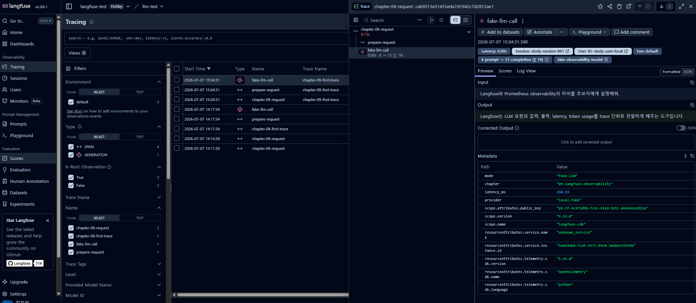
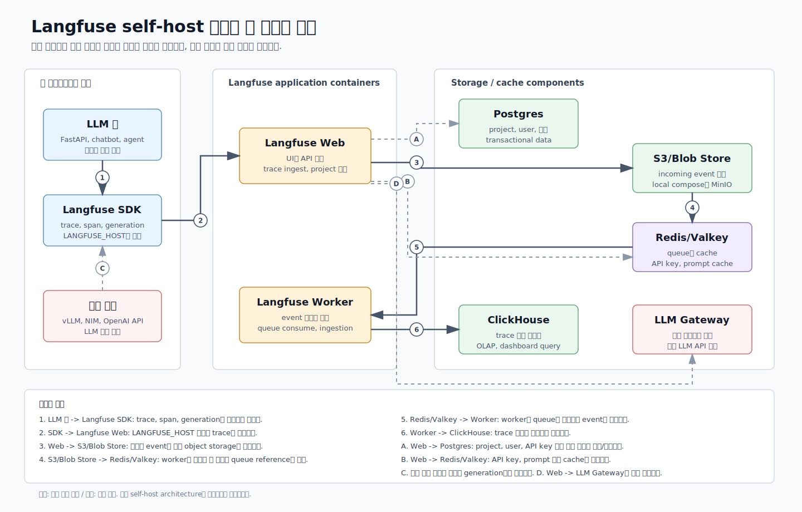

# 9. Langfuse와 LLM Observability

챕터 8에서는 Prometheus/Grafana로 서버의 숫자 지표를 봤다.
챕터 9에서는 Langfuse로 **LLM 요청 하나의 내용과 흐름**을 본다.

Prometheus가 "요청 수, latency, tokens/sec가 얼마나 나오는가"를 보는 데 강하다면,
Langfuse는 "어떤 prompt가 들어왔고, 어떤 답변이 나왔고, 어떤 사용자/session에서 발생했으며, 어떤 generation이 느렸는가"를 보는 데 강하다.

Langfuse SDK, Cloud region, self-hosting 방식, prompt/evaluation 기능은 업데이트될 수 있다.  
이 문서는 2026-07-07 기준 공식 문서를 바탕으로 작성했다.  
핵심 공식 문서는 본문에 바로 연결해 두고, 전체 목록은 [references.md](references.md)에 모아 둔다.

## 학습 목표

- Langfuse가 해결하는 문제를 Prometheus/Grafana와 비교해 이해한다.
- trace, observation, span, generation의 차이를 설명한다.
- prompt, completion, latency, token usage를 요청 단위로 추적하는 방법을 배운다.
- session/user 단위로 LLM 요청을 묶어 보는 이유를 이해한다.
- prompt versioning과 evaluation dataset의 목적을 정리한다.
- Langfuse Cloud 또는 self-hosted Langfuse를 사용할 때 필요한 환경변수를 안다.
- Python SDK로 trace를 전송하는 실습을 한다.
- vLLM/NIM 같은 OpenAI-compatible endpoint 호출 결과를 Langfuse generation으로 기록한다.
- prompt별 latency와 token usage 비교 결과를 정리한다.

## 추천 진행 순서

1. [../../GLOSSARY.md](../../GLOSSARY.md)에서 Langfuse, trace, span, generation 용어를 확인한다.
2. 아래 핵심 개념 요약을 읽는다.
3. [공식 문서 바로가기](#공식-문서-바로가기)에서 Langfuse SDK, prompt, dataset, self-hosting 문서 위치를 본다.
4. 챕터별 `.venv`를 만든다.
5. [scripts/01_check_env.sh](scripts/01_check_env.sh)로 환경을 확인한다.
6. [scripts/02_send_trace.sh](scripts/02_send_trace.sh)를 dry-run으로 실행해 trace 구조를 먼저 본다.
7. Langfuse key가 있으면 `DRY_RUN=false`로 실제 trace를 보낸다.
8. [scripts/03_prepare_vllm_endpoint.sh](scripts/03_prepare_vllm_endpoint.sh)로 OpenAI-compatible endpoint 준비 흐름을 확인한다.
9. [scripts/04_trace_openai_compatible.sh](scripts/04_trace_openai_compatible.sh)로 endpoint 호출 결과를 trace한다.
10. [scripts/05_compare_prompts.sh](scripts/05_compare_prompts.sh)로 prompt별 latency/token usage 비교 CSV를 만든다.
11. 폐쇄망이나 local 실습이 필요하면 [심화 실습: Self-host Langfuse](#심화-실습-self-host-langfuse) 섹션을 진행한다.
12. [templates/lab-notes.md](templates/lab-notes.md)를 보며 결과를 정리하고 [scripts/12_cleanup.sh](scripts/12_cleanup.sh)로 마무리한다.

## 공식 문서 바로가기

| 문서 | 바로 볼 부분 |
| --- | --- |
| [Langfuse Overview](https://langfuse.com/docs) | Langfuse가 observability, prompt management, evaluation을 함께 제공하는 큰 그림 |
| [Langfuse Python SDK](https://langfuse.com/docs/observability/sdk/overview) | SDK v4, `get_client()`, span/generation 생성, `flush()` |
| [Langfuse Observability](https://langfuse.com/docs/observability/overview) | trace, session, user, latency/cost/usage dashboard |
| [Langfuse Prompt Management](https://langfuse.com/docs/prompt-management/get-started) | prompt version, label, compile, trace 연결 |
| [Langfuse Datasets](https://langfuse.com/docs/evaluation/experiments/datasets) | dataset item, expected output, experiment 재현성 |
| [Langfuse Self-hosting](https://langfuse.com/self-hosting) | Cloud와 self-hosting 선택 |
| [Langfuse Docker Compose](https://langfuse.com/self-hosting/deployment/docker-compose) | local/VM compose 요구사항, secret 변경, startup/shutdown |

## 실행 환경 기준

| 구성요소 | 실행 위치 | 이유 |
| --- | --- | --- |
| Python scripts | 챕터 `.venv` | Langfuse SDK와 OpenAI SDK를 직접 사용 |
| Langfuse | Cloud 또는 self-hosted | trace 저장/조회 UI |
| vLLM/NIM endpoint | 선택 실습 | OpenAI-compatible 호출 결과를 generation으로 기록 |
| CSV 결과 | `results/` | prompt 비교 결과를 로컬에 기록 |

Python `.venv` 준비:

```bash
cd ~/study/model-serving/chapters/09-langfuse-observability
python3 -m venv .venv
source .venv/bin/activate
pip install -r requirements.txt
```

실습 후:

```bash
deactivate
```

## 챕터 8과의 차이

| 구분 | 챕터 8 Prometheus/Grafana | 챕터 9 Langfuse |
| --- | --- | --- |
| 주요 질문 | 서버 상태가 괜찮은가? | 이 LLM 요청에서 무슨 일이 있었는가? |
| 데이터 단위 | metric time series | trace, observation, generation |
| 잘 보는 것 | latency p95, error rate, requests/sec, GPU memory | prompt, completion, token usage, user/session, prompt version |
| 민감 정보 | 보통 metric label에 넣지 않음 | prompt/completion을 저장할 수 있으므로 보안/마스킹 고려 필요 |
| 사용 목적 | 운영 지표 모니터링 | LLM 앱 디버깅, prompt 개선, evaluation 연결 |

## 핵심 개념 요약

### Langfuse가 해결하는 문제

LLM application은 일반 API보다 디버깅이 어렵다.    
같은 코드라도 prompt, model, temperature, RAG context, user history에 따라 결과가 달라진다.

Langfuse는 이런 질문에 답하기 위한 도구다.

- 어떤 prompt가 들어왔는가?
- 어떤 completion이 나왔는가?
- 어떤 model과 parameter를 썼는가?
- latency와 token usage는 얼마였는가?
- 같은 session 안에서 이전 요청과 어떻게 이어지는가?
- 특정 prompt version이 더 느리거나 더 비싼가?
- 평가 dataset으로 재현 가능한 비교를 할 수 있는가?

### Trace, Observation, Span, Generation

Langfuse에서 가장 먼저 잡아야 할 구조는 아래와 같다.

```text
Trace: 사용자 요청 하나의 전체 흐름
  ├─ Span: 전처리, 검색, tool call 같은 일반 작업
  └─ Generation: LLM 호출
```

| 용어 | 쉬운 의미 | 예시 |
| --- | --- | --- |
| Trace | 요청 하나의 전체 기록 | 사용자가 "요약해줘"라고 보낸 한 번의 처리 흐름 |
| Observation | trace 안의 세부 단계 | span, generation, event 등 |
| Span | LLM이 아닌 일반 작업 | request validation, prompt formatting, RAG retrieval |
| Generation | LLM 호출에 특화된 observation | vLLM `/v1/chat/completions` 호출 |

Generation에는 보통 아래 정보가 들어간다.

- model
- input prompt/messages
- output completion
- model parameters
- token usage
- latency
- cost metadata

### Session과 User

`session_id`는 여러 trace를 하나의 대화나 workflow로 묶는다.
chatbot에서는 한 사용자의 multi-turn conversation을 볼 때 유용하다.

`user_id`는 어떤 사용자의 요청인지 묶는 값이다.  
사용자별 비용, latency, 실패 패턴을 볼 수 있지만 개인정보 정책에 맞게 익명화해야 한다.

Metric label에는 `user_id`를 넣지 말라고 했지만, Langfuse trace metadata에는 user 관점 분석을 위해 넣을 수 있다.  
다만 raw 개인정보를 그대로 넣는 것은 피하고 내부 익명 ID를 쓰는 편이 좋다.

### Prompt, Completion, Token Usage

Langfuse는 prompt와 completion을 함께 저장할 수 있다.  
그래서 "왜 이 답변이 나왔는지"를 metric보다 훨씬 자세히 볼 수 있다.

하지만 prompt와 completion에는 민감 정보가 들어갈 수 있다.  
실제 운영에서는 아래를 함께 고려한다.

- PII masking
- secret redaction
- 저장 기간
- 프로젝트 접근 권한
- Cloud region 또는 self-hosting 선택

Token usage는 비용과 latency 분석에 중요하다.  
같은 request 1개라도 긴 prompt와 긴 completion은 더 많은 비용과 시간이 든다.

### Prompt Versioning

Prompt versioning은 prompt를 코드처럼 버전 관리하는 개념이다.  
Langfuse Prompt Management에서는 prompt를 만들고, label로 production 버전을 가져오고, 특정 version을 지정해 가져오는 흐름을 제공한다.

이 챕터에서는 실제 prompt management API를 깊게 쓰기보다,
prompt별 latency/token usage를 비교하는 CSV 실습으로 "어떤 값을 비교해야 하는지"를 먼저 익힌다.

### Evaluation Dataset

Evaluation dataset은 여러 prompt/model 버전을 같은 입력 묶음으로 비교하기 위한 기준 데이터다.  
dataset item은 보통 input과 expected output을 가진다.

이것이 필요한 이유:

- prompt를 바꿨을 때 답변 품질이 좋아졌는지 비교
- model을 바꿨을 때 latency/cost/quality 변화 비교
- 과거 dataset version으로 실험을 재현
- production trace에서 문제 사례를 dataset으로 승격

## 학습 포인트와 파일 안내

| 파일 | 볼 부분 | 이유 |
| --- | --- | --- |
| [client/02_send_trace.py](client/02_send_trace.py) | `start_as_current_observation`, `generation`, `flush()` | Langfuse SDK로 trace를 보내는 기본 구조 |
| [client/04_trace_openai_compatible.py](client/04_trace_openai_compatible.py) | OpenAI SDK 호출, generation 기록 | vLLM/NIM endpoint 결과를 Langfuse로 기록하는 흐름 |
| [client/06_compare_prompts.py](client/06_compare_prompts.py) | prompt별 CSV 생성 | prompt version 비교 시 필요한 값 이해 |
| [scripts/03_prepare_vllm_endpoint.sh](scripts/03_prepare_vllm_endpoint.sh) | 챕터 4 vLLM 재실행 안내 | 이전 챕터 서버를 다시 띄우는 방법 |
| [.env.example](.env.example) | Langfuse/OpenAI-compatible 환경변수 | key와 endpoint 설정 방법 |
| [ui-guide.md](ui-guide.md) | Langfuse Tracing 화면 읽는 법 | trace 목록, tree, preview, metadata, error를 해석하는 방법 |

## 실습

### 1. 환경 확인

```bash
cd ~/study/model-serving/chapters/09-langfuse-observability
python3 -m venv .venv
source .venv/bin/activate
pip install -r requirements.txt
bash scripts/01_check_env.sh
```

Langfuse key가 없어도 괜찮다.
처음에는 dry-run으로 trace 구조를 먼저 본다.

### 2. Trace 구조 dry-run

```bash
bash scripts/02_send_trace.sh
```

기본값은 `DRY_RUN=true`다.
Langfuse에 아무것도 보내지 않고 trace 모양만 출력한다.

dry-run 출력에서 보는 값은 아래 의미를 가진다.

| 항목 | 의미 | 왜 보는가 |
| --- | --- | --- |
| `trace name` | 요청 흐름의 이름 | Langfuse UI에서 "이 trace가 어떤 기능/API에서 생겼는지" 구분한다. 예: `chat-completion`, `rag-answer`, `chapter-09-first-trace` |
| `session_id` | 여러 trace를 하나의 대화나 작업 흐름으로 묶는 ID | multi-turn chatbot처럼 한 사용자가 여러 번 질문한 흐름을 이어서 볼 때 필요하다. 같은 대화방이면 같은 `session_id`를 쓴다. |
| `user_id` | 요청을 보낸 사용자 ID | 사용자별 latency, error, 비용 패턴을 볼 때 필요하다. 운영에서는 raw email/name 대신 익명화된 내부 ID를 쓰는 편이 좋다. |
| `span` | LLM 호출이 아닌 일반 처리 단계 | request validation, prompt formatting, RAG 검색, tool call처럼 "LLM 호출 전후에 앱이 한 일"을 나눠 본다. |
| `generation` | LLM 호출 단계 | 어떤 model에 어떤 input을 보냈고, 어떤 output과 token usage가 나왔는지 기록한다. |
| `input/output` | LLM 또는 span에 들어간 입력과 결과 | 답변이 이상할 때 prompt, 전처리 결과, completion을 함께 보고 원인을 찾는다. 민감정보 저장 여부는 반드시 고려한다. |
| `latency_ms` | 해당 단계가 걸린 시간, ms 단위 | 느린 요청이 model inference 때문인지, 전처리/RAG/tool call 때문인지 나눠 보기 위한 기본 값이다. |
| `usage.prompt_tokens` | prompt/input 쪽 token 수 | 입력이 길수록 비용과 처리 시간이 늘어날 수 있다. |
| `usage.completion_tokens` | completion/output 쪽 token 수 | 답변이 길수록 decode 시간이 늘어나고 비용도 늘 수 있다. |

#### 학습용 기본값과 운영 코드의 차이

[client/02_send_trace.py](client/02_send_trace.py)는 처음 구조를 보기 쉽게 하려고 아래 값을 기본값으로 둔다.

| 값 | 실습 기본값 | 운영에서는 보통 어디서 가져오는가 |
| --- | --- | --- |
| `TRACE_NAME` | `chapter-09-first-trace` | API route, workflow 이름, 기능 이름. 예: `chat-completion`, `summarize-document` |
| `SESSION_ID` | `study-session-001` | 대화방 ID, browser session ID, workflow run ID |
| `USER_ID` | `study-user-local` | 로그인 사용자 ID 또는 익명화된 내부 사용자 ID |
| `MODEL_NAME` | `fake-observability-model` | 실제 호출한 model 이름. 예: vLLM의 `--served-model-name`, NIM model name, OpenAI model name |

즉, 운영 코드에서 모든 값을 문자열로 고정해 두는 것이 목표는 아니다.  
이 챕터에서는 trace 구조를 눈으로 익히기 위해 기본값을 둔 것이고,
실제 서비스에서는 request context, 인증 정보, session store, model 설정에서 값을 받아 기록한다.

값을 바꿔서 dry-run을 해보고 싶으면 환경변수로 넘길 수 있다.

```bash
TRACE_NAME=chat-completion \
SESSION_ID=session-local-001 \
USER_ID=user-anonymous-42 \
MODEL_NAME=Qwen/Qwen3-0.6B \
bash scripts/02_send_trace.sh
```

### 3. 실제 Langfuse로 trace 전송

Langfuse Cloud나 self-hosted Langfuse project에서 API key를 발급받은 뒤 `.env`를 만든다.

공식 문서 기준으로 Langfuse SDK는 project별 `public key`, `secret key`, `base URL`을 환경변수로 읽어 trace를 보낸다.  
이 문서는 2026-07-07 기준으로 작성했지만, UI 메뉴 이름은 Langfuse 버전에 따라 조금 바뀔 수 있다.  
막히면 [Langfuse SDK setup 문서](https://langfuse.com/docs/observability/sdk/overview)의 credentials 설정 부분을 먼저 확인한다.

#### Cloud에서 API key 받기

Cloud를 쓸 때는 Langfuse가 운영하는 서버에 trace를 보낸다.

1. https://cloud.langfuse.com 에 접속해 로그인한다.
2. 새 project를 만들거나 기존 project를 연다.
3. project 안의 `Settings` 또는 `Project Settings`로 이동한다.
4. `API Keys` 또는 credentials 영역에서 key를 생성한다.
5. `public key`는 `pk-lf-...`, `secret key`는 `sk-lf-...` 형태인지 확인한다.
6. 사용하는 region의 base URL을 확인한다.

Cloud base URL 예시:

| Region | Base URL |
| --- | --- |
| EU 기본 | `https://cloud.langfuse.com` |
| US | `https://us.cloud.langfuse.com` |
| Japan | `https://jp.cloud.langfuse.com` |

#### Self-hosted에서 API key 받기

self-hosted를 쓸 때도 key를 받는 위치는 Cloud와 거의 같다.  
차이는 접속 주소가 `cloud.langfuse.com`이 아니라 내가 띄운 Langfuse 서버라는 점이다.  

1. self-hosted Langfuse UI에 접속한다. local compose 실습이면 보통 `http://localhost:3000`이다.
2. 처음 접속이면 회원가입 또는 초기 admin 계정을 만든다.
3. 새 project를 만들거나 기존 project를 연다.
4. project 안의 `Settings` 또는 `Project Settings`로 이동한다.
5. `API Keys` 또는 credentials 영역에서 `public key`와 `secret key`를 생성한다.
6. `LANGFUSE_BASE_URL`에는 self-hosted UI/API 주소를 넣는다.

self-hosted URL 예시:

| 환경 | Base URL |
| --- | --- |
| local Docker Compose | `http://localhost:3000` |
| GPU/내부 VM 서버 | `http://<server-ip>:3000` |
| 폐쇄망 내부 DNS | `http://langfuse.internal.example:3000` |

key를 발급받으면 `.env.example`을 복사한다.

```bash
cp .env.example .env
```

`.env`에서 아래 값을 채운다.

```text
LANGFUSE_PUBLIC_KEY=...
LANGFUSE_SECRET_KEY=...
LANGFUSE_BASE_URL=...
```

`LANGFUSE_PUBLIC_KEY`는 project를 식별하는 공개 key이고, `LANGFUSE_SECRET_KEY`는 trace를 보낼 권한을 가진 secret이다.  
`.env` 파일은 실제 secret을 담기 때문에 Git에 커밋하지 않는다.

이 실습 코드에서는 기존 예제 호환을 위해 `LANGFUSE_HOST`만 설정되어 있어도 동작하게 해두었다.  
다만 새로 작성할 때는 공식 문서와 맞춰 `LANGFUSE_BASE_URL`을 우선 사용한다.  

`01_check_env.sh`와 `02_send_trace.sh`는 챕터 디렉터리의 `.env`를 자동으로 읽는다.  
따라서 `.env`에 key를 넣었다면 매번 `export`를 직접 하지 않아도 된다.  

전송:

```bash
DRY_RUN=false bash scripts/02_send_trace.sh
```

아래처럼 script 뒤에 `DRY_RUN=false`를 붙이면 shell 환경변수로 적용되지 않는다.

```bash
# 잘못된 예
bash scripts/02_send_trace.sh DRY_RUN=false
```

헷갈리면 아래 방식도 사용할 수 있다.

```bash
bash scripts/02_send_trace.sh --send
```

짧은 CLI script에서는 `langfuse.flush()`가 중요하다.  
SDK가 event를 background로 보내기 때문에 process가 바로 종료되면 전송 전에 끝날 수 있다.

전송 후 확인할 것:

1. Langfuse UI에서 해당 project를 연다.
2. `Traces` 화면으로 이동한다.
3. `chapter-09-first-trace` 또는 `TRACE_NAME`으로 지정한 trace가 보이는지 확인한다.
4. trace 안에서 `prepare-request` span과 `fake-llm-call` generation이 나뉘어 보이는지 확인한다.
5. generation 안에 model, input, output, token usage가 들어갔는지 확인한다.

Langfuse UI가 처음에는 복잡하게 보일 수 있다.  



화면에서 어디를 봐야 하는지는 [ui-guide.md](ui-guide.md)에 따로 정리했다.

### 4. OpenAI-compatible endpoint 준비

Langfuse는 모델 서버가 아니다.  
vLLM/NIM/OpenAI API 같은 endpoint 호출 결과를 관측하는 도구다.

챕터 4의 vLLM endpoint를 다시 띄우는 흐름은 아래 script가 안내한다.

```bash
bash scripts/03_prepare_vllm_endpoint.sh
```

### 5. OpenAI-compatible endpoint 결과 trace

dry-run:

```bash
bash scripts/04_trace_openai_compatible.sh
```

실제 endpoint와 Langfuse로 보내기:

```bash
export OPENAI_BASE_URL=http://127.0.0.1:8000/v1
export OPENAI_API_KEY=EMPTY
export OPENAI_MODEL=study-model
DRY_RUN=false bash scripts/04_trace_openai_compatible.sh
```

`OPENAI_MODEL`은 vLLM을 띄울 때 지정한 `--served-model-name`과 맞아야 한다.

### 6. Prompt별 latency/token usage 비교

```bash
bash scripts/05_compare_prompts.sh
```

결과:

```text
results/prompt_comparison.csv
```

이 CSV는 Langfuse Prompt Management 자체를 대체하지 않는다.  
다만 prompt version을 비교할 때 어떤 값을 봐야 하는지 연습하기 위한 작은 실습이다.

주로 비교할 값:

| 컬럼 | 의미 | 어떻게 해석할까 |
| --- | --- | --- |
| `prompt_name` | prompt variant 이름 | 어떤 의도로 만든 prompt인지 구분한다. 예: 짧은 설명, 친근한 설명, 운영 관점 설명 |
| `prompt_version` | prompt version | prompt를 바꿨을 때 결과를 재현하고 비교하기 위한 기준이다. Langfuse Prompt Management에서는 version/label로 관리한다. |
| `prompt_tokens` | 입력 prompt token 수 | 값이 커질수록 prefill 비용과 latency가 늘 수 있다. RAG context가 길어질 때 특히 중요하다. |
| `completion_tokens` | 생성된 답변 token 수 | 값이 커질수록 decode 시간이 늘고 비용도 커질 수 있다. |
| `latency_ms` | 요청 처리 시간 | prompt가 길거나 completion이 길면 증가할 수 있다. 같은 조건에서 여러 번 실행해 평균/p95로 보는 것이 더 정확하다. |
| `answer_preview` | 답변 미리보기 | 숫자만 좋다고 끝이 아니다. 답변이 요구사항을 충족하는지 사람이 함께 확인해야 한다. |

비교할 때의 기본 질문:

- 더 긴 prompt가 정말 더 좋은 답변을 만들었는가?
- latency가 늘어난 만큼 답변 품질도 좋아졌는가?
- prompt_tokens와 completion_tokens 중 어느 쪽이 비용 증가에 더 영향을 줬는가?
- 같은 목적의 prompt라면 더 짧고 안정적인 version을 선택할 수 있는가?
- 운영용 prompt라면 session/user별로 특정 prompt가 더 자주 실패하지는 않는가?

중요한 점은 `latency_ms`나 token 수가 낮다고 무조건 좋은 prompt가 아니라는 것이다.  
LLM prompt 비교는 보통 `품질`, `latency`, `token cost`, `안정성`, `재현성`을 함께 본다.

<a id="심화-실습-self-host-langfuse"></a>

### 7. 심화 실습: Self-host Langfuse

이 실습은 앞의 Langfuse 기본 개념과 SDK 사용법을 이해한 뒤 진행하는 편이 좋다.  
Cloud key가 없거나, 폐쇄망/내부망 환경에서 trace를 저장해야 할 때 선택한다.

폐쇄망에서 일하는 경우 Langfuse Cloud에 trace를 보낼 수 없다.  
이럴 때는 Langfuse를 내부망에 self-host하고 Python SDK의 `LANGFUSE_BASE_URL`을 내부 Langfuse 주소로 설정한다.

공식 문서 기준으로 Langfuse self-host v3는 Docker로 실행할 수 있으며, local/VM Docker Compose 방식은 testing/low-scale deployment에 권장된다.   
고가용성, scale-out, backup이 필요한 운영 환경은 Kubernetes Helm 같은 production-scale deployment를 검토해야 한다.

#### Self-host 구성요소

Langfuse self-host는 단일 container 하나로 끝나지 않는다.  
공식 문서의 architecture 기준으로 아래 구성요소가 함께 필요하다.



이 그림은 Langfuse 공식 self-host architecture 설명을 학습용으로 재구성한 것이다.  
핵심은 `Langfuse Web`이 trace를 받는 입구이고, `Langfuse Worker`가 들어온 event를 비동기로 처리하며,
저장소가 목적별로 나뉜다는 점이다.

| 구성요소 | 역할 |
| --- | --- |
| Langfuse Web | UI와 API를 제공하는 main web application |
| Langfuse Worker | trace/event를 비동기로 처리하는 worker |
| Postgres | transactional workload를 저장하는 main database |
| ClickHouse | trace, observation, score 분석용 OLAP database |
| Redis/Valkey | queue와 cache |
| S3/Blob Store | incoming event, media, export 등을 저장하는 object storage. local compose에서는 MinIO를 사용 |

이 구조 때문에 폐쇄망에서는 단순히 `langfuse/langfuse` image 하나만 반입하면 부족하다.   
공식 `docker-compose.yml`이 요구하는 모든 image와 volume, secret, port 정책을 함께 준비해야 한다.

#### Local/VM self-host 실행

공식 repository를 가져온다.

```bash
bash scripts/06_prepare_self_host_official.sh
```

이 script는 두 가지 일을 한다.

1. 공식 Langfuse repository를 `self-host/langfuse-official` 아래에 받는다.
2. 같은 디렉터리에 `.env`를 만들고 self-host용 secret을 랜덤값으로 채운다.

공식 compose 파일의 `# CHANGEME` 위치는 아래처럼 확인할 수 있다.

```bash
cd self-host/langfuse-official
grep -n "CHANGEME" docker-compose.yml
sed -n '1,80p' .env
```

공식 문서는 `# CHANGEME`로 표시된 secret을 긴 random 값으로 바꾸라고 권장한다.  
이 실습에서는 공식 `docker-compose.yml`을 직접 고치지 않고 `.env`로 값을 override한다.

자동 생성되는 주요 값:

| 값 | 생성 방식 | 이유 |
| --- | --- | --- |
| `SALT` | base64 random | Langfuse application secret |
| `NEXTAUTH_SECRET` | base64 random | auth/session secret |
| `ENCRYPTION_KEY` | 64자리 hex | 공식 compose가 `openssl rand -hex 32` 형식을 권장 |
| `POSTGRES_PASSWORD` | base64 기반 alphanumeric | `DATABASE_URL`에도 들어가므로 URL-safe하게 생성 |
| `CLICKHOUSE_PASSWORD` | base64 기반 alphanumeric | ClickHouse 접속 secret |
| `REDIS_AUTH` | base64 기반 alphanumeric | Redis 인증 |
| `MINIO_ROOT_PASSWORD` | base64 기반 alphanumeric | local S3/MinIO secret |

UI에서 첫 계정을 직접 만들어야 하면 학습용으로 아래 값을 사용한다.

| 항목 | 값 |
| --- | --- |
| user/name | `admin` |
| email이 필요할 때 | `admin@example.local` |
| password | `admin123` |

이미 `.env`가 있으면 script는 기존 secret을 덮어쓰지 않는다.  
다시 만들고 싶을 때만 아래처럼 실행한다.

```bash
SELF_HOST_ENV_OVERWRITE=true bash scripts/06_prepare_self_host_official.sh
```

실행:

```bash
cd ~/study/model-serving/chapters/09-langfuse-observability
bash scripts/08_start_self_host.sh
```

첫 실행은 image pull, migration, dependency 준비 때문에 시간이 걸릴 수 있다.  
공식 문서는 local/VM compose 실행 후 web container가 ready 상태가 되기까지 약 2-3분 정도 걸릴 수 있다고 설명한다.  

상태 확인:

```bash
bash scripts/09_check_self_host.sh
```

접속:

```text
http://localhost:3000
```

Langfuse UI에서 project를 만들고 public/secret key를 발급받은 뒤 Python SDK 환경변수를 설정한다.

```bash
bash scripts/11_print_self_host_env.sh
```

예시:

```bash
export LANGFUSE_BASE_URL=http://localhost:3000
export LANGFUSE_PUBLIC_KEY=pk-lf-...
export LANGFUSE_SECRET_KEY=sk-lf-...
DRY_RUN=false bash scripts/02_send_trace.sh
```

self-host stack을 내릴 때:

```bash
bash scripts/10_stop_self_host.sh
```

데이터 volume까지 지우려면:

```bash
REMOVE_VOLUMES=true bash scripts/10_stop_self_host.sh
```

#### 폐쇄망 반입 흐름

폐쇄망에서는 `git clone`, `docker pull`, package install이 바로 되지 않는 경우가 많다.  
따라서 인터넷이 되는 준비 환경에서 아래 산출물을 만들어 내부망으로 가져간다.

| 산출물 | 만드는 곳 | 내부망에서 하는 일 |
| --- | --- | --- |
| Langfuse official repo snapshot | 인터넷 가능 환경 | `self-host/langfuse-official`로 복사 |
| Docker images tar | 인터넷 가능 환경 | `docker load -i ...` |
| Python wheelhouse | 인터넷 가능 환경 | `pip install --no-index --find-links ...` |
| 내부망용 `.env`/secret | 내부망 보안 절차 | Git에 커밋하지 않고 서버에만 배치 |

공식 compose가 필요로 하는 image 목록을 만든다.

```bash
bash scripts/07_list_self_host_images.sh
```

인터넷 가능 환경에서 image 저장:

```bash
while read -r image; do docker pull "${image}"; done < results/langfuse-self-host-images.txt
xargs -a results/langfuse-self-host-images.txt docker save -o langfuse-self-host-images.tar
```

폐쇄망 서버에서 image 불러오기:

```bash
docker load -i langfuse-self-host-images.tar
```

폐쇄망 운영 체크포인트:

- inbound port는 Langfuse Web `3000`과 필요한 경우 MinIO console `9090`만 열고 나머지는 내부 network로 제한한다.
- Postgres와 ClickHouse timezone은 UTC 기준을 지킨다.
- trace에는 prompt/completion이 저장될 수 있으므로 개인정보/민감정보 masking 정책을 정한다.
- backup은 Postgres, ClickHouse, object storage volume을 모두 고려한다.
- compose 방식은 HA/scale-out/backup이 부족하므로 production은 Kubernetes Helm 등으로 확장 계획을 세운다.

### 8. 실습 마무리

```bash
bash scripts/12_cleanup.sh
```

가상환경 종료:

```bash
deactivate
```

결과 확인:

- Langfuse UI의 traces
- Langfuse UI의 sessions/users
- `results/prompt_comparison.csv`

## Troubleshooting

| 증상 | 원인 후보 | 확인/해결 |
| --- | --- | --- |
| dry-run만 실행됨 | Langfuse key가 없거나 `DRY_RUN=true` | `.env`와 `DRY_RUN=false` 확인 |
| trace가 UI에 안 보임 | `LANGFUSE_BASE_URL` region 불일치, key 오류, flush 누락 | `.env` 값과 `langfuse.flush()` 확인 |
| `LangfuseSpan`에 `update_trace`가 없다는 에러 | 설치된 Langfuse SDK version과 예제 API가 맞지 않음 | 이 챕터 코드는 SDK v4.13.0 기준으로 `propagate_attributes()`와 observation metadata를 사용한다. 기존 error trace는 UI에 남아 있을 수 있으니 새로 실행한 trace를 확인 |
| `Trace-level input/output is deprecated` 경고 | 예전 코드가 `set_trace_io()`를 사용함 | 현재 코드는 `set_trace_io()`를 제거했다. 최신 파일로 다시 실행 |
| self-host UI가 안 열림 | container 준비 중, migration 진행 중, port 충돌 | `bash scripts/09_check_self_host.sh`, `docker compose logs --tail=100 langfuse-web` |
| 폐쇄망에서 image pull 실패 | image tar 미반입, registry mirror 미설정 | `scripts/07_list_self_host_images.sh`로 목록 생성 후 `docker save/load` |
| OpenAI-compatible 호출 실패 | vLLM/NIM server가 꺼짐, model name 불일치 | 챕터 4/6 server 상태와 `OPENAI_MODEL` 확인 |
| token usage가 정확하지 않음 | fake tokenizer 사용 | 운영에서는 provider response usage 또는 tokenizer 사용 |
| prompt 내용 저장이 부담됨 | 민감 정보 포함 가능 | masking/redaction/self-hosting 검토 |

## 확인 질문

| 질문 | 정리 |
| --- | --- |
| Langfuse와 Prometheus의 차이는 무엇인가? | Prometheus는 time series metric 중심이고, Langfuse는 LLM 요청의 prompt/completion/trace 중심이다. |
| generation은 span과 무엇이 다른가? | generation은 LLM 호출에 특화되어 model, usage, cost 같은 필드를 기록한다. |
| session_id는 왜 필요한가? | 여러 trace를 하나의 대화나 workflow로 묶어 보기 위해서다. |
| user_id를 기록할 때 주의할 점은? | 개인정보를 직접 넣기보다 익명화된 내부 ID를 쓰고 접근 권한을 관리한다. |
| prompt versioning은 왜 필요한가? | prompt 변경이 latency, cost, quality에 미치는 영향을 버전별로 비교하기 위해서다. |
| evaluation dataset은 왜 필요한가? | 같은 입력 묶음으로 prompt/model 변경을 재현 가능하게 비교하기 위해서다. |

## 다음 챕터에서 이어질 내용

다음 챕터에서는 Kubernetes Deployment, Service, Ingress를 사용해 모델 서버를 cluster 위에 배포하는 흐름을 다룬다.
