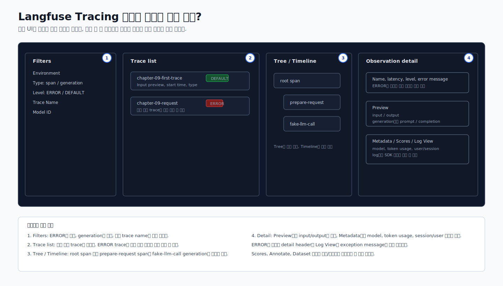

# Langfuse UI 읽는 법

이 문서는 2026-07-07 기준 Langfuse Cloud 화면과 공식 문서를 바탕으로 작성했다.  
Langfuse UI는 자주 개선될 수 있으므로 메뉴 이름이나 위치가 조금 다르면 [Langfuse Observability 문서](https://langfuse.com/docs/observability/overview)와 [SDK 문서](https://langfuse.com/docs/observability/sdk/overview)를 함께 확인한다.

## 먼저 알아둘 것

Langfuse 화면에서 `Trace`, `Observation`, `Span`, `Generation`이 섞여 보이면 처음에는 꽤 복잡하다.
이 챕터에서는 아래 순서로 보면 충분하다.

1. 방금 실행한 trace가 생겼는지 본다.
2. `ERROR`인지 `DEFAULT`인지 본다.
3. Tree에서 `prepare-request`와 `fake-llm-call`이 보이는지 본다.
4. `fake-llm-call` generation을 눌러 model, input, output, token usage를 본다.
5. Metadata에서 session/user/tag가 들어갔는지 확인한다.




## Tracing 목록에서 볼 것

왼쪽 목록 또는 중앙 table에서 새 trace를 찾는다.

확인할 값:

| UI 항목 | 의미 | 실습에서 기대하는 값 |
| --- | --- | --- |
| Name | root observation 이름 | `chapter-09-request` |
| Trace Name | trace를 묶는 이름 | `chapter-09-first-trace` 또는 `TRACE_NAME` 값 |
| Level | 정상/에러 상태 | 새 실행은 보통 `DEFAULT`여야 함 |
| Input | trace 입력 미리보기 | prompt 일부 |
| Start Time | 실행 시각 | 방금 실행한 시간 |

`ERROR`가 보이면 바로 실패라고 단정하지 말고 start time을 본다.
이전 실패 trace일 수 있다.

## Tree / Timeline 보는 법

trace를 클릭하면 오른쪽이나 가운데에 `Tree`와 `Timeline` 전환 버튼이 보인다.

처음에는 `Tree`를 추천한다.

기대 구조:

```text
chapter-09-request
  ├─ prepare-request
  └─ fake-llm-call
```

각 항목의 의미:

| 항목 | 타입 | 의미 |
| --- | --- | --- |
| `chapter-09-request` | span | 요청 하나의 전체 흐름을 잡는 root span |
| `prepare-request` | span | prompt를 정리하는 전처리 단계 |
| `fake-llm-call` | generation | LLM 호출에 해당하는 단계. model, input, output, token usage를 본다. |

`Timeline`은 어떤 단계가 몇 ms 걸렸는지 볼 때 유용하다.

## Preview 탭에서 볼 것

`Preview`는 가장 먼저 보는 탭이다.

root span을 눌렀을 때:

- `Input`: 사용자가 보낸 prompt
- `Output`: 최종 answer와 latency

generation을 눌렀을 때:

- `Input`: LLM에 들어간 prompt/messages
- `Output`: LLM이 만든 completion
- `Model`: 사용한 model 이름
- `Usage`: prompt/completion/total token 수

이 실습에서는 fake LLM을 쓰기 때문에 output은 고정된 예시 문장이다.
실제 vLLM/NIM endpoint를 연결하면 실제 모델 응답이 보인다.

## Metadata에서 볼 것

Metadata는 "나중에 검색하거나 필터링할 때 필요한 설명 값"이다.

이 챕터에서 기대하는 값:

| Metadata | 의미 |
| --- | --- |
| `chapter` | 어떤 학습 챕터에서 만든 trace인지 |
| `mode` | fake LLM인지 실제 endpoint인지 |
| `provider` | generation이 local fake인지, vLLM/NIM/OpenAI인지 |
| `latency_ms` | 실습 코드가 측정한 LLM 호출 시간 |

`session_id`, `user_id`, `tags`, `trace_name`은 최신 코드에서 `propagate_attributes(...)`로 전파한다.
UI 버전에 따라 trace detail, metadata, filter 영역에 보이는 위치가 다를 수 있다.

## Log View에서 볼 것

`Log View`는 에러가 났을 때 중요하다.

예를 들어 아래 메시지가 보이면:

```text
AttributeError: 'LangfuseSpan' object has no attribute 'update_trace'
```

의미:

- Langfuse 서버 문제가 아니다.
- 모델 응답 문제가 아니다.
- Python SDK method 사용법이 현재 설치 버전과 맞지 않은 것이다.

이 챕터의 현재 코드는 `update_trace()`를 사용하지 않도록 수정했다.

## Scores, Annotate, Dataset은 언제 보나?

처음 trace를 보낼 때는 몰라도 된다.

| 기능 | 지금은 어떻게 보면 되는가 |
| --- | --- |
| Scores | 답변 품질이나 평가 점수를 붙이는 곳. evaluation 단계에서 중요해진다. |
| Annotate | 사람이 직접 좋은/나쁜 답변을 표시하거나 코멘트하는 기능 |
| Add to datasets | 문제가 있거나 대표적인 trace를 evaluation dataset으로 저장하는 기능 |

이 챕터에서는 trace 구조를 읽는 것이 먼저다.  
dataset과 evaluation은 나중에 prompt/version 비교나 평가 실습에서 더 깊게 다룬다.  

## 정상 실행 체크리스트

아래가 만족되면 이번 실습은 성공으로 봐도 된다.

- `DRY_RUN=false bash scripts/02_send_trace.sh` 실행 후 Python traceback이 없다.
- Langfuse UI에 새 trace가 생긴다.
- 새 trace의 level이 `ERROR`가 아니다.
- Tree에 `prepare-request`와 `fake-llm-call`이 보인다.
- `fake-llm-call` detail에서 input/output/model/token usage가 보인다.
- 이전 `update_trace` 에러 trace와 새 trace를 start time으로 구분할 수 있다.
