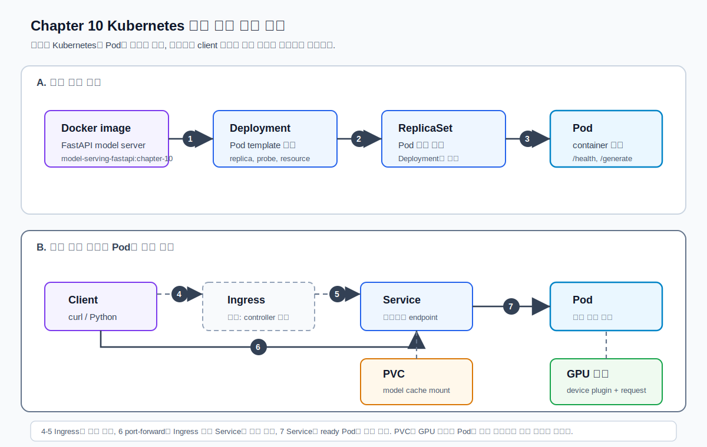
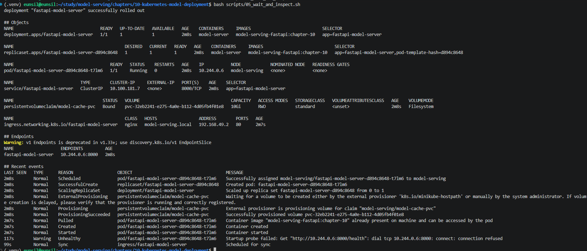

# 10. Kubernetes 기반 모델 배포

챕터 10에서는 Docker container로 만들었던 모델 서버를 Kubernetes 위에 올린다.  
이번 단원의 핵심은 "모델 서버 container 하나를 실행한다"가 아니라, **운영 환경에서 반복 배포할 수 있는 Kubernetes object 흐름**을 이해하는 것이다.

Kubernetes 설치 방식, NVIDIA device plugin 버전, Ingress controller 구성은 자주 바뀔 수 있다.
이 문서는 2026년 7월 기준 공식 문서를 바탕으로 작성했다.
핵심 공식 문서는 본문에 바로 연결해 두고, 전체 목록은 [references.md](references.md)에 모아 둔다.

## 학습 목표

- Kubernetes를 구축하는 여러 방식과 차이를 이해한다.
- 이번 실습에서 사용할 Kubernetes 환경을 왜 그렇게 고르는지 설명한다.
- Deployment, Service, Ingress로 모델 서버를 노출하는 흐름을 익힌다.
- GPU node scheduling과 `nvidia.com/gpu` resource request를 이해한다.
- `nodeSelector`, taints, tolerations가 GPU workload 배치에 어떻게 쓰이는지 정리한다.
- PVC로 Hugging Face/model cache를 Pod 재시작과 분리하는 방법을 배운다.
- readiness probe, liveness probe, startup probe를 모델 서버 관점에서 설계한다.
- FastAPI 모델 서버를 Kubernetes Deployment로 배포하고 Service/port-forward로 호출한다.
- GPU resource request를 적용하고 NVIDIA device plugin 설치 흐름을 확인한다.
- rolling update 중 모델 서버가 어떻게 교체되는지 관찰한다.

## 추천 진행 순서

1. [../../GLOSSARY.md](../../GLOSSARY.md)에서 Kubernetes, Deployment, Service, Ingress, PVC, probe 용어를 확인한다.
2. [Kubernetes 구축 방식 비교](#kubernetes-구축-방식-비교)를 읽고 실습 환경을 정한다.
3. [공식 문서 바로가기](#공식-문서-바로가기)에서 Kubernetes/minikube/NVIDIA device plugin 문서의 확인 위치를 본다.
4. [scripts/01_check_env.sh](scripts/01_check_env.sh)로 host 도구와 cluster 상태를 확인한다.
5. 로컬 실습이면 [scripts/02_start_minikube.sh](scripts/02_start_minikube.sh)로 minikube cluster를 만든다.
6. [scripts/03_build_and_load_image.sh](scripts/03_build_and_load_image.sh)로 챕터 3 FastAPI image를 만들고 cluster에 전달한다.
7. [scripts/04_apply_cpu_manifests.sh](scripts/04_apply_cpu_manifests.sh)로 Namespace, PVC, Deployment, Service, Ingress를 배포한다.
8. [scripts/05_wait_and_inspect.sh](scripts/05_wait_and_inspect.sh)로 Pod, Service, PVC, event를 확인한다.
9. [scripts/06_port_forward.sh](scripts/06_port_forward.sh)를 실행한 터미널을 열어두고 [scripts/07_curl_generate.sh](scripts/07_curl_generate.sh)로 호출한다.
10. GPU node가 있으면 [scripts/08_install_nvidia_device_plugin.sh](scripts/08_install_nvidia_device_plugin.sh)로 NVIDIA device plugin 설치 방식을 확인한다.
11. GPU node가 있으면 [scripts/09_apply_gpu_patch.sh](scripts/09_apply_gpu_patch.sh)로 GPU resource request, nodeSelector, toleration을 적용한다.
12. [scripts/10_rolling_update.sh](scripts/10_rolling_update.sh)로 rolling update를 관찰한다.
13. [templates/lab-notes.md](templates/lab-notes.md)를 보며 결과를 정리하고 [scripts/11_cleanup.sh](scripts/11_cleanup.sh)로 정리한다.

## 이번 챕터에서 사용할 방식

이번 챕터의 기본 실습은 **minikube + Docker driver + `kubectl apply -f`** 로 진행한다.

이유:

- 단일 노드라서 Deployment, Service, PVC, port-forward 흐름을 빠르게 볼 수 있다.
- 챕터 3에서 만든 local Docker image를 `minikube image load`로 바로 사용할 수 있다.
- GPU가 없어도 CPU Deployment 실습을 완료할 수 있다.
- GPU 서버에서 minikube GPU 설정이 가능하면 같은 manifest에 GPU patch만 더해 실험할 수 있다.

단, 실제 운영과 가장 가까운 선택은 managed Kubernetes다.  
운영 환경에서는 EKS, GKE, AKS 같은 managed Kubernetes 또는 사내 표준 cluster를 쓰고, 이 챕터의 manifest를 registry image와 cloud storage class에 맞게 바꾸는 편이 일반적이다.

이번 실습에서는 **모델 서버 배포 방식**을 배우는 것이 목적이므로 cluster 구축 자체는 가장 단순한 minikube로 시작한다.  
즉, 이 챕터에서 직접 깊게 다루는 것은 `Deployment`, `Service`, `PVC`, `Ingress`, `probe`, `GPU scheduling`이고, HA control plane이나 cloud load balancer 운영은 범위 밖이다.

환경별로 바뀌는 지점은 아래처럼 생각하면 된다.

| 환경 | 그대로 따라 해도 되는 것 | 바꿔야 하는 것 |
| --- | --- | --- |
| 로컬 minikube | script 순서, manifest 대부분, port-forward 호출 | host에 Docker/minikube/kubectl 설치 필요 |
| GPU 서버 minikube | CPU 실습 흐름, GPU patch 실습 | NVIDIA driver/runtime, minikube GPU 설정, device plugin 확인 |
| k3s 또는 kubeadm | manifest 구조, `kubectl apply -f`, Service/PVC/probe 개념 | image registry, StorageClass, Ingress controller, GPU runtime 설정 |
| managed Kubernetes | Deployment/Service/PVC/probe/GPU request 개념 | cloud registry, cloud disk StorageClass, node group, IAM, LoadBalancer/Ingress 설정 |

## 공식 문서 바로가기

이번 장에서 자주 확인할 공식 문서는 아래와 같다.

| 문서 | 바로 볼 부분 |
| --- | --- |
| [Kubernetes Deployment](https://kubernetes.io/docs/concepts/workloads/controllers/deployment/) | Deployment가 Pod replica와 rolling update를 관리하는 방식 |
| [Kubernetes Service](https://kubernetes.io/docs/concepts/services-networking/service/) | Pod를 안정적인 endpoint로 묶는 방식 |
| [Kubernetes Ingress](https://kubernetes.io/docs/concepts/services-networking/ingress/) | HTTP routing과 Ingress controller 관계 |
| [Kubernetes Persistent Volumes](https://kubernetes.io/docs/concepts/storage/persistent-volumes/) | PVC, access mode, storage backend 개념 |
| [minikube start](https://minikube.sigs.k8s.io/docs/start/) | local Kubernetes cluster 시작 방법 |
| [NVIDIA k8s-device-plugin](https://github.com/NVIDIA/k8s-device-plugin) | `nvidia.com/gpu` resource를 node에 노출하는 방식 |
| [Helm documentation](https://helm.sh/docs/) | chart 설치, `helm repo`, `helm upgrade --install` 기본 흐름 |

## Kubernetes 구축 방식 비교

| 방식 | 용도 | 장점 | 주의점 | 대략 필요한 리소스 |
| --- | --- | --- | --- | --- |
| Managed Kubernetes | 운영, 팀 공용 dev/staging/prod | control plane 운영 부담이 작고 cloud LB, disk, IAM 연동이 좋다. | 비용, cloud 권한, node group/GPU quota, registry 구성이 필요하다. | control plane은 provider가 관리. worker는 최소 1-2 vCPU/2-4GB부터 가능하지만 모델 서빙은 모델 크기에 맞는 GPU node와 50GB+ disk를 권장한다. |
| minikube | 개인 학습, 로컬 단일 노드 | 설치와 삭제가 쉽고 Kubernetes 기본 object 학습에 좋다. | 운영 HA가 아니며 node가 하나라 장애/스케줄링 실험이 제한된다. GPU passthrough는 host/driver/driver mode 영향을 받는다. | 공식 최소 기준은 2 CPU, 2GB memory, 20GB disk. 모델 서버 실습은 4 CPU, 8GB memory, 30GB+ disk를 권장한다. |
| k3s | 가벼운 서버, edge, 작은 GPU lab | 단일 binary 기반으로 가볍고 VM/베어메탈에 설치하기 쉽다. | managed cloud 연동은 직접 구성해야 한다. storage, ingress, NVIDIA runtime 설정을 직접 점검해야 한다. | 공식 최소 기준은 server 2 core/2GB, agent 1 core/512MB. 모델 서빙은 server 2-4 core/4-8GB, GPU agent는 모델에 맞는 GPU memory와 SSD 권장. |
| kubeadm 단일 control-plane | Kubernetes 표준 구성 학습, 사내 cluster 기초 | upstream Kubernetes 구성 요소를 직접 이해하기 좋다. | CNI, container runtime, 인증서, upgrade, LB 등을 직접 운영해야 한다. | control-plane 2 CPU/2GB 이상, worker 1-2 CPU/2GB 이상부터 가능. 모델 서빙은 GPU worker 별도 권장. |
| kubeadm HA | 운영형 자체 구축, 온프레미스 | control plane 장애 대응을 직접 설계할 수 있다. | etcd quorum, LB, 인증서, upgrade, backup 운영 난이도가 높다. | control-plane 3대 이상 권장. 각 2-4 CPU/4-8GB 이상, etcd SSD 권장. GPU worker는 별도. |

리소스 표는 "Kubernetes가 뜨는 최소 기준"과 "모델 서빙 실습이 편한 기준"이 다르다.  
작은 FastAPI 예제는 CPU cluster에서도 동작하지만, 실제 LLM은 model weight, KV cache, tokenizer cache 때문에 GPU memory와 disk 요구량이 훨씬 커진다.

## Helm vs kubectl apply

이번 챕터의 기본 애플리케이션 배포는 `kubectl apply -f <manifest.yaml>`로 YAML을 하나씩 적용한다.

| 도구 | 잘 맞는 경우 | 이번 챕터에서의 사용 |
| --- | --- | --- |
| `kubectl apply -f` | YAML object를 직접 보며 Deployment, Service, PVC를 학습할 때 | 기본 모델 서버 배포에 사용 |
| Helm | chart로 패키징된 third-party add-on을 설치하고 값만 바꿀 때 | NVIDIA device plugin 설치 옵션으로 사용 |

`kubectl apply -f` 예시:

```bash
kubectl apply -f manifests/00-namespace.yaml
kubectl apply -f manifests/10-model-cache-pvc.yaml
kubectl apply -f manifests/20-deployment-cpu.yaml
kubectl apply -f manifests/30-service.yaml
kubectl apply -f manifests/40-ingress.yaml
kubectl get deploy,svc,pvc -n model-serving
```

Helm 예시:

```bash
helm repo add nvdp https://nvidia.github.io/k8s-device-plugin
helm repo update
helm upgrade -i nvdp nvdp/nvidia-device-plugin \
  --namespace nvidia-device-plugin \
  --create-namespace
```

NVIDIA device plugin은 공식 문서에서 production 배포는 Helm을 권장하고, 간단한 static DaemonSet manifest도 제공한다.  
그래서 이 챕터는 둘 다 보여주되, 기본값은 학습용으로 안전하게 명시적인 선택을 요구한다.

정리하면, **내가 만든 모델 서버**는 직접 YAML을 읽어 보며 `kubectl apply -f`로 배포한다.  
반면 **다른 팀/벤더가 관리하는 Kubernetes add-on**은 Helm chart가 제공되면 Helm을 쓰는 편이 업그레이드와 설정 관리가 편하다.

## 배포 흐름 요약



그림의 번호를 실습 명령과 연결하면 아래처럼 읽을 수 있다.

| 번호 | 의미 | 관련 실습 |
| --- | --- | --- |
| 1 | Docker image를 만들고 cluster node가 사용할 수 있게 전달한다. | `scripts/03_build_and_load_image.sh` |
| 2 | Deployment가 ReplicaSet을 만든다. | `manifests/20-deployment-cpu.yaml` |
| 3 | ReplicaSet이 Pod 개수를 유지하고 Pod를 실행한다. | `scripts/05_wait_and_inspect.sh` |
| 4 | Ingress controller가 있으면 Client 요청이 Ingress를 거쳐 들어올 수 있다. | `manifests/40-ingress.yaml` |
| 5 | Ingress가 받은 요청을 Service로 보낸다. | `manifests/40-ingress.yaml`, `manifests/30-service.yaml` |
| 6 | Ingress 없이도 port-forward로 Client가 Service에 직접 연결할 수 있다. | `scripts/06_port_forward.sh`, `scripts/07_curl_generate.sh` |
| 7 | Service가 ready 상태인 Pod로 요청을 전달한다. | `manifests/30-service.yaml` |

PVC와 GPU 조건은 번호가 붙은 요청 흐름이 아니라 **Pod에 붙는 설정**이다.
PVC는 Pod가 `/root/.cache/huggingface`에 model cache를 보존하도록 mount되고, GPU 조건은 Pod spec에 `nvidia.com/gpu` request와 node 배치 조건을 붙여 GPU node에 뜰 수 있게 한다.

### Deployment

Deployment는 원하는 Pod replica 수와 update 전략을 선언한다.
모델 서버에서는 Deployment가 아래 역할을 한다.

- Pod가 죽으면 다시 만든다.
- image tag나 환경변수가 바뀌면 rolling update를 수행한다.
- readiness probe가 성공한 Pod만 Service endpoint로 들어가게 한다.
- resource request/limit을 scheduler에게 알려준다.

### Service

Pod IP는 재시작 때마다 바뀔 수 있다.  
Service는 label selector로 Pod들을 묶고 안정적인 DNS 이름과 virtual IP를 제공한다.

이번 실습의 Service 이름은 `fastapi-model-server`다.  
cluster 내부에서는 아래 주소로 접근할 수 있다.

```text
http://fastapi-model-server.model-serving.svc.cluster.local

# http://<service 명>.<namespace 명>.svc.cluster.local 로 생성됨
```

외부에서 가장 단순하게 호출하려면 port-forward를 쓴다.

```bash
kubectl -n model-serving port-forward svc/fastapi-model-server 8000:8000
```

### Ingress

Ingress는 HTTP host/path 기반 routing을 선언하는 object다.  
중요한 점은 Ingress object만 만든다고 traffic이 자동으로 들어오지 않는다는 것이다.  
cluster에는 nginx-ingress, cloud provider ingress controller, Traefik 같은 **Ingress controller**가 있어야 한다.  

minikube에서는 아래처럼 addon을 켤 수 있다.

```bash
minikube addons enable ingress
```

Ingress가 불편하거나 controller가 없다면 이 챕터에서는 port-forward로 충분하다.

## GPU node scheduling

Kubernetes scheduler는 Pod의 resource request, node label, taint/toleration, affinity 등을 보고 어떤 node에 배치할지 결정한다.

GPU workload에서 중요한 흐름:

1. GPU node에 NVIDIA driver와 container runtime 설정이 되어 있다.
2. NVIDIA device plugin이 DaemonSet으로 떠서 GPU를 node의 allocatable resource로 등록한다.
3. node에 `nvidia.com/gpu` resource가 보인다.
4. Pod가 `resources.limits.nvidia.com/gpu: 1`을 요청한다.
5. scheduler가 GPU resource가 남아 있는 node에 Pod를 배치한다.

확인 명령:

```bash
kubectl describe node <GPU_NODE_NAME> | grep -A5 "nvidia.com/gpu"
kubectl get nodes -L accelerator
```

### `nvidia.com/gpu` request

NVIDIA device plugin을 쓰는 일반적인 manifest는 아래처럼 GPU를 요청한다.

```yaml
resources:
  limits:
    nvidia.com/gpu: "1"
```

GPU는 CPU/memory처럼 fractional request를 마음대로 나눠 쓰는 자원이 아니다.  
일반 device plugin 방식에서는 container가 정수 개수의 GPU를 요청한다.  
MIG나 time-slicing은 별도 device plugin 설정과 node 구성이 필요하므로 이번 챕터에서는 개념만 언급한다.

### nodeSelector

`nodeSelector`는 특정 label을 가진 node에만 Pod를 배치하게 하는 가장 단순한 방법이다.

예시:

```bash
kubectl label node <GPU_NODE_NAME> accelerator=nvidia
```

```yaml
nodeSelector:
  accelerator: nvidia
```

운영에서는 더 표현력이 좋은 node affinity를 쓰기도 하지만, 처음에는 `nodeSelector`가 배치 조건을 이해하기 좋다.

### taints와 tolerations

taint는 node 쪽의 "아무 Pod나 오지 마라" 설정이다.  
toleration은 Pod 쪽의 "나는 그 taint를 견딜 수 있다" 설정이다.

GPU node를 비싼 전용 자원으로 보호하려면 아래처럼 taint를 걸 수 있다.

```bash
kubectl taint node <GPU_NODE_NAME> nvidia.com/gpu=true:NoSchedule
```

그러면 GPU Pod에는 아래 toleration이 필요하다.

```yaml
tolerations:
  - key: nvidia.com/gpu
    operator: Exists
    effect: NoSchedule
```

이 조합은 "GPU node에는 GPU workload만 배치하자"는 의도를 명확히 표현한다.

## PVC로 model cache 관리

모델 서버는 처음 뜰 때 model weight와 tokenizer file을 내려받거나 cache에서 읽는다.  
Pod filesystem만 쓰면 Pod가 새로 만들어질 때 cache가 사라질 수 있다.

PVC를 쓰면 아래 장점이 있다.

- Pod 재시작 후에도 model cache를 보존한다.
- image 안에 model weight를 넣지 않아 image size를 줄인다.
- rolling update 때 새 Pod가 같은 cache를 재사용할 수 있다.

이번 실습에서는 `model-cache-pvc`를 `/root/.cache/huggingface`에 mount한다.  
단, ReadWriteOnce PVC는 보통 한 node에서만 쓰는 것을 전제로 한다.  
여러 replica가 동시에 같은 model cache를 써야 하면 storage backend의 access mode, file lock, read/write pattern을 따로 검토해야 한다.

여기서 헷갈리기 쉬운 부분은 "같은 모델을 2개 띄운다"와 "같은 cache directory를 2개 Pod가 동시에 읽고 쓴다"가 다른 문제라는 점이다.

| 상황 | 가능한 방식 | 주의점 |
| --- | --- | --- |
| replica 1개 | 지금처럼 RWO PVC 하나를 mount | 가장 단순하다. 이 챕터의 기본 실습 방식이다. |
| replica 2개가 같은 node에만 뜬다 | RWO PVC가 같은 node에서 여러 Pod에 붙을 수 있는 storage라면 가능할 수 있다. | storage 구현마다 동작이 다를 수 있고, 동시에 model download/write가 일어나면 file lock 문제가 생길 수 있다. |
| replica 2개가 서로 다른 node에 뜰 수 있다 | ReadWriteMany(RWX)를 지원하는 shared storage가 필요하다. 예: NFS, NAS, CephFS, EFS, Azure Files 등 | 여러 Pod가 같은 Hugging Face cache를 동시에 읽고 쓸 때 corruption이나 lock 충돌이 없는지 확인해야 한다. |
| replica마다 독립 cache를 둔다 | PVC를 replica별로 따로 쓰거나, node local disk/cache를 쓴다. | storage는 단순하지만 같은 model weight가 여러 번 저장될 수 있다. 첫 기동 시간이 replica마다 발생할 수 있다. |
| model weight를 image에 포함한다 | container image 안에 model을 bake한다. | image가 커지고 build/push/pull 시간이 길어진다. 모델 교체 때 image를 다시 만들어야 한다. |

그래서 **서로 다른 node에 같은 모델 서버 replica 2개를 안정적으로 띄우고, 둘이 같은 Hugging Face cache를 공유하게 하고 싶다면** NAS/NFS 같은 RWX shared storage를 검토하는 것이 자연스러운 선택지다.  
다만 "무조건 NAS가 필요하다"는 뜻은 아니다. 운영에서는 아래 중 하나를 고른다.

- 작은 모델이나 replica 수가 적으면 replica마다 cache를 따로 둔다.
- download 시간이 문제라면 init container나 사전 warmup job으로 각 PVC/cache를 미리 채운다.
- 여러 node가 같은 cache를 공유해야 하면 RWX storage를 쓴다.
- cloud managed Kubernetes에서는 EFS, Filestore, Azure Files 같은 managed shared filesystem을 쓴다.
- vLLM/NIM처럼 큰 모델을 다룰 때는 cache 공유뿐 아니라 GPU memory, model loading time, node placement까지 함께 설계한다.

중요한 실무 포인트는 **cache는 read가 대부분이면 공유하기 쉽지만, 여러 Pod가 동시에 같은 파일을 download/write하면 위험해질 수 있다**는 점이다.  
따라서 shared cache를 쓸 때는 "이미 받아 둔 cache를 여러 Pod가 읽는 구조"로 만드는 편이 안전하다.

## Probe 설계

모델 서버 probe는 일반 웹 서버보다 신중해야 한다.
모델 로딩이 오래 걸리기 때문이다.

| Probe | 의미 | 모델 서버에서의 설계 |
| --- | --- | --- |
| startup probe | container가 시작을 완료했는지 | model download/load가 오래 걸릴 수 있으므로 충분히 길게 둔다. |
| readiness probe | traffic을 받아도 되는지 | `/health`가 model loaded 상태를 확인하도록 만든다. 실패하면 Service endpoint에서 제외된다. |
| liveness probe | process가 복구 불가능하게 멈췄는지 | 너무 공격적으로 두면 긴 inference 중 재시작을 유발할 수 있다. readiness보다 느슨하게 둔다. |

이번 manifest는 `/health`를 세 probe에 모두 사용하지만, 운영에서는 endpoint를 분리하는 편이 좋다.

- `/live`: process가 살아 있는지만 확인
- `/ready`: model이 load되었고 request를 받을 준비가 되었는지 확인
- `/health`: 사람이 보는 종합 상태

## 실습

### 1. 환경 확인

```bash
cd ~/study/model-serving/chapters/10-kubernetes-model-deployment
bash scripts/01_check_env.sh
```

확인할 것:

- `kubectl`이 설치되어 있는가?
- `docker` 또는 `minikube`가 있는가?
- 현재 context가 실습 cluster를 가리키는가?
- GPU 실습이면 `nvidia-smi`가 동작하는가?

도구가 없다면 1번 스크립트가 설치 문서와 예시 명령을 함께 출력한다.
이 챕터의 기본 local 실습에는 `kubectl`, `docker`, `minikube`가 필요하고, Helm은 NVIDIA device plugin을 Helm 방식으로 설치할 때만 필요하다.

Ubuntu/WSL에서 minikube가 없다면 공식 문서 기준으로 아래 흐름을 사용할 수 있다.

```bash
curl -LO https://storage.googleapis.com/minikube/releases/latest/minikube-linux-amd64
sudo install minikube-linux-amd64 /usr/local/bin/minikube
rm minikube-linux-amd64
minikube version
```

Windows + WSL2에서 Docker driver를 쓸 때는 Docker Desktop이 실행 중이고, Docker Desktop의 WSL integration이 켜져 있어야 한다.

### 2. minikube cluster 만들기

로컬에서 새 cluster를 만든다면:

```bash
bash scripts/02_start_minikube.sh
```

기본값:

- profile: `model-serving`
- driver: `docker`
- CPU: 4
- memory: 8192MB
- disk: 40GB

이미 사용할 cluster가 있다면 이 단계는 건너뛰고 `kubectl config current-context`만 확인한다.

### 3. Image build/load

챕터 3의 FastAPI Dockerfile을 다시 사용한다.

```bash
bash scripts/03_build_and_load_image.sh
```

minikube이면 `minikube image load model-serving-fastapi:chapter-10`을 수행한다.
managed Kubernetes나 원격 k3s/kubeadm cluster라면 local image가 node에 없으므로 registry에 push한 image로 manifest의 image 값을 바꿔야 한다.

예시:

```bash
IMAGE=ghcr.io/my-org/model-serving-fastapi:chapter-10 \
  bash scripts/04_apply_cpu_manifests.sh
```

### 4. CPU Deployment 배포

```bash
bash scripts/04_apply_cpu_manifests.sh
bash scripts/05_wait_and_inspect.sh
```

정상적으로 배포되면 Deployment, Pod, PVC, Service, Ingress가 아래처럼 보인다.



특히 먼저 볼 값은 `deployment.apps/fastapi-model-server`의 `READY 1/1`, Pod의 `STATUS Running`, PVC의 `STATUS Bound`, Service endpoint의 Pod IP다.  
초기 event에 `Startup probe failed`가 한두 번 보여도 최종적으로 Pod가 `READY 1/1`이면 정상적으로 회복된 상태다.

주요 object:

| 파일 | 역할 |
| --- | --- |
| [manifests/00-namespace.yaml](manifests/00-namespace.yaml) | 실습용 namespace |
| [manifests/10-model-cache-pvc.yaml](manifests/10-model-cache-pvc.yaml) | model cache용 PVC |
| [manifests/20-deployment-cpu.yaml](manifests/20-deployment-cpu.yaml) | CPU FastAPI 모델 서버 Deployment |
| [manifests/30-service.yaml](manifests/30-service.yaml) | Pod 앞의 안정적인 Service |
| [manifests/40-ingress.yaml](manifests/40-ingress.yaml) | Ingress controller가 있을 때 HTTP route |

### 5. Service 호출

터미널 1:

```bash
bash scripts/06_port_forward.sh
```

터미널 2:

```bash
bash scripts/07_curl_generate.sh
```

직접 호출:

```bash
curl http://127.0.0.1:8000/health
curl -X POST http://127.0.0.1:8000/generate \
  -H 'Content-Type: application/json' \
  -d '{"prompt":"Kubernetes model serving in one sentence","max_new_tokens":32}'
```

### 6. NVIDIA device plugin 설치

GPU node가 있는 cluster에서만 진행한다.

Helm 방식:

```bash
INSTALL_METHOD=helm bash scripts/08_install_nvidia_device_plugin.sh
```

08번 스크립트의 Helm 방식은 내부적으로 아래 흐름을 실행한다.

```bash
helm repo add nvdp https://nvidia.github.io/k8s-device-plugin
helm repo update
helm upgrade -i nvdp nvdp/nvidia-device-plugin \
  --version 0.17.1 \
  --namespace nvidia-device-plugin \
  --create-namespace
```

각 명령의 의미:

| 명령 | 의미 |
| --- | --- |
| `helm repo add nvdp ...` | NVIDIA device plugin chart가 있는 Helm repository를 `nvdp`라는 이름으로 등록한다. |
| `helm repo update` | 등록된 repository의 chart 목록을 최신으로 가져온다. |
| `helm upgrade -i` | release가 이미 있으면 upgrade하고, 없으면 install한다. `-i`는 `--install`의 짧은 옵션이다. |
| `nvdp` | cluster에 설치될 Helm release 이름이다. 나중에 `helm list -n nvidia-device-plugin`에서 이 이름으로 보인다. |
| `nvdp/nvidia-device-plugin` | `nvdp` repository 안의 `nvidia-device-plugin` chart를 설치한다는 뜻이다. |
| `--namespace nvidia-device-plugin` | device plugin을 설치할 namespace를 지정한다. |
| `--create-namespace` | namespace가 없으면 Helm이 먼저 만들게 한다. |

Helm은 여러 YAML을 chart로 묶어 설치하고 upgrade하기 위한 도구다.  
이번 챕터의 모델 서버 YAML은 직접 읽어 보기 위해 `kubectl apply -f`로 배포하지만, NVIDIA device plugin 같은 add-on은 Helm chart가 제공되므로 Helm 방식도 함께 학습한다.  

Static manifest 방식:

```bash
INSTALL_METHOD=kubectl bash scripts/08_install_nvidia_device_plugin.sh
```

설치 후 확인:

```bash
kubectl get pods -n nvidia-device-plugin
kubectl describe node <GPU_NODE_NAME> | grep -A5 "nvidia.com/gpu"
```

managed Kubernetes에서는 cloud provider가 GPU node image, driver, plugin 설치를 일부 자동화하는 경우가 있다.  
이미 GPU operator나 device plugin이 설치되어 있다면 중복 설치하지 않는다.

### 7. GPU resource request 적용

GPU node에 label을 붙인다.

```bash
kubectl label node <GPU_NODE_NAME> accelerator=nvidia
```

GPU node를 전용으로 보호하고 싶으면 taint를 붙인다.

```bash
kubectl taint node <GPU_NODE_NAME> nvidia.com/gpu=true:NoSchedule
```

그 다음 GPU patch를 적용한다. 이 단계는 기존 Deployment에 GPU scheduling 조건을 덧붙이므로 내부적으로 `kubectl patch`를 사용한다.

```bash
bash scripts/09_apply_gpu_patch.sh
```

적용 후 볼 것:

```bash
kubectl get pods -n model-serving -o wide
kubectl describe pod -n model-serving -l app=fastapi-model-server
```

GPU가 없는 환경에서 이 patch를 적용하면 Pod는 `Pending` 상태가 된다.
그 상태도 중요한 학습 포인트다.
scheduler event에서 `Insufficient nvidia.com/gpu` 같은 메시지를 확인한다.

### 8. Rolling update 확인

Rolling update는 Deployment가 새 Pod를 준비하면서 기존 Pod를 순차적으로 교체하는 방식이다.  
모델 서버에서는 image tag, 환경변수, resource, probe, model name 같은 **Pod template**이 바뀌면 새 ReplicaSet이 만들어지고 rollout이 시작된다.

이번 스크립트는 `kubectl set env`로 Deployment의 환경변수를 바꿔 rolling update를 일부러 발생시킨다.

```bash
bash scripts/10_rolling_update.sh
```

08번 스크립트가 아니라 10번 스크립트에서 내부적으로 실행하는 핵심 명령은 아래와 같다.

```bash
kubectl -n model-serving set env deployment/fastapi-model-server \
  ROLLING_UPDATE_MARK="$(date +%Y%m%d%H%M%S)" \
  MODEL_NAME="sshleifer/tiny-gpt2"

kubectl -n model-serving rollout status deployment/fastapi-model-server --timeout=10m
kubectl -n model-serving rollout history deployment/fastapi-model-server
kubectl -n model-serving get deploy,rs,pod -o wide
```

각 명령의 의미:

| 명령 | 의미 |
| --- | --- |
| `kubectl set env deployment/...` | Deployment의 Pod template에 들어가는 environment variable을 수정한다. Pod template이 바뀌면 Kubernetes는 새 ReplicaSet을 만들고 rolling update를 시작한다. |
| `ROLLING_UPDATE_MARK="$(date ...)"` | 매번 다른 값을 넣어 "Pod template이 바뀌었다"는 신호를 강제로 만든다. 같은 값이면 업데이트가 발생하지 않을 수 있다. |
| `MODEL_NAME="sshleifer/tiny-gpt2"` | 모델 서버 container가 사용할 모델 이름을 설정한다. 실제 운영에서는 모델 버전 변경이 rolling update의 대표적인 원인이 될 수 있다. |
| `kubectl rollout status` | rollout이 끝날 때까지 기다린다. 새 Pod가 ready가 되지 않으면 timeout까지 대기한다. |
| `kubectl rollout history` | Deployment revision 이력을 본다. 어떤 revision들이 만들어졌는지 확인할 때 사용한다. |
| `kubectl get deploy,rs,pod -o wide` | Deployment, ReplicaSet, Pod가 어떤 상태인지 한 번에 본다. 새 ReplicaSet과 old ReplicaSet을 비교하기 좋다. |

관찰 포인트:

- 새 ReplicaSet이 생기는가?
- readiness가 성공하기 전까지 Service endpoint에 들어가지 않는가?
- old Pod가 바로 죽지 않고 순차적으로 교체되는가?
- `kubectl rollout history`에 revision이 남는가?

실패하면 rollback:

```bash
kubectl -n model-serving rollout undo deployment/fastapi-model-server
```

rollback 관련 명령:

```bash
kubectl -n model-serving rollout history deployment/fastapi-model-server
kubectl -n model-serving rollout undo deployment/fastapi-model-server
kubectl -n model-serving rollout undo deployment/fastapi-model-server --to-revision=<REVISION>
```

| 명령 | 의미 |
| --- | --- |
| `rollout undo` | 바로 이전 revision으로 되돌린다. |
| `--to-revision=<REVISION>` | 특정 revision으로 되돌린다. `rollout history`에서 revision 번호를 확인한 뒤 사용한다. |

실습에서는 작은 모델이라 교체가 빠르게 끝날 수 있다.
큰 LLM은 model download/load 시간이 길어서 새 Pod가 ready 되기까지 오래 걸리고, 이때 startup/readiness probe 설계가 더 중요해진다.

### 9. 정리

```bash
bash scripts/11_cleanup.sh
```

minikube cluster까지 지우려면:

```bash
minikube delete -p model-serving
```

## 확인 질문

| 질문 | 정리 |
| --- | --- |
| Deployment와 Pod를 직접 만드는 방식의 차이는 무엇인가? | Pod를 직접 만들면 죽었을 때 복구, replica 유지, rolling update를 직접 관리해야 한다. Deployment는 Pod template과 replica 수를 선언하고 ReplicaSet을 통해 원하는 상태를 유지한다. |
| Service가 없으면 Pod IP로 직접 호출할 때 어떤 문제가 생기는가? | Pod IP는 재시작이나 교체 때 바뀔 수 있다. Service는 바뀌는 Pod IP 앞에 안정적인 DNS 이름과 virtual IP를 제공한다. |
| Ingress object와 Ingress controller는 왜 둘 다 필요한가? | Ingress object는 HTTP routing 규칙 선언이고, Ingress controller는 그 규칙을 실제 proxy/load balancer 설정으로 반영하는 실행 주체다. object만 만들면 traffic이 자동으로 들어오지 않는다. |
| GPU node에 `nvidia.com/gpu`가 보이지 않는다면 어느 계층부터 확인해야 하는가? | host NVIDIA driver, container runtime, NVIDIA device plugin Pod, node allocatable resource 순서로 확인한다. managed Kubernetes라면 GPU node image나 GPU operator 설치 여부도 확인한다. |
| `nodeSelector`와 toleration은 각각 어떤 방향의 제약인가? | `nodeSelector`는 Pod가 특정 label을 가진 node를 선택하는 조건이다. toleration은 taint가 있는 node에도 해당 Pod가 배치될 수 있음을 허용하는 조건이다. |
| 모델 로딩이 5분 걸리는 서버에서 liveness probe를 너무 짧게 두면 어떤 일이 생기는가? | 모델이 뜨기 전에 kubelet이 container를 계속 재시작할 수 있다. 긴 model loading에는 startupProbe를 길게 두고, readinessProbe로 traffic 투입 시점을 제어하는 편이 안전하다. |
| PVC를 쓰면 image size와 cold start에 어떤 영향을 줄 수 있는가? | 모델 파일을 image에 넣지 않아 image size를 줄일 수 있고, Pod 재시작 후 cache를 재사용해 download 시간을 줄일 수 있다. 다만 첫 다운로드와 여러 replica의 cache 공유 방식은 별도로 설계해야 한다. |

## 다음 챕터에서 이어질 내용

이번 챕터에서는 Kubernetes 기본 리소스를 직접 조합해 모델 서버를 배포했다.  
다음 챕터에서는 KServe를 사용해 `Deployment`, `Service`, runtime 선택, routing 같은 반복 패턴을 `InferenceService`라는 모델 서빙용 리소스로 추상화하는 방법을 배운다.
