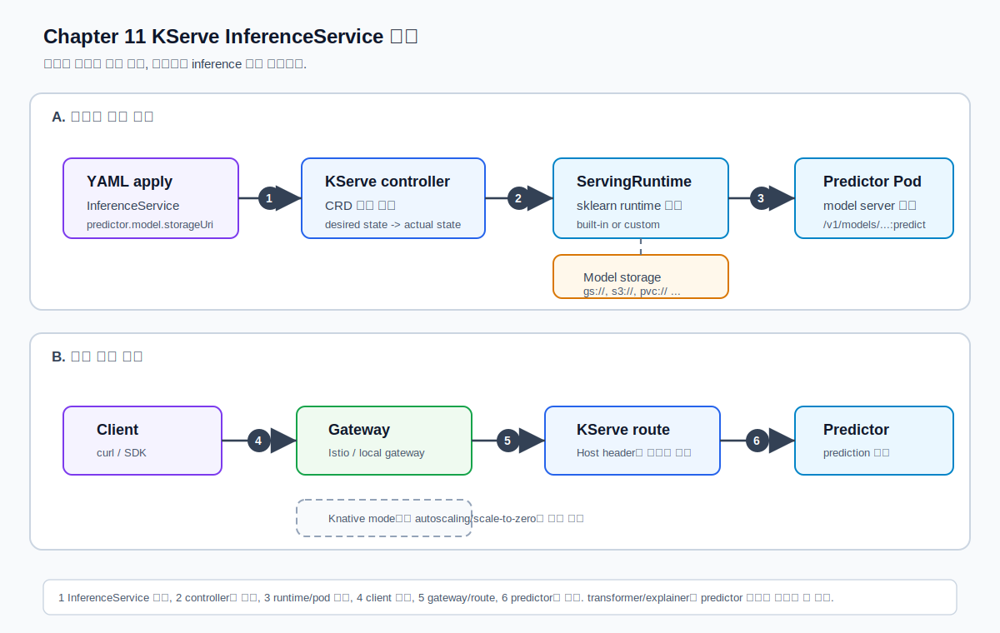

# 11. KServe 입문

챕터 10에서는 `Deployment`, `Service`, `Ingress`, `PVC`를 직접 만들면서 모델 서버를 Kubernetes에 배포했다.
챕터 11에서는 KServe가 그 위에 어떤 추상화를 제공하는지 배운다.

KServe, Knative, Istio, Gateway, cert-manager, runtime 구성은 버전 변화가 잦다.
이 문서는 2026-07-08 기준 KServe 0.18 공식 문서를 바탕으로 작성했다.
핵심 공식 문서는 본문에 바로 연결해 두고, 전체 목록은 [references.md](references.md)에 모아 둔다.

## 학습 목표

- KServe가 제공하는 추상화를 이해한다.
- `InferenceService` 리소스 구조를 학습한다.
- predictor, transformer, explainer 개념을 구분한다.
- built-in runtime과 custom runtime 차이를 이해한다.
- Knative, Istio, Gateway와 KServe의 관계를 정리한다.
- autoscaling과 scale-to-zero 개념을 이해한다.
- KServe 설치 상태를 확인한다.
- sklearn iris 예제 `InferenceService`를 배포한다.
- gateway/Host header 방식으로 endpoint를 호출한다.
- autoscaling 관련 리소스를 관찰한다.

## 추천 진행 순서

1. [../../GLOSSARY.md](../../GLOSSARY.md)에서 KServe, InferenceService, ServingRuntime, Knative, scale-to-zero 용어를 확인한다.
2. [KServe란?](#kserve란)을 읽고 KServe가 Kubernetes 위에서 어떤 역할을 하는지 이해한다.
3. [InferenceService란?](#inferenceservice란)을 읽고 KServe의 핵심 리소스를 이해한다.
4. [KServe가 해주는 일](#kserve가-해주는-일)을 읽고 챕터 10의 직접 Deployment 방식과 비교한다.
5. [KServe 설치 방법](#kserve-설치-방법)을 읽고 현재 cluster에 KServe를 올린다.
6. [scripts/00_install_kserve_quickstart_standard.sh](scripts/00_install_kserve_quickstart_standard.sh)로 학습용 standard mode 설치 명령을 확인하고, 필요하면 직접 실행한다.
7. [scripts/01_check_env.sh](scripts/01_check_env.sh)로 KServe CRD, runtime, gateway 상태를 확인한다.
8. [scripts/02_prepare_namespace.sh](scripts/02_prepare_namespace.sh)로 실습 namespace를 만든다.
9. [scripts/03_apply_sklearn_iris.sh](scripts/03_apply_sklearn_iris.sh)로 sklearn iris `InferenceService`를 배포한다.
10. [scripts/04_wait_and_inspect.sh](scripts/04_wait_and_inspect.sh)로 Ready 상태와 하위 리소스를 확인한다.
11. [scripts/05_prepare_request.sh](scripts/05_prepare_request.sh)로 요청 payload를 확인한다.
12. 필요하면 [scripts/06_port_forward_gateway.sh](scripts/06_port_forward_gateway.sh)를 실행한 터미널을 열어두고 [scripts/07_curl_predict.sh](scripts/07_curl_predict.sh)로 호출한다.
13. [scripts/08_check_autoscaling.sh](scripts/08_check_autoscaling.sh)로 autoscaling 관련 리소스를 확인한다.
14. [templates/lab-notes.md](templates/lab-notes.md)를 보며 결과를 정리하고 [scripts/09_cleanup.sh](scripts/09_cleanup.sh)로 정리한다.

## KServe란?

KServe는 Kubernetes 위에서 모델 서빙을 더 쉽게 선언하고 운영하기 위한 **model serving platform**이다.
조금 풀어 말하면, Kubernetes에 모델 서버를 올릴 때 반복적으로 만들게 되는 `Deployment`, `Service`, routing, runtime 선택, model storage 연결, autoscaling 같은 패턴을 KServe가 `InferenceService`라는 리소스 중심으로 묶어 준다.

챕터 10에서는 우리가 직접 이런 질문에 답해야 했다.

- 어떤 container image를 실행할까?
- Pod는 몇 개 띄울까?
- Service는 어떻게 만들까?
- Ingress나 port-forward는 어떻게 연결할까?
- 모델 파일은 image에 넣을까, PVC에 둘까?
- readiness/liveness probe는 어떻게 잡을까?

KServe를 쓰면 관점이 조금 바뀐다.

- 어떤 **모델**을 serving할까?
- 이 모델은 어떤 **format**인가? 예: sklearn, xgboost, triton, huggingface
- 모델 artifact는 어디에 있는가? 예: `gs://`, `s3://`, `pvc://`
- 어떤 runtime으로 실행할까?
- traffic, revision, autoscaling은 KServe가 어떻게 관리하게 할까?

즉 KServe는 Kubernetes를 대체하지 않는다.
KServe는 Kubernetes 위에 model serving에 특화된 CRD와 controller를 추가해서, 모델 배포를 더 선언적으로 다룰 수 있게 해 준다.

## InferenceService란?

`InferenceService`는 KServe에서 모델 serving endpoint를 만들 때 사용하는 핵심 custom resource다.
Kubernetes 기본 리소스인 `Deployment`가 "이 container를 몇 개 띄워라"에 가깝다면, `InferenceService`는 "이 모델을 이 runtime으로 serving해라"에 가깝다.

이번 챕터에서 배포할 `InferenceService`는 대략 이런 뜻이다.

```yaml
spec:
  predictor:
    model:
      modelFormat:
        name: sklearn
      storageUri: gs://kfserving-examples/models/sklearn/1.0/model
```

이 YAML은 사람 말로 바꾸면 아래와 같다.

```text
sklearn 형식의 모델 artifact가 gs://... 위치에 있으니,
KServe가 sklearn runtime을 사용해서 predictor endpoint를 만들어 줘.
```

여기서 중요한 단어:

| 용어 | 의미 |
| --- | --- |
| `InferenceService` | KServe가 관리하는 모델 serving endpoint 선언 |
| `predictor` | 실제 모델 추론을 수행하는 부분 |
| `modelFormat` | 어떤 runtime이 이 모델을 실행할 수 있는지 알려주는 힌트 |
| `storageUri` | 모델 파일이 있는 위치 |
| `ServingRuntime` | 실제 모델 서버 container를 어떻게 실행할지 정의한 runtime |

처음에는 `InferenceService = 모델 serving endpoint를 만들기 위한 KServe용 YAML`이라고 이해하면 충분하다.

## KServe가 해주는 일

챕터 10에서는 모델 서버를 배포하기 위해 우리가 직접 여러 Kubernetes 리소스를 만들었다.

```text
Deployment + Service + Ingress + PVC + probes + resource 설정
```

KServe에서는 보통 아래처럼 `InferenceService` 하나를 선언한다.

```text
InferenceService
  -> predictor
      -> modelFormat: sklearn
      -> storageUri: gs://...
      -> resources
```

그러면 KServe control plane이 ServingRuntime을 선택하고, 실제 predictor Pod와 routing 리소스를 준비한다.



그림은 위아래가 하나의 긴 실행 순서로 이어지는 것이 아니다.

- A는 `InferenceService`를 적용했을 때 KServe가 predictor Pod와 route를 준비하는 **배포 준비 흐름**이다.
- B는 배포가 Ready가 된 뒤 client 요청이 predictor까지 들어가는 **요청 처리 흐름**이다.
- A의 마지막에 만들어진 predictor Pod가 B에서 실제 요청을 처리한다.

그림의 번호를 실습 명령과 연결하면 아래처럼 읽을 수 있다.

| 번호 | 의미 | 관련 실습 |
| --- | --- | --- |
| 1 | `InferenceService` YAML을 적용한다. | `scripts/03_apply_sklearn_iris.sh` |
| 2 | KServe controller가 선언된 상태를 보고 필요한 하위 리소스를 조정한다. | `scripts/04_wait_and_inspect.sh` |
| 3 | `modelFormat: sklearn`에 맞는 ServingRuntime이 predictor Pod를 실행한다. | `manifests/10-sklearn-iris.yaml` |
| 4 | Client가 gateway로 요청을 보낸다. | `scripts/06_port_forward_gateway.sh` |
| 5 | Host header와 route를 통해 특정 `InferenceService`로 연결된다. | `scripts/07_curl_predict.sh` |
| 6 | predictor가 prediction을 반환한다. | `data/iris-input.json` |

## 챕터 10 방식과 KServe 방식 비교

| 관점 | 직접 Kubernetes Deployment | KServe InferenceService |
| --- | --- | --- |
| 선언 대상 | container와 Kubernetes object | model, runtime, storage URI |
| 사용자가 직접 관리 | Deployment, Service, Ingress, probe, rollout | `InferenceService` spec과 runtime 선택 |
| 장점 | 모든 설정을 직접 통제하기 쉽다. | model serving에 필요한 공통 패턴을 추상화한다. |
| 단점 | 반복되는 YAML과 운영 패턴을 직접 설계해야 한다. | KServe/Knative/Istio/Gateway 설치와 동작 방식을 이해해야 한다. |
| 적합한 실습 | Kubernetes 기본기, custom API server | 표준 model serving abstraction 학습 |

KServe는 Kubernetes를 숨기는 도구라기보다, Kubernetes 위에 model serving용 CRD와 controller를 얹은 도구라고 보는 편이 좋다.

## InferenceService 구조

이번 챕터의 sklearn iris 예제는 아래 구조를 가진다.

```yaml
apiVersion: serving.kserve.io/v1beta1
kind: InferenceService
metadata:
  name: sklearn-iris
  namespace: kserve-test
spec:
  predictor:
    model:
      modelFormat:
        name: sklearn
      storageUri: gs://kfserving-examples/models/sklearn/1.0/model
```

핵심 field:

| field | 의미 |
| --- | --- |
| `kind: InferenceService` | KServe가 관리하는 model serving 리소스 |
| `spec.predictor` | 실제 inference를 수행하는 component |
| `modelFormat.name` | 어떤 runtime이 이 모델을 serving할지 고르는 힌트 |
| `storageUri` | model artifact 위치. storage initializer가 이 위치에서 모델을 가져온다. |
| `resources` | predictor Pod의 CPU/memory/GPU request와 limit |

## predictor, transformer, explainer

| component | 역할 | 처음에는 어떻게 이해할까 |
| --- | --- | --- |
| predictor | 모델 추론을 수행하는 핵심 component | FastAPI/vLLM/NIM에서 실제 `/generate`나 `/predict`를 처리하는 부분 |
| transformer | predictor 앞뒤에서 전처리/후처리를 수행 | request shape 변환, feature engineering, response formatting |
| explainer | 모델 예측 설명을 제공 | 왜 이런 예측이 나왔는지 해석하는 별도 component |

이번 챕터는 predictor만 사용한다.
transformer와 explainer는 개념만 잡고, 실제로는 이후 고급 실습에서 다루는 편이 좋다.

## built-in runtime과 custom runtime

KServe는 sklearn, XGBoost, LightGBM, TensorFlow, Triton, Hugging Face 등 여러 framework runtime을 지원한다.

| 구분 | 의미 | 예시 |
| --- | --- | --- |
| built-in runtime | KServe가 기본 제공하거나 공식 chart/resource로 제공하는 runtime | sklearn, xgboost, triton, huggingface |
| custom runtime | 사용자가 직접 container image와 runtime spec을 정의한 runtime | 사내 model server, 특수 preprocessing 포함 서버 |

처음에는 built-in runtime으로 model serving 흐름을 이해하고, 나중에 custom runtime으로 넘어가는 편이 좋다.

## Standard mode와 Knative mode

KServe 0.18 문서에서는 deployment mode를 크게 standard mode와 Knative mode로 나누어 설명한다.

둘의 가장 큰 차이는 **KServe가 뒤에서 어떤 실행 리소스를 만들고, autoscaling을 누가 담당하는가**다.

| mode | KServe가 뒤에서 만드는 실행 형태 | autoscaling 방식 | scale-to-zero |
| --- | --- | --- | --- |
| Standard mode | Kubernetes `Deployment`, `Service`, `Ingress` 또는 `Gateway` 중심 | Kubernetes HPA 또는 KEDA 같은 표준 Kubernetes scaling 흐름 | HTTP 요청 기준 scale-to-zero를 지원하지 않는다. |
| Knative mode | Knative `Service`, `Revision`, `Route` 중심 | Knative autoscaler가 request/concurrency를 보고 Pod 수를 조정 | traffic이 없으면 Pod를 0까지 줄일 수 있다. |

공식 문서 바로가기:

- [KServe Quickstart Guide](https://kserve.github.io/website/docs/getting-started/quickstart-guide)
- [KServe Kubernetes Deployment Installation Guide, Standard mode](https://kserve.github.io/website/docs/admin-guide/kubernetes-deployment)
- [KServe Knative Serverless Installation Guide](https://kserve.github.io/website/docs/admin-guide/serverless)

이번 장은 `sklearn iris` 예제로 시작한다.
여기서 `sklearn`은 Python 머신러닝 라이브러리인 scikit-learn을 뜻하고, `predictive model`은 "입력 feature를 넣으면 class나 score를 예측하는 전통적인 머신러닝 모델"을 뜻한다.

LLM처럼 token을 길게 생성하는 모델이 아니라, iris 꽃의 feature 값을 넣으면 품종 class를 예측하는 작은 모델이다. 그래서 KServe의 기본 구조를 배우기에 좋다.

챕터 12에서는 같은 KServe 위에서 LLM을 다룬다.
LLM은 GPU, model download, KV cache, cold start가 훨씬 중요하므로 standard mode를 기준으로 보는 편이 더 자연스럽다.

### mode에 따라 autoscaling 결과가 다르게 보이는 이유

같은 `InferenceService`를 배포해도 설치 mode에 따라 뒤에서 만들어지는 리소스가 달라진다.

| 관점 | Standard mode | Knative mode |
| --- | --- | --- |
| 기본 실행 단위 | Kubernetes `Deployment`, `Pod`, `Service` | Knative `ksvc`, `revision`, `route`, 그리고 그 아래 Pod |
| autoscaling 확인 위치 | `Deployment`, `HPA`, Pod replica 수 | `ksvc`, `revision`, `kpa`, Pod replica 수 |
| traffic이 없을 때 | Pod가 계속 떠 있는 구성이 기본 | 설정에 따라 Pod가 0까지 줄어든다 |
| scale from zero | HTTP 요청 기준 scale from zero를 기대하지 않는다 | 첫 요청이 들어오면 0에서 다시 Pod를 띄운다 |

그래서 `scripts/08_check_autoscaling.sh`를 실행했을 때 결과는 이렇게 해석한다.

| 출력 | 해석 |
| --- | --- |
| `Deployment`와 `Pod`는 보이고 `ksvc`가 없다 | standard mode로 설치된 환경이다. 정상이다. |
| `ksvc`, `revision`, `route`, `kpa`가 보인다 | Knative mode로 설치된 환경이다. 정상이다. |
| traffic이 없을 때 Pod가 0이 된다 | Knative scale-to-zero가 동작하는 것이다. |
| standard mode인데 Pod가 0이 되지 않는다 | 정상이다. Standard mode는 요청 기반 scale-to-zero를 기본 목표로 하지 않는다. |

Knative mode의 scale-to-zero는 비용을 줄이는 데 도움이 된다.
대신 0에서 다시 뜰 때 image pull, model download, model loading 시간이 들어간다.
sklearn iris 같은 작은 모델은 이 시간이 짧지만, LLM은 수 GB 이상의 weight를 GPU에 올려야 하므로 첫 요청 latency가 크게 튈 수 있다.

## KServe 설치 방법

Kubernetes cluster는 이미 준비되어 있다고 보고, 그 위에 KServe를 설치하는 흐름까지 함께 정리한다.

2026-07-08 기준 KServe 0.18 공식 Quickstart는 실험용 환경을 만드는 문서다.
운영처럼 오래 유지할 cluster에 설치할 때는 Quickstart만 보지 말고 KServe Admin Guide의 설치 문서를 함께 봐야 한다.

여기서 Admin Guide는 "KServe를 cluster에 설치하고 운영하기 위한 관리자용 문서 묶음"이라고 보면 된다.
그 안에 standard mode 설치, Knative serverless 설치, ingress/gateway, storage, runtime 관련 설정 문서가 나뉘어 있다.

공식 문서 바로가기:

- [KServe Quickstart Guide](https://kserve.github.io/website/docs/getting-started/quickstart-guide)
- [KServe Admin Guide](https://kserve.github.io/website/docs/admin-guide/overview)
- [Standard mode installation](https://kserve.github.io/website/docs/admin-guide/kubernetes-deployment)
- [Knative mode installation](https://kserve.github.io/website/docs/admin-guide/serverless)


| 항목 | 의미 |
| --- | --- |
| `kubectl` | Kubernetes cluster에 명령을 보내는 CLI |
| `helm` | KServe와 관련 dependency를 chart로 설치할 때 사용하는 도구 |
| `git` | KServe repository나 설치 script를 가져올 때 필요 |
| Kubernetes 1.32+ | KServe 0.18 Quickstart 기준 최소 Kubernetes version |
| kind 또는 minikube | local 실험용 cluster 선택지 |
| 기존 Kubernetes cluster | 사내/클라우드 cluster가 이미 있으면 kubeconfig로 연결해서 사용 |

설치 방식은 크게 네 가지로 생각하면 된다.

| 설치 방식 | 언제 쓰나 | 이번 스터디에서의 위치 |
| --- | --- | --- |
| Quickstart standard mode | local/minikube/kind에서 빠르게 KServe를 올려 보고 싶을 때 | 기본 추천 |
| Quickstart Knative mode | scale-to-zero까지 직접 보고 싶을 때 | 선택 실습 |
| Admin Guide 기반 standard 설치 | 운영 또는 사내 cluster에 맞춰 설치할 때 | 운영 학습용 |
| Kubeflow 배포판에 포함된 KServe 사용 | Kubeflow를 함께 공부하거나 이미 Kubeflow가 있을 때 | 설치된 version 확인 필요 |

cluster를 어떻게 준비하느냐도 선택지가 있다.

| 환경 | 적합한 상황 | 주의 |
| --- | --- | --- |
| kind/minikube local cluster | KServe CRD와 sklearn 예제를 빠르게 확인 | local PC resource가 부족하면 image pull이나 Pod 시작이 느릴 수 있음 |
| 기존 사내/클라우드 Kubernetes | 실제 운영 환경과 비슷하게 확인 | cluster 권한, 기존 Istio/Knative/KServe 설치와 충돌 주의 |
| Kubeflow가 이미 설치된 cluster | Kubeflow와 KServe를 함께 공부할 때 | Kubeflow 배포판에 포함된 KServe version을 확인해야 함 |

### 스터디 표준 선택

앞으로 챕터 11, 12에서 계속 쓸 기본 선택은 **KServe Quickstart standard mode**다.

이유:

- 챕터 12에서 LLM을 다룰 때 GPU resource와 긴 요청 처리가 중요하다.
- standard mode는 Kubernetes `Deployment`, `Service`, `Gateway/Ingress`, HPA 흐름과 연결되어 챕터 10에서 배운 내용과 이어진다.
- Knative의 scale-to-zero는 좋은 기능이지만, LLM에서는 cold start가 커질 수 있어 처음 표준 환경으로 두기에는 헷갈릴 수 있다.

Knative mode는 나중에 "scale-to-zero가 실제로 어떻게 보이는지"를 확인하는 선택 실습으로 보는 것이 좋다.

### 설치 전 확인

```bash
kubectl config current-context
kubectl version --output=json
kubectl get nodes -o wide
helm version
git --version
```

확인할 것:

| 명령 | 볼 것 |
| --- | --- |
| `kubectl config current-context` | 내가 설치하려는 cluster가 맞는지 |
| `kubectl version --output=json` | server version이 KServe 0.18 요구사항과 맞는지 |
| `kubectl get nodes -o wide` | node가 Ready인지 |
| `helm version` | Helm chart 설치 가능 여부 |
| `git --version` | KServe repository 기반 설치 script 사용 가능 여부 |

### 학습용 standard mode 설치

먼저 스크립트가 어떤 명령을 실행하려는지 출력만 확인한다.

```bash
bash scripts/00_install_kserve_quickstart_standard.sh
```

실제로 설치하려면 명시적으로 확인 값을 넣는다.

```bash
CONFIRM_INSTALL_KSERVE=true \
bash scripts/00_install_kserve_quickstart_standard.sh
```

이 스크립트는 KServe 공식 Quickstart의 standard mode quick install script를 사용한다.
cluster 전체에 CRD, controller, gateway 관련 리소스를 설치하므로, 사내 공유 cluster에서는 먼저 관리자와 확인해야 한다.

### 설치 후 확인

```bash
kubectl get crd inferenceservices.serving.kserve.io
kubectl get pods -n kserve
kubectl get clusterservingruntime
bash scripts/01_check_env.sh
```

정상 기준:

| 항목 | 정상 기준 |
| --- | --- |
| `InferenceService CRD` | `inferenceservices.serving.kserve.io`가 존재 |
| `kserve` namespace | KServe controller Pod가 Running |
| `ClusterServingRuntime` | sklearn 계열 runtime이 보임 |
| networking layer | gateway 또는 ingress 관련 service가 보임 |

## Knative, Istio, Gateway 관계

처음 보면 KServe, Knative, Istio, Gateway가 모두 비슷한 배포 도구처럼 보일 수 있다.
하지만 실제 관계는 "나란히 있는 도구"라기보다 서로 다른 층을 맡는 구성요소에 가깝다.

한 문장으로 정리하면 아래와 같다.

| 구성요소 | 역할 |
| --- | --- |
| KServe | "이 모델을 serving해 줘"라는 `InferenceService` 선언을 보고 필요한 리소스를 만들어 주는 controller |
| Knative | Knative mode에서 Pod revision, request 기반 autoscaling, scale-to-zero를 담당하는 실행 계층 |
| Istio/Gateway | 외부 HTTP 요청을 cluster 안의 올바른 service/route로 보내는 네트워크 입구 |

즉 KServe는 요청이 지나가는 길 자체라기보다, 그 길과 실행 리소스를 만들어 주는 쪽에 가깝다.

```text
사용자가 작성한 YAML
  -> InferenceService
  -> KServe controller가 읽음
  -> predictor Pod, Service, Route/Gateway 관련 리소스를 준비
```

요청이 들어올 때는 이렇게 흐른다.

```text
client
  -> Gateway 또는 Istio ingress
  -> KServe가 준비한 route
  -> Kubernetes Service 또는 Knative Route
  -> predictor Pod
  -> model server
```

mode에 따라 중간 계층이 달라진다.

| mode | KServe가 주로 만드는 실행 리소스 | 요청 흐름 |
| --- | --- | --- |
| Standard mode | Kubernetes `Deployment`, `Service`, `Ingress` 또는 `Gateway` 관련 리소스 | Gateway/Ingress -> Service -> predictor Pod |
| Knative mode | Knative `Service`, `Revision`, `Route` | Gateway/Istio -> Knative Route -> Revision Pod |

그래서 standard mode에서는 Knative가 필수 흐름에 들어가지 않는다.
반대로 Knative mode에서는 KServe가 Knative 리소스를 만들고, Knative가 revision과 scale-to-zero를 관리한다.

Istio와 Gateway는 "외부 요청이 어디로 들어오고, 어떤 service로 갈지"를 담당한다.
local cluster에서는 보통 DNS가 없기 때문에 gateway service를 `localhost`로 port-forward한 뒤 요청한다.

이때 `Host` header가 중요하다.

```text
TCP 연결 대상: 127.0.0.1:8080
실제 보내고 싶은 대상: sklearn-iris.kserve-test.example.com
```

gateway 입장에서는 `127.0.0.1:8080`으로 들어온 요청만 보고는 어떤 `InferenceService`로 보내야 할지 알 수 없다.
그래서 `Host: sklearn-iris.kserve-test...` 같은 header를 넣어 "이 요청은 sklearn-iris InferenceService로 보내 줘"라고 알려준다.

정리하면:

| 질문 | 답 |
| --- | --- |
| KServe가 모델 서버인가? | 아니다. 모델 서버를 직접 구현하는 것이 아니라, 모델 서버 리소스를 선언적으로 만들고 관리하는 controller에 가깝다. |
| Knative는 항상 필요한가? | 아니다. Knative mode에서 필요하다. Standard mode에서는 Kubernetes Deployment/Service 흐름을 중심으로 본다. |
| Istio/Gateway는 무엇을 하나? | 외부 HTTP 요청을 cluster 내부의 올바른 route/service로 연결한다. |
| Host header는 왜 필요한가? | gateway가 여러 `InferenceService` 중 어느 곳으로 보낼지 hostname 기준으로 판단하기 때문이다. |

## 실습

### 1. 환경 확인

```bash
cd ~/study/model-serving/chapters/11-kserve-intro
bash scripts/01_check_env.sh
```

확인할 것:

- `kubectl`이 현재 KServe cluster를 바라보는가?
- `inferenceservices.serving.kserve.io` CRD가 있는가?
- `ClusterServingRuntime`에 sklearn runtime이 보이는가?
- Knative/Istio gateway를 쓰는 환경인가?

### 2. namespace 준비

```bash
bash scripts/02_prepare_namespace.sh
```

KServe 공식 튜토리얼은 control plane namespace가 아닌 별도 namespace에 `InferenceService`를 배포한다.

### 3. sklearn iris InferenceService 배포

```bash
bash scripts/03_apply_sklearn_iris.sh
```

적용되는 manifest:

| 파일 | 역할 |
| --- | --- |
| [manifests/00-namespace.yaml](manifests/00-namespace.yaml) | 실습 namespace |
| [manifests/10-sklearn-iris.yaml](manifests/10-sklearn-iris.yaml) | sklearn iris InferenceService |

### 4. Ready 상태 확인

```bash
bash scripts/04_wait_and_inspect.sh
```

볼 것:

- `InferenceService`가 `READY True`인가?
- `.status.url`이 생겼는가?
- predictor Pod가 떠 있는가?
- Knative mode라면 `ksvc`, `revision`, `route`가 보이는가?

### 5. 요청 payload 확인

```bash
bash scripts/05_prepare_request.sh
```

`data/iris-input.json`은 두 개의 iris feature row를 포함한다.

```json
{
  "instances": [
    [6.8, 2.8, 4.8, 1.4],
    [6.0, 3.4, 4.5, 1.6]
  ]
}
```

### 6. gateway port-forward

외부 LoadBalancer나 DNS가 없다면 터미널 1에서 gateway를 port-forward한다.

```bash
bash scripts/06_port_forward_gateway.sh
```

이 터미널은 열어 둔다.

### 7. predict 호출

터미널 2에서:

```bash
bash scripts/07_curl_predict.sh
```

정상이라면 `predictions`가 포함된 JSON 응답이 온다.

### 8. autoscaling 확인

```bash
bash scripts/08_check_autoscaling.sh
```

볼 것:

- Knative mode라면 `ksvc`, `revision`, autoscaling 관련 리소스가 보이는가?
- traffic이 없을 때 Pod 수가 줄어드는가?
- standard mode라면 어떤 Deployment/Pod 상태로 유지되는가?

### 9. 정리

```bash
bash scripts/09_cleanup.sh
```

가상환경을 켜둔 상태라면:

```bash
deactivate
```

## 확인 질문

| 질문 | 정리 |
| --- | --- |
| KServe는 Kubernetes를 대체하는가, 아니면 Kubernetes 위에 model serving abstraction을 추가하는가? | Kubernetes를 대체하지 않는다. KServe는 Kubernetes 위에 `InferenceService`, `ServingRuntime` 같은 CRD와 controller를 추가해 모델 서빙 패턴을 더 선언적으로 다루게 해 준다. |
| `InferenceService`와 일반 `Deployment`의 선언 관점은 어떻게 다른가? | Deployment는 container image, replica, probe 같은 Pod 실행 방식을 직접 선언한다. InferenceService는 모델 format, storage URI, predictor 같은 모델 서빙 의도를 선언하고, KServe가 runtime과 하위 리소스를 준비한다. |
| `predictor`, `transformer`, `explainer` 중 이번 실습에서 실제로 쓴 것은 무엇인가? | 이번 실습에서는 predictor만 사용했다. predictor는 실제 모델 추론을 수행하는 component다. transformer는 전처리/후처리, explainer는 예측 설명을 위한 component다. |
| `modelFormat.name`은 왜 필요한가? | KServe가 이 모델을 어떤 ServingRuntime으로 실행할지 판단하는 힌트다. 예를 들어 `sklearn`이면 sklearn을 지원하는 runtime을 선택해야 한다. |
| `storageUri`가 잘못되면 어떤 단계에서 실패할까? | storage initializer 또는 predictor Pod 시작 단계에서 모델 artifact를 가져오지 못해 Ready가 되지 않는다. 이때 InferenceService describe, Pod event, init container logs를 확인한다. |
| built-in runtime과 custom runtime은 언제 각각 선택할까? | sklearn, xgboost, triton처럼 KServe가 제공하는 framework면 built-in runtime으로 시작한다. 사내 모델 서버, 특수 API, custom preprocessing이 필요하면 custom runtime을 정의한다. |
| Knative mode의 scale-to-zero는 어떤 workload에 유리하고, LLM에는 왜 조심해야 할까? | 요청이 드문 CPU predictive model에는 비용 절감에 유리하다. 하지만 LLM은 model loading 시간이 길고 GPU 자원을 쓰므로 scale-to-zero 후 cold start가 매우 커질 수 있다. |
| gateway 호출에서 `Host` header가 필요한 이유는 무엇인가? | local port-forward에서는 TCP 연결 대상이 `127.0.0.1`이지만, gateway는 Host header를 보고 어떤 InferenceService route로 보낼지 결정한다. 그래서 status.url의 hostname을 Host header로 넣어야 한다. |

## 다음 챕터에서 이어질 내용

이번 챕터에서는 sklearn 같은 작은 predictive model로 KServe의 기본 추상화를 익혔다.
다음 챕터에서는 KServe로 LLM을 serving할 때 달라지는 점을 다룬다.
특히 vLLM custom runtime, Hugging Face model URI, storage initializer, GPU resource request, OpenAI-compatible endpoint, autoscaling 정책을 챕터 10/11에서 배운 개념과 연결해 본다.
