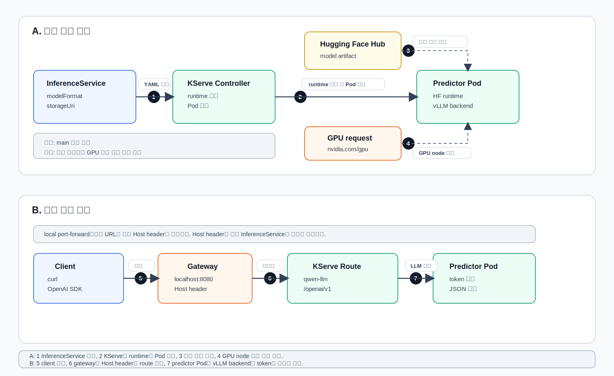

# 12. KServe로 LLM 서빙

챕터 11에서는 KServe `InferenceService`로 sklearn iris 같은 작은 predictive model을 배포했다.  
챕터 12에서는 같은 KServe abstraction을 LLM에 적용한다.

KServe의 generative inference, Hugging Face runtime, vLLM backend, Gateway, autoscaling 정책은 버전 변화가 잦다.  
이 문서는 2026-07-08 기준 KServe 0.18 공식 문서를 바탕으로 작성했다.  
실습 전 [references.md](references.md)의 공식 문서를 다시 확인한다.

## 학습 목표

- KServe에서 LLM을 서빙할 때 predictive model과 다른 제약을 이해한다.
- KServe Hugging Face runtime과 vLLM backend의 관계를 이해한다.
- custom runtime으로 vLLM을 올리는 방식이 언제 필요한지 학습한다.
- Hugging Face model URI와 storage initializer 개념을 이해한다.
- GPU resource request를 어디에 쓰는지 정리한다.
- 일반 Kubernetes Deployment와 KServe 방식의 차이를 비교한다.
- KServe `InferenceService`로 LLM을 배포한다.
- OpenAI-compatible endpoint를 `curl`과 OpenAI SDK로 호출한다.
- autoscaling 정책을 관찰하고 LLM에서 scale-to-zero가 조심스러운 이유를 이해한다.

## 추천 진행 순서

1. [../../GLOSSARY.md](../../GLOSSARY.md)에서 `Hugging Face Runtime`, `storageUri`, `storage initializer`, `OpenAI-compatible API`, `GPU request`를 확인한다.
2. [KServe에서 LLM은 무엇이 다른가](#kserve에서-llm은-무엇이-다른가)를 읽고 LLM serving의 제약을 먼저 잡는다.
3. [KServe LLM 배포 흐름](#kserve-llm-배포-흐름)을 보고 `InferenceService -> runtime -> vLLM backend -> OpenAI-compatible endpoint` 흐름을 이해한다.
4. [references.md](references.md)에서 공식 문서와 업데이트 가능성이 큰 부분을 확인한다.
5. [scripts/01_check_env.sh](scripts/01_check_env.sh)로 KServe, runtime, GPU, gateway 상태를 확인한다.
6. [scripts/02_prepare_namespace.sh](scripts/02_prepare_namespace.sh)로 실습 namespace를 만든다.
7. gated/private Hugging Face model을 쓸 경우 [scripts/03_create_hf_secret.sh](scripts/03_create_hf_secret.sh)로 token secret을 준비한다.
8. [scripts/04_apply_qwen_llm.sh](scripts/04_apply_qwen_llm.sh)로 Qwen LLM `InferenceService`를 배포한다.
9. [scripts/05_wait_and_inspect.sh](scripts/05_wait_and_inspect.sh)로 Ready 상태와 실패 원인을 확인한다.
10. [scripts/06_port_forward_gateway.sh](scripts/06_port_forward_gateway.sh)를 별도 터미널에 열어두고 [scripts/07_curl_chat.sh](scripts/07_curl_chat.sh)로 호출한다.
11. `.venv`를 만든 뒤 [scripts/08_openai_client.sh](scripts/08_openai_client.sh)로 OpenAI SDK 호출을 확인한다.
12. [scripts/09_check_autoscaling.sh](scripts/09_check_autoscaling.sh)로 scaling 관련 리소스를 관찰한다.
13. [scripts/10_preview_custom_runtime.sh](scripts/10_preview_custom_runtime.sh)로 custom vLLM runtime 예시 구조를 읽는다.
14. [templates/lab-notes.md](templates/lab-notes.md)를 보며 결과를 정리하고 [scripts/11_cleanup.sh](scripts/11_cleanup.sh)로 정리한다.

## KServe에서 LLM은 무엇이 다른가

챕터 11의 sklearn iris 모델은 작고 빠르다.  
모델 파일도 작고, CPU로도 충분히 실행할 수 있고, 요청 하나가 보통 짧은 numerical prediction이다.

LLM은 성격이 다르다.

| 관점 | 작은 predictive model | LLM serving |
| --- | --- | --- |
| 모델 크기 | MB 단위도 흔함 | 수 GB 이상이 흔함 |
| 실행 장치 | CPU로도 충분한 경우 많음 | GPU가 사실상 필요 |
| 요청 크기 | feature vector 중심 | prompt token 수가 매번 달라짐 |
| 응답 방식 | 한 번에 prediction 반환 | token을 여러 번 생성, streaming 가능 |
| 메모리 | model weight 중심 | model weight + KV cache가 중요 |
| cold start | 비교적 짧음 | image pull, model download, GPU loading 때문에 길 수 있음 |
| autoscaling | scale-to-zero가 잘 맞는 경우 많음 | 첫 요청 지연 때문에 신중하게 결정 |

그래서 KServe에서 LLM을 배포할 때는 `InferenceService`만 외우면 부족하다.  
아래 질문을 같이 확인해야 한다.

- 이 cluster에 GPU node가 있는가?
- NVIDIA Device Plugin이 설치되어 `nvidia.com/gpu` resource가 보이는가?
- 모델을 Hugging Face Hub에서 받을 수 있는가?
- gated/private model이면 `HF_TOKEN`이 준비되어 있는가?
- model weight와 KV cache가 GPU memory에 들어가는가?
- gateway를 통해 OpenAI-compatible endpoint를 어떻게 호출할 것인가?
- scale-to-zero를 켜도 첫 요청 지연을 감당할 수 있는가?

## KServe LLM 배포 흐름

KServe 0.18의 generative inference 문서에서는 Hugging Face runtime이 vLLM backend를 사용해 LLM을 serving하는 흐름을 안내한다.  
즉 이번 실습에서는 직접 `vllm serve ...` container를 만드는 대신, KServe의 `InferenceService` 안에서 `modelFormat: huggingface`를 선언한다.



그림은 두 개의 흐름으로 나누어 읽는다.  
위쪽 A는 배포 준비이고, 아래쪽 B는 실제 요청 호출이다.  
두 흐름은 하나의 긴 화살표로 이어지는 것이 아니라, A에서 준비된 predictor Pod가 B에서 요청을 처리한다고 보면 된다.

| 구간 | 의미 | 관련 파일 |
| --- | --- | --- |
| A. 배포 준비 흐름 | `InferenceService`를 적용하면 KServe controller가 Hugging Face runtime과 predictor Pod를 준비한다. | [manifests/10-qwen-llm-inferenceservice.yaml](manifests/10-qwen-llm-inferenceservice.yaml) |
| B. 요청 처리 흐름 | 배포가 Ready가 된 뒤 client가 gateway를 통해 OpenAI-compatible API를 호출한다. | [scripts/07_curl_chat.sh](scripts/07_curl_chat.sh), [client/08_openai_client.py](client/08_openai_client.py) |

번호를 실습 명령과 연결하면 아래와 같다.

| 번호 | 의미 | 관련 실습 |
| --- | --- | --- |
| 1 | `InferenceService` YAML을 적용한다. | `scripts/04_apply_qwen_llm.sh` |
| 2 | KServe controller가 runtime과 predictor Pod를 조정한다. | `scripts/05_wait_and_inspect.sh` |
| 3 | `hf://...` 모델 URI를 보고 Hugging Face Hub에서 model artifact를 준비한다. | `storageUri`, `scripts/03_create_hf_secret.sh` |
| 4 | `nvidia.com/gpu: 1` request를 보고 GPU가 있는 node에 배치할 조건을 만든다. | manifest `resources` |
| 5 | client가 gateway로 요청을 보낸다. | `scripts/06_port_forward_gateway.sh` |
| 6 | Host header와 route로 특정 `InferenceService`를 찾고 `/openai/v1/chat/completions`로 연결한다. | `scripts/07_curl_chat.sh` |
| 7 | predictor Pod의 vLLM backend가 token을 생성해 JSON 응답을 반환한다. | `client/08_openai_client.py` |

그림에서 점선은 main request path가 아니라 보조 조건을 뜻한다.  
`Hugging Face Hub`는 모델 파일을 어디서 가져오는지, `GPU request`는 Pod가 어떤 node에 배치될 수 있는지를 설명한다.

## built-in runtime과 custom runtime

챕터 체크리스트에 "custom runtime으로 vLLM을 올리는 방식"이 있다.  
다만 처음 실습에서 바로 custom runtime부터 만들면 KServe 자체 흐름이 잘 안 보일 수 있다.

그래서 이번 장은 두 단계로 이해한다.

| 방식 | 설명 | 이번 장에서의 위치 |
| --- | --- | --- |
| Hugging Face built-in runtime | KServe가 제공하는 Hugging Face runtime을 사용하고, 내부 backend로 vLLM을 사용한다. | 실제 실습 |
| vLLM custom runtime | 직접 만든 vLLM image와 ServingRuntime/ClusterServingRuntime을 연결한다. | 선택 실습으로 구조 확인 |

처음에는 built-in Hugging Face runtime으로 LLM 배포와 호출 흐름을 익히는 것이 좋다.  
custom runtime은 다음과 같은 경우에 필요해진다.

- 사내 표준 vLLM image를 써야 한다.
- vLLM 실행 옵션, plugin, model path, logging 방식을 세밀하게 통제해야 한다.
- 사내 인증, private registry, custom entrypoint가 필요하다.
- KServe built-in runtime이 원하는 model architecture나 옵션을 아직 지원하지 않는다.

선택 실습으로 [manifests/20-vllm-custom-runtime-example.yaml](manifests/20-vllm-custom-runtime-example.yaml)을 둔다.  
이 파일은 바로 적용하는 manifest가 아니라 custom runtime의 구조를 읽기 위한 예시다.

```bash
bash scripts/10_preview_custom_runtime.sh
```

여기서 볼 것은 네 가지다.

| field | 의미 |
| --- | --- |
| `kind: ServingRuntime` | namespace 안에서만 쓰는 KServe runtime 정의 |
| `supportedModelFormats` | 이 runtime이 어떤 model format을 처리할 수 있는지 선언 |
| `containers.image` | 실제로 실행할 vLLM server image |
| `containers.args` | `vllm serve`에 해당하는 실행 옵션 |

## `storageUri: hf://...`가 의미하는 것

이번 manifest에는 아래 설정이 들어 있다.

```yaml
storageUri: "hf://Qwen/Qwen2.5-0.5B-Instruct"
```

이 값은 "모델 파일이 Hugging Face Hub의 `Qwen/Qwen2.5-0.5B-Instruct` repository에 있다"는 뜻이다.  
KServe는 이 URI를 보고 storage initializer 또는 runtime 쪽 다운로드 흐름을 통해 모델 artifact를 준비한다.

주의할 점:

- public model이면 token 없이 받을 수 있는 경우가 많다.
- gated/private model이면 Hugging Face token이 필요하다.
- 모델 이름은 마음대로 지어 쓰는 별명이 아니라 Hugging Face model page의 repository 이름이다.
- license, gated 여부, 권장 GPU memory는 model card에서 확인해야 한다.
- 폐쇄망에서는 Hugging Face Hub에 직접 접근할 수 없으므로 사내 object storage, PVC, image pre-baking, local model cache 전략이 필요하다.

## GPU resource request

manifest의 이 부분이 GPU scheduling과 관련된다.

```yaml
resources:
  requests:
    nvidia.com/gpu: "1"
  limits:
    nvidia.com/gpu: "1"
```

이 설정은 "이 predictor Pod는 GPU 1개가 필요하다"는 뜻이다.  
Kubernetes scheduler는 `nvidia.com/gpu` allocatable resource가 있는 node에 Pod를 배치하려고 한다.

GPU request가 동작하려면 아래 조건이 필요하다.

- GPU가 있는 node가 cluster에 있어야 한다.
- NVIDIA driver가 host에 설치되어 있어야 한다.
- NVIDIA Device Plugin이 cluster에 설치되어 있어야 한다.
- `kubectl describe nodes`에서 `nvidia.com/gpu` capacity/allocatable이 보여야 한다.
- container runtime이 GPU device를 container에 전달할 수 있어야 한다.

## 일반 Kubernetes Deployment와 KServe 방식 비교

| 관점 | Kubernetes Deployment로 직접 vLLM 배포 | KServe InferenceService로 LLM 배포 |
| --- | --- | --- |
| 선언 대상 | container image, command, Service, Ingress | model format, storage URI, resources |
| vLLM 실행 | 직접 `vllm serve` 옵션을 관리 | Hugging Face runtime이 vLLM backend를 사용 |
| routing | Service/Ingress/Gateway를 직접 설계 | KServe route와 Host header 흐름 사용 |
| model download | Dockerfile, PVC, initContainer 등을 직접 설계 | `storageUri`와 storage initializer/runtime 흐름 사용 |
| 장점 | 모든 것을 직접 통제하기 쉽다. | 모델 serving 표준 abstraction과 KServe 기능을 활용한다. |
| 단점 | 운영 패턴을 직접 만들어야 한다. | KServe runtime, gateway, CRD 동작을 이해해야 한다. |

## 실습 전 확인

이 장은 CPU laptop에서 그대로 끝까지 실행하기 어렵다.  
최소한 KServe가 설치된 Kubernetes cluster와 GPU node가 필요하다.

```bash
cd ~/study/model-serving/chapters/12-kserve-llm-serving
bash scripts/01_check_env.sh
```

확인할 것:

- `inferenceservices.serving.kserve.io` CRD가 있는가?
- `clusterservingruntime` 목록에 Hugging Face runtime이 보이는가?
- node resource에 `nvidia.com/gpu`가 보이는가?
- gateway service를 port-forward할 수 있는가?

GPU가 없으면 이번 장의 manifest는 Pending 상태에 머무를 수 있다.  
그 경우에도 `FailedScheduling` event를 보면서 "왜 GPU request가 충족되지 않는지"를 확인하는 것까지는 의미 있는 실습이다.

## 실습

### 1. namespace 준비

```bash
bash scripts/02_prepare_namespace.sh
```

KServe 공식 문서는 control plane namespace에 `InferenceService`를 배포하지 말라고 안내한다.  
이번 장은 `kserve-llm` namespace를 따로 사용한다.

### 2. Hugging Face token 준비

public model만 사용할 때는 건너뛰어도 된다.

```bash
export HF_TOKEN=hf_your_token
bash scripts/03_create_hf_secret.sh
```

이번 실습 모델인 `Qwen/Qwen2.5-0.5B-Instruct`는 작은 공개 모델을 예시로 둔다.  
다른 gated/private model을 쓰려면 model card에서 사용 조건을 확인하고 token을 준비해야 한다.

### 3. LLM InferenceService 배포

```bash
bash scripts/04_apply_qwen_llm.sh
```

적용되는 핵심 YAML:

```yaml
modelFormat:
  name: huggingface
storageUri: "hf://Qwen/Qwen2.5-0.5B-Instruct"
args:
  - --model_name=qwen
resources:
  requests:
    nvidia.com/gpu: "1"
```

`--model_name=qwen`은 OpenAI-compatible request에서 사용할 model 이름이다.  
그래서 요청 JSON에도 `"model": "qwen"`을 넣는다.

### 4. Ready 상태 확인

```bash
bash scripts/05_wait_and_inspect.sh
```

자주 보는 상태:

| 증상 | 볼 부분 | 가능한 원인 |
| --- | --- | --- |
| `Pending` | events의 `FailedScheduling` | GPU node 없음, GPU resource 부족 |
| `ImagePullBackOff` | pod describe, image name | runtime image pull 실패 |
| init container 실패 | storage initializer log/event | model download 실패, token 필요, 네트워크 차단 |
| `OOMKilled` | pod status, container restart | memory limit 부족 |
| Ready가 오래 걸림 | pod log, model download 시간 | model weight 다운로드와 loading 중 |

### 5. gateway port-forward

별도 터미널을 열고 실행한다.

```bash
bash scripts/06_port_forward_gateway.sh
```

이 터미널은 계속 열어둔다.  
local에서는 보통 `127.0.0.1:8080`으로 gateway를 호출한다.

### 6. curl로 OpenAI-compatible API 호출

다른 터미널에서 실행한다.

```bash
bash scripts/07_curl_chat.sh
```

이 스크립트가 하는 일:

- `InferenceService`의 `.status.url`에서 hostname을 가져온다.
- `Host: qwen-llm.kserve-llm...` header를 붙인다.
- `/openai/v1/chat/completions`로 요청을 보낸다.
- [data/chat-input.json](data/chat-input.json)의 prompt를 사용한다.

성공하면 `choices[0].message.content`와 `usage.prompt_tokens`, `usage.completion_tokens` 같은 값을 확인할 수 있다.

### 7. OpenAI SDK로 호출

Python client 실습은 이 챕터 안에 별도 `.venv`를 만든다.

```bash
python3 -m venv .venv
source .venv/bin/activate
pip install -r requirements.txt
bash scripts/08_openai_client.sh
```

끝나면 가상환경에서 나온다.

```bash
deactivate
```

OpenAI SDK를 쓸 때도 KServe gateway를 거치면 Host header가 필요하다.  
[client/08_openai_client.py](client/08_openai_client.py)는 `default_headers={"Host": SERVICE_HOSTNAME}`으로 이 값을 넣는다.

### 8. autoscaling 확인

```bash
bash scripts/09_check_autoscaling.sh
```

LLM에서 autoscaling은 단순히 "Pod를 줄이면 비용이 줄어든다"로만 보면 위험하다.

- scale-out은 더 많은 요청을 처리하는 데 도움이 된다.
- 하지만 replica마다 model weight를 올릴 GPU memory가 필요하다.
- scale-to-zero는 idle 비용을 줄일 수 있다.
- 하지만 다시 scale-from-zero할 때 model download/loading 때문에 첫 요청 latency가 커질 수 있다.

운영에서는 latency SLO, GPU 비용, 모델 크기, traffic pattern을 같이 보고 결정한다.

### 9. 정리

```bash
bash scripts/11_cleanup.sh
```

Python `.venv`가 켜져 있으면 나온다.

```bash
deactivate
```

## 확인 질문과 정리

| 질문 | 정리 |
| --- | --- |
| KServe에서 LLM은 왜 작은 sklearn 예제보다 까다로운가? | 모델 weight가 크고 GPU/KV cache/model download 시간이 중요해서 resource, cold start, autoscaling 판단이 더 어렵다. |
| `modelFormat: huggingface`는 무엇을 의미하는가? | KServe가 Hugging Face runtime을 사용해 모델을 serving하라는 힌트다. KServe generative runtime은 vLLM backend를 사용한다. |
| `storageUri: hf://...`는 무엇인가? | Hugging Face Hub의 model repository에서 artifact를 가져오라는 URI다. private/gated model은 token이 필요할 수 있다. |
| `--model_name=qwen`과 요청 JSON의 `"model": "qwen"`은 왜 맞춰야 하나? | runtime이 OpenAI-compatible API에서 이 이름으로 모델을 노출하기 때문이다. |
| GPU request는 어디에 쓰이는가? | scheduler가 GPU node에 Pod를 배치하고 runtime이 GPU용 실행 경로를 선택하는 데 영향을 준다. |
| KServe 방식과 직접 Deployment 방식의 핵심 차이는? | 직접 Deployment는 container 중심이고, KServe는 model/runtime/storage URI 중심이다. |
| LLM에서 scale-to-zero는 항상 좋은가? | 아니다. idle 비용은 줄지만 model loading 때문에 첫 요청 latency가 크게 늘 수 있다. |

## 다음 챕터에서 이어질 내용

챕터 13에서는 KServe 여부와 관계없이 LLM serving에서 자주 만나는 고급 주제를 다룬다.

- quantization: AWQ, GPTQ, bitsandbytes
- tensor parallelism과 pipeline parallelism
- multi-LoRA serving
- speculative decoding
- prompt cache와 response cache
- rate limiting과 authentication
- multi-tenant serving 고려사항

챕터 12를 마치면 "KServe로 LLM endpoint를 만들 수 있다"까지 온 것이다.  
챕터 13부터는 "그 endpoint를 더 빠르고, 싸고, 안전하게 운영하려면 무엇을 조정해야 하는가"로 넘어간다.
