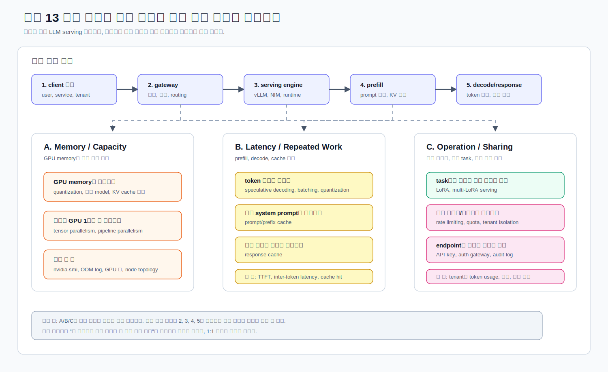
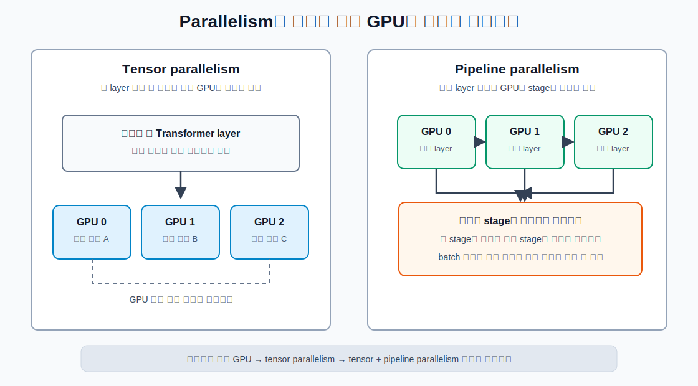

# 13. 고급 서빙 주제

챕터 13은 지금까지 배운 내용을 바탕으로 LLM serving에서 자주 만나는 고급 주제를 정리한다.  
이 장의 목표는 모든 기능을 운영 환경 수준으로 완벽하게 쓰는 것이 아니라, **어떤 문제가 생겼을 때 어떤 종류의 해결책을 검토해야 하는지**를 잡는 것이다.

vLLM quantization, LoRA, speculative decoding, prefix caching, parallelism 관련 옵션은 버전 변화가 잦다.  
이 문서는 2026-07-08 기준 vLLM latest developer preview 문서와 NGINX 공식 문서를 바탕으로 작성했다.

## 학습 목표

- quantization: AWQ, GPTQ, bitsandbytes 차이를 이해한다.
- tensor parallelism과 pipeline parallelism의 차이를 정리한다.
- multi-LoRA serving이 해결하는 문제를 이해한다.
- speculative decoding이 decode latency를 줄이는 원리를 이해한다.
- model warmup이 왜 필요한지 정리한다.
- prompt cache와 response cache 차이를 이해한다.
- rate limiting을 어디에 두고 무엇을 보호하는지 설계한다.
- authentication과 API key 관리 방식을 정리한다.
- multi-tenant serving에서 어떤 격리 기준이 필요한지 이해한다.
- quantized model serving, LoRA adapter serving, rate limit 실습을 진행한다.

## 추천 진행 순서

1. [../../GLOSSARY.md](../../GLOSSARY.md)에서 quantization, LoRA, speculative decoding, tensor parallelism, rate limiting 용어를 확인한다.
2. [문제별 해결 전략](#문제별-해결-전략)을 보고 각 기술이 해결하는 병목을 먼저 잡는다.
3. [공식 문서 바로가기](#공식-문서-바로가기)에서 vLLM/NGINX 문서의 확인 위치를 먼저 본다.
4. [Quantization](#quantization)을 읽고 AWQ, GPTQ, bitsandbytes 차이를 이해한다.
5. [Parallelism](#parallelism)을 읽고 tensor parallelism과 pipeline parallelism을 구분한다.
6. [LoRA와 multi-LoRA serving](#lora와-multi-lora-serving)을 읽고 adapter serving 흐름을 이해한다.
7. [Speculative decoding](#speculative-decoding)을 읽고 draft/verify 구조를 이해한다.
8. [Cache와 warmup](#cache와-warmup)을 읽고 prompt cache, response cache, warmup 차이를 정리한다.
9. [Traffic control](#traffic-control)을 읽고 rate limiting, auth, multi-tenant 기준을 잡는다.
10. [scripts/01_check_env.sh](scripts/01_check_env.sh)로 실습 가능 환경을 확인한다.
11. [scripts/02_run_quantized_vllm.sh](scripts/02_run_quantized_vllm.sh)와 [scripts/03_call_chat.sh](scripts/03_call_chat.sh)로 quantized model serving 흐름을 확인한다.
12. [scripts/04_run_lora_vllm.sh](scripts/04_run_lora_vllm.sh)와 [scripts/05_call_lora.sh](scripts/05_call_lora.sh)로 LoRA adapter serving 흐름을 확인한다.
13. [scripts/06_preview_parallelism.sh](scripts/06_preview_parallelism.sh), [scripts/07_preview_speculative_and_cache.sh](scripts/07_preview_speculative_and_cache.sh)로 옵션을 읽는다.
14. [scripts/08_preview_rate_limit_config.sh](scripts/08_preview_rate_limit_config.sh), [scripts/09_run_nginx_rate_limit.sh](scripts/09_run_nginx_rate_limit.sh)로 rate limiting 구조를 실습한다.
15. [templates/lab-notes.md](templates/lab-notes.md)에 결과를 정리하고 [scripts/10_cleanup.sh](scripts/10_cleanup.sh)로 정리한다.

## 공식 문서 바로가기

고급 기능은 vLLM version과 GPU architecture에 따라 동작이 바뀔 수 있다.  
본문을 읽다가 옵션을 실제로 쓰려면 아래 문서를 먼저 확인한다.

| 문서 | 바로 볼 부분 |
| --- | --- |
| [vLLM Quantization](https://docs.vllm.ai/en/latest/features/quantization/) | 지원 quantization format, hardware compatibility, memory trade-off |
| [vLLM LoRA Adapters](https://docs.vllm.ai/en/latest/features/lora/) | `--enable-lora`, `--lora-modules`, LoRA adapter 호출 방식, dynamic LoRA 보안 경고 |
| [vLLM Parallelism and Scaling](https://docs.vllm.ai/en/latest/serving/parallelism_scaling/) | 단일 GPU, tensor parallelism, pipeline parallelism 선택 기준 |
| [vLLM Speculative Decoding](https://docs.vllm.ai/en/latest/features/speculative_decoding/) | draft/verify 구조, speculative config, workload 조건 |
| [vLLM Automatic Prefix Caching](https://docs.vllm.ai/en/latest/features/automatic_prefix_caching/) | 같은 prefix를 공유할 때 KV cache를 재사용하는 원리 |
| [NGINX request limiting](https://docs.nginx.com/nginx/admin-guide/security-controls/controlling-access-proxied-http/) | `limit_req_zone`, `limit_req`, proxy 앞단 제한 방식 |

## 이 장을 읽는 법

챕터 13은 고급 주제를 한 번에 모두 마스터하자는 장이 아니다.  
처음에는 "문제가 생겼을 때 어떤 카드를 꺼내 볼 수 있는가"를 익히는 장으로 보면 된다.

| 우선순위 | 주제 | 왜 먼저 보는가 |
| --- | --- | --- |
| 필수 | quantization, warmup, prompt/prefix cache, rate limiting, authentication | 실제 LLM serving을 시작하면 가장 빨리 만나는 문제다. memory, latency, 비용, 보안과 바로 연결된다. |
| 중요 | tensor parallelism, multi-LoRA serving, tenant별 usage 관리 | 모델이 커지거나 여러 팀이 함께 쓰기 시작하면 필요해진다. |
| 심화 | pipeline parallelism, speculative decoding, runtime LoRA loading | workload와 infra 조건을 많이 타므로 개념을 먼저 잡고 필요할 때 깊게 들어간다. |

실습도 같은 기준으로 보면 된다.

| 실습 | 성격 | 준비 조건 |
| --- | --- | --- |
| quantized model serving | 실행형 실습 | GPU, Docker, vLLM image, 지원되는 quantized model |
| LoRA adapter serving | 조건부 실습 | base model과 adapter 호환성, HF token, model card 확인 |
| parallelism/speculative/cache preview | 읽기형 실습 | 로컬에서도 가능. 실제 server 실행보다 옵션 의미 이해가 목적 |
| rate limiting | 실행형 실습 | 8000번 포트에 model server 또는 vLLM-compatible server 필요 |

## 문제별 해결 전략

아래 그림은 LLM serving 요청 흐름에서 memory, latency, cache, LoRA, traffic control 문제가 각각 어디에 연결되는지 보여주는 관계도다.



그림은 큰 구조를 잡기 위한 것이고, 아래 표는 문제가 생겼을 때 바로 찾아보는 lookup 표다.  
예를 들어 "GPU memory가 부족하다"는 weight만의 문제가 아니라 KV cache, context 길이, 동시 요청 수와도 연결된다.  
반대로 "endpoint를 외부에 열어야 한다"는 모델 내부 최적화가 아니라 API gateway, 인증, 감사 로그 같은 운영 경계와 연결된다.  


| 문제 | 검토할 기술 | 먼저 볼 것 |
| --- | --- | --- |
| 1. GPU memory가 부족하다. | quantization, 작은 model, KV cache 제한 | `nvidia-smi`, OOM log, prompt 길이, concurrency |
| 2. 모델이 GPU 1장에 안 들어간다. | tensor parallelism, pipeline parallelism | GPU 수, GPU 간 통신, node topology |
| 3. token 생성이 느리다. | speculative decoding, 더 작은 model, quantization, batching | TTFT, inter-token latency, tokens/sec |
| 4. 같은 system prompt가 반복된다. | prompt/prefix cache | cache hit 가능성, prefill latency |
| 5. 같은 질문에 같은 답변이 반복된다. | response cache | cache key, 사용자 권한, 개인정보 섞임 여부 |
| 6. task별로 모델을 따로 띄우기 부담스럽다. | LoRA, multi-LoRA serving | base model과 adapter 호환성, adapter별 품질 |
| 7. 특정 사용자/서비스가 server를 독점한다. | rate limiting, quota, tenant isolation | API key/user/tenant별 request 수와 token 사용량 |
| 8. endpoint를 외부에 열어야 한다. | API key, auth gateway, audit log | 인증 방식, key rotation, 호출 이력 |

## Quantization

Quantization은 모델의 숫자 표현을 낮은 precision으로 바꾸는 방법이다.  
쉽게 말하면, 모델 weight를 더 작은 숫자 형식으로 저장하고 계산해서 GPU memory 사용량을 줄이는 것이다.  

예를 들어 FP16 weight가 14GB라면, 4-bit weight는 훨씬 작아질 수 있다.  
그러면 원래 GPU 1장에 안 들어가던 모델이 들어갈 수 있고, memory bandwidth 부담도 줄어들 수 있다.

조금 더 감을 잡기 위해 아주 단순화해서 보면 아래와 같다.

| 표현 방식 | 숫자 하나당 대략 크기 | 70억 개 weight를 저장한다면 |
| --- | --- | --- |
| FP32 | 4 bytes | 약 28GB |
| FP16/BF16 | 2 bytes | 약 14GB |
| INT8 | 1 byte | 약 7GB |
| INT4/4-bit | 0.5 byte | 약 3.5GB |

실제 모델은 metadata, scale 값, tokenizer, runtime overhead가 있어서 표처럼 딱 떨어지지는 않는다.  
하지만 큰 그림은 이렇다. precision을 낮추면 model weight memory는 줄어든다.

다만 LLM serving의 GPU memory는 weight만으로 끝나지 않는다.

```text
GPU memory 사용량
  = model weight
  + KV cache
  + activation/runtime buffer
  + CUDA/kernel/runtime overhead
```

그래서 quantization으로 weight를 줄여도, prompt가 길거나 concurrent request가 많으면 KV cache 때문에 여전히 OOM이 날 수 있다.  
챕터 5에서 봤던 `--max-model-len`, `--max-num-seqs`, `--max-num-batched-tokens`가 여기서 다시 중요해진다.

하지만 공짜는 아니다.

- 정확도나 답변 품질이 조금 떨어질 수 있다.
- 특정 GPU architecture에서만 빠른 kernel이 지원될 수 있다.
- quantized model repository와 serving engine이 서로 맞아야 한다.
- weight memory는 줄어도 KV cache memory는 prompt/output 길이에 따라 여전히 커질 수 있다.

### AWQ, GPTQ, bitsandbytes 차이

처음에는 아래 정도로 구분하면 된다.

| 방식 | 대략적 의미 | 장점 | 주의할 점 |
| --- | --- | --- | --- |
| AWQ | Activation-aware Weight Quantization | LLM weight quantization에서 널리 쓰이고, vLLM에서 자주 다룬다. | GPU generation과 kernel 지원 여부를 확인해야 한다. |
| GPTQ | Post-training quantization 계열 | 이미 GPTQ로 공개된 model repo가 많다. | repo별 format과 loader 지원 여부를 확인해야 한다. |
| bitsandbytes | runtime에서 8-bit/4-bit loading에 자주 쓰이는 library | 실험과 fine-tuning 생태계에서 익숙하다. | serving throughput이 항상 최고라는 뜻은 아니다. |

vLLM 공식 문서는 quantization이 model precision과 memory footprint 사이의 trade-off라고 설명하고, AWQ, bitsandbytes, GPTQModel 등 여러 형식을 지원 목록에 둔다.  
또 hardware별 지원 표가 따로 있으므로, model만 고르지 말고 GPU architecture도 함께 확인해야 한다.

처음 실습할 때는 아래처럼 고르면 덜 헤맨다.

| 상황 | 먼저 검토할 것 |
| --- | --- |
| vLLM에서 바로 실행할 공개 quantized repo를 찾고 있다. | AWQ model repo를 먼저 찾는다. 예: model 이름에 `AWQ`가 붙은 repo |
| 이미 GPTQ로 공개된 repo를 써야 한다. | vLLM이 해당 GPTQ format을 지원하는지 확인한다. |
| Hugging Face/Transformers 실험 코드와 연결해서 보고 싶다. | bitsandbytes를 검토한다. 다만 serving 성능은 따로 측정한다. |
| GPU가 오래되었거나 특수한 환경이다. | quantization 형식보다 hardware support 표를 먼저 확인한다. |
| 품질이 중요한 서비스다. | quantized model을 바로 믿지 말고 원본 모델과 같은 prompt set으로 비교한다. |

### Quantization을 볼 때 질문

- 이 quantized model repo가 실제로 존재하는가?
- model card에 license와 사용 조건이 명확한가?
- vLLM이 해당 quantization format을 지원하는가?
- 내 GPU architecture에서 지원되는가?
- 품질 저하를 어떤 evaluation으로 확인할 것인가?
- memory가 줄어든 대신 latency/throughput은 어떻게 바뀌는가?

## Parallelism

Parallelism은 모델을 여러 GPU 또는 여러 node에 나누어 실행하는 방식이다.  
이 장에서는 가장 자주 듣는 tensor parallelism과 pipeline parallelism을 구분한다.



그림을 먼저 말로 풀면 이렇다.

- tensor parallelism은 한 layer 안의 큰 계산을 여러 GPU가 나누어 처리한다.
- pipeline parallelism은 모델의 layer 묶음을 앞/중간/뒤 구간으로 나누어 다른 GPU에 배치한다.
- tensor parallelism은 GPU 사이 통신 속도가 중요하고, pipeline parallelism은 stage 사이 대기 시간과 batch 흐름이 중요하다.

### 여기서 말하는 parallelism은 학습용인가, 서빙용인가?

이 장에서 말하는 parallelism은 **모델 서빙/inference를 위한 parallelism**이다.  
학습(training)에서도 tensor parallelism, pipeline parallelism이라는 말을 쓰지만, 챕터 13의 관심사는 사용자의 prompt를 받아서 답변을 생성하는 serving 과정이다.  

LLM이 답변을 만들 때는 모델 내부에서 숫자 연산이 계속 일어난다. 여기서 "계산"은 아래 같은 일을 뜻한다.

```text
입력 token
  -> embedding
  -> transformer layer 1
  -> transformer layer 2
  -> ...
  -> 마지막 layer
  -> 다음 token 확률 계산
  -> token 선택
```

각 transformer layer 안에서는 attention, MLP, 큰 matrix multiplication 같은 숫자 연산이 수행된다.  
서빙에서는 이 forward 계산만 수행한다. 학습에서는 여기에 backward 계산과 gradient update가 추가된다.

| 구분 | Serving / Inference | Training |
| --- | --- | --- |
| 목적 | 이미 학습된 모델로 답변 생성 | 모델 weight를 업데이트 |
| 계산 | forward 계산 | forward + backward + optimizer step |
| 중간 결과 | 다음 layer가 사용할 activation 전달 | activation과 gradient를 모두 다룸 |
| 챕터 13의 범위 | 여기에 해당 | 범위 밖 |

### 다른 node에서 다른 job을 돌리는 것과 무엇이 다른가?

여러 node를 쓴다고 해서 모두 pipeline parallelism은 아니다.

다른 node에서 다른 job을 돌리는 경우:

```text
Node A: 모델 서버 A
Node B: batch job B
Node C: 다른 모델 서버 C
```

이 경우 각 node는 독립적으로 일한다. Node A의 중간 계산 결과를 Node B가 이어받지 않는다.

pipeline parallelism으로 하나의 모델을 나누는 경우:

```text
Node A: layer 1-20
Node B: layer 21-40
Node C: layer 41-60

하나의 요청:
  Node A -> Node B -> Node C -> 응답
```

이 경우 하나의 요청이 여러 node 또는 GPU를 순서대로 통과한다.  
Node A가 앞쪽 layer를 계산한 뒤, 그 중간 결과인 activation을 Node B로 넘긴다.   
Node B는 그 activation을 이어받아 다음 layer를 계산한다.

| 구분 | 다른 node에서 다른 job | pipeline parallelism |
| --- | --- | --- |
| 작업 관계 | 서로 독립 | 하나의 요청을 여러 stage가 이어 처리 |
| 중간 결과 전달 | 거의 없음 | stage 사이 activation 전달 필요 |
| 목적 | 여러 작업을 동시에 처리 | 너무 큰 하나의 모델을 나누어 serving |
| 장애 영향 | 한 job에 주로 영향 | 한 stage가 느리면 전체 요청이 느려짐 |

InfiniBand나 NVLink는 이 중간 결과를 빠르게 주고받기 위한 통신 경로다.  
하지만 빠른 네트워크가 있다고 해서 모델이 자동으로 나뉘는 것은 아니다.   
모델을 tensor 단위로 나눌지, layer 구간으로 나눌지, 둘을 섞을지는 별도의 실행 전략이다.

### Tensor parallelism

Tensor parallelism은 한 layer 안의 큰 tensor 계산을 여러 GPU로 쪼개는 방식이다.
비유하면, 큰 행렬 곱셈 하나를 여러 GPU가 나누어 계산하는 것이다.

이런 경우에 적합하다:

- 모델이 GPU 1장에는 안 들어가지만, 한 node의 여러 GPU에는 들어간다.
- GPU 사이 통신이 빠르다. 예: NVLINK가 있거나 같은 node 내부 통신이 빠름
- 동일한 node 안에서 `--tensor-parallel-size 4`처럼 실행한다.

주의:

- GPU 간 통신이 느리면 오히려 효율이 떨어질 수 있다.
- 모든 GPU가 같은 속도로 움직여야 하므로 느린 GPU가 전체 병목이 될 수 있다.

### Pipeline parallelism

Pipeline parallelism은 모델 layer를 구간별로 나누어 여러 GPU나 node에 배치하는 방식이다.
비유하면, 모델의 앞쪽 layer는 GPU 1, 중간 layer는 GPU 2, 뒤쪽 layer는 GPU 3이 처리하는 흐름이다.

이런 경우에 적합하다:

- 모델이 한 node에도 다 들어가지 않아 여러 node가 필요하다.
- GPU 개수가 모델 구조와 딱 맞게 나누어지지 않는다.
- GPU 간 통신이 tensor parallelism에 불리한 환경이다.

주의:

- pipeline stage 사이에 bubble이 생길 수 있다.
- batch와 scheduling이 잘 맞아야 GPU utilization이 잘 나온다.

### vLLM 공식 문서 기준 선택

vLLM 공식 문서는 대략 아래 흐름으로 권장한다.

| 상황 | 선택 |
| --- | --- |
| 모델이 GPU 1장에 들어간다. | distributed inference 없이 단일 GPU 실행 |
| 모델이 한 node의 여러 GPU에 들어간다. | tensor parallelism |
| 모델이 한 node에도 안 들어간다. | tensor parallelism + pipeline parallelism |

실습에서는 [scripts/06_preview_parallelism.sh](scripts/06_preview_parallelism.sh)가 현재 GPU 개수를 보고 어떤 옵션을 떠올리면 되는지 출력한다.

처음에는 아래 순서로 판단하는 것이 좋다.

1. quantization이나 더 작은 모델로 GPU 1장에 올릴 수 있는지 본다.
2. 그래도 안 되면 같은 node의 여러 GPU로 tensor parallelism을 검토한다.
3. 한 node에도 안 들어가면 pipeline parallelism이나 multi-node 구성을 검토한다.
4. 그때부터는 네트워크, NCCL, GPU topology, node 간 bandwidth까지 같이 봐야 한다.

## LoRA와 multi-LoRA serving

LoRA는 base model 전체를 새로 학습하거나 새로 띄우지 않고, 작은 adapter weight를 붙여 특정 task에 맞게 동작을 바꾸는 방법이다.

예를 들어 base model 하나가 있고, 아래처럼 adapter가 여러 개 있다고 생각할 수 있다.

```text
base model
  + sql-lora       -> SQL 질의 생성에 특화
  + support-lora   -> 고객지원 답변에 특화
  + legal-lora     -> 법률 문서 스타일에 특화
```

multi-LoRA serving은 하나의 base model server가 여러 LoRA adapter를 함께 serving하는 방식이다.
장점은 base model weight를 adapter마다 다시 올리지 않아도 된다는 것이다.

vLLM에서는 server 시작 시 `--enable-lora`를 켜고, `--lora-modules name=path` 형태로 adapter를 등록할 수 있다.
요청할 때는 OpenAI-compatible API의 `model` field에 LoRA adapter 이름을 넣어 호출한다.

```json
{
  "model": "sql-lora",
  "messages": [...]
}
```

주의할 점:

- LoRA adapter는 아무 base model에나 붙일 수 없다. base model 계열과 adapter가 맞아야 한다.
- adapter가 많아질수록 CPU/GPU memory와 loading 정책을 신경 써야 한다.
- runtime LoRA loading은 편하지만 보안 위험이 있다. vLLM 문서도 운영 환경에서는 신뢰된 격리 환경이 아니면 주의하라고 경고한다.
- adapter별 품질, latency, token usage를 따로 관측해야 한다.

이번 LoRA 실습은 **조건부 실습**이다.
일부 base model은 gated license라 Hugging Face에서 사용 승인을 받아야 하고, adapter도 특정 base model을 전제로 만들어진다. 그래서 script가 기본 모델을 강제로 실행하지 않고 `BASE_MODEL`, `LORA_MODULES`, `HF_TOKEN`을 직접 넣게 되어 있다.

실습 전에 확인할 것:

| 확인 항목 | 이유 |
| --- | --- |
| base model card | license, gated 여부, 필요한 GPU memory 확인 |
| LoRA adapter card | 어떤 base model에서 학습된 adapter인지 확인 |
| HF token | gated/private model이면 다운로드 권한 필요 |
| vLLM LoRA 문서 | 현재 vLLM version에서 지원되는 LoRA 옵션 확인 |
| 평가 prompt | adapter가 실제 task에 도움이 되는지 비교할 기준 필요 |

## Speculative decoding

LLM decode 단계는 token을 하나씩 생성한다.
큰 모델은 token 하나를 만들 때마다 큰 weight를 읽고 계산해야 하므로 decode latency가 병목이 되기 쉽다.

Speculative decoding은 이 병목을 줄이기 위해 두 단계를 둔다.

1. 작은 draft model 또는 n-gram 같은 proposer가 다음 token 후보 몇 개를 빠르게 제안한다.
2. 큰 target model이 그 후보를 한 번에 검증한다.

잘 맞으면 target model을 매 token마다 느리게 호출하는 것보다 빠르게 여러 token을 확정할 수 있다.

비유하면 이렇다.

```text
일반 decode:
  큰 모델: 다음 token 하나 생성
  큰 모델: 다음 token 하나 생성
  큰 모델: 다음 token 하나 생성

speculative decoding:
  작은 모델: 후보 token 5개 제안
  큰 모델: 후보 5개를 한 번에 검증
  맞는 token들은 그대로 채택
```

vLLM 문서는 speculative decoding이 medium-to-low QPS, memory-bound workload에서 inter-token latency를 줄이는 데 도움이 될 수 있다고 설명한다.
다만 QPS가 높거나 draft model까지 올릴 memory가 부족하면 기대한 만큼 이득이 없을 수 있다.

볼 지표:

- TTFT보다는 inter-token latency
- total generation latency
- tokens/sec
- speculative token acceptance rate 또는 관련 log/metric
- draft model이 추가로 쓰는 GPU memory

### speculative decoding을 바로 쓰지 않는 편이 나은 경우

| 상황 | 이유 |
| --- | --- |
| GPU memory가 이미 부족하다. | draft model이나 추가 buffer가 memory를 더 쓸 수 있다. |
| QPS가 높고 batching이 이미 잘 되고 있다. | speculative decoding 이득보다 scheduling/overhead가 커질 수 있다. |
| draft model과 target model 조합을 검증하지 않았다. | 후보 token이 자주 틀리면 검증 비용만 늘고 속도 이득이 작다. |
| TTFT가 주요 병목이다. | speculative decoding은 주로 decode 중 inter-token latency에 영향을 준다. |
| 품질 회귀를 측정할 prompt set이 없다. | 최적화 후 답변 품질이 흔들리는지 확인하기 어렵다. |

## Cache와 warmup

### Model warmup

Warmup은 실제 traffic을 받기 전에 모델 서버를 한 번 준비시키는 과정이다.

LLM server는 처음 요청에서 아래 작업이 몰릴 수 있다.

- container start
- model weight download 또는 load
- CUDA context 초기화
- kernel compile 또는 graph capture
- tokenizer load
- 첫 KV cache allocation

그래서 운영에서는 readiness가 True가 되었다고 바로 실제 사용자 traffic을 넣기보다, 대표 prompt 몇 개로 warmup request를 보내고 latency가 안정되는지 확인하는 경우가 많다.

### Prompt cache / prefix cache

Prompt cache 또는 prefix cache는 여러 요청이 같은 앞부분 prompt를 공유할 때 prefill 계산을 줄이는 기법이다.

예:

```text
공통 system prompt:
  너는 사내 문서 검색 assistant야. 답변은 한국어로...

사용자 질문만 매번 달라짐:
  휴가 정책 알려줘
  GPU 서버 신청 절차 알려줘
```

공통 앞부분이 길수록 cache hit가 나면 이득이 커진다.

vLLM의 Automatic Prefix Caching 문서는 기존 query의 KV cache를 저장했다가, 새 query가 같은 prefix를 공유하면 그 KV cache를 재사용해 shared part 계산을 건너뛸 수 있다고 설명한다.

### Response cache

Response cache는 완성된 답변 자체를 저장했다가 같은 요청에 그대로 반환하는 방식이다.

prompt cache와 response cache 차이:

| 구분 | 재사용하는 것 | 장점 | 위험 |
| --- | --- | --- | --- |
| prompt/prefix cache | 중간 계산인 KV cache | 답변은 새로 생성하되 prefill 비용 감소 | cache hit가 없으면 효과 작음 |
| response cache | 최종 응답 text/JSON | 매우 빠르게 응답 가능 | 사용자별 권한/개인정보 섞이면 위험 |

## Traffic control

고급 serving은 모델 내부 최적화만이 아니다.
서버 앞단에서 traffic을 제어하지 않으면 아무리 좋은 GPU server도 쉽게 망가질 수 있다.

먼저 자주 섞이는 단어를 분리한다.

| 용어 | 질문 | 예시 |
| --- | --- | --- |
| authentication | 너는 누구인가? | API key, JWT, OAuth/OIDC, mTLS |
| authorization | 너는 이 모델을 써도 되는가? | user A는 `qwen`만 가능, team B는 `llama` 가능 |
| rate limiting | 너무 빠르게 많이 부르고 있지 않은가? | 초당 5 request, 분당 10k token |
| quota | 일정 기간 총 사용량을 넘지 않았는가? | 하루 100만 token, 월 GPU 비용 100달러 |
| audit log | 누가 언제 무엇을 호출했는가? | user id, model, prompt hash, token usage |

처음에는 API key로 사용자를 구분하고, key별 rate limit과 token usage를 기록하는 것부터 시작하면 된다.

### Rate limiting

Rate limiting은 사용자, IP, API key, tenant 같은 기준으로 요청 속도를 제한하는 것이다.

LLM serving에서 rate limit이 중요한 이유:

- 요청 1개가 매우 비쌀 수 있다.
- prompt가 길면 같은 QPS라도 GPU memory와 latency 부담이 커진다.
- 악의적이거나 실수로 보낸 대량 요청이 다른 사용자를 밀어낼 수 있다.
- tenant별 quota와 비용 통제를 해야 한다.

Rate limit은 보통 model server 내부보다는 아래 계층에 둔다.

- API gateway
- Ingress controller
- NGINX/Envoy reverse proxy
- service mesh
- application middleware

이 장의 실습은 [config/nginx-rate-limit.conf](config/nginx-rate-limit.conf)를 사용해 NGINX에서 request rate와 demo API key check를 적용한다.

처음에는 request 수 기준 제한으로 시작하지만, LLM에서는 token 기준 제한도 중요하다.

| 제한 기준 | 장점 | 한계 |
| --- | --- | --- |
| request 수 | 구현이 쉽고 대부분 gateway가 지원 | 짧은 요청 1개와 긴 요청 1개 비용 차이를 반영하지 못함 |
| prompt token 수 | 입력 workload를 더 잘 반영 | tokenizer 계산이나 app-level 계측이 필요 |
| completion token 수 | 생성 비용을 더 잘 반영 | 응답이 끝난 뒤에야 정확히 알 수 있음 |
| total token 수 | 비용/과금 기준에 가까움 | gateway 단독으로는 알기 어려울 수 있음 |

### Authentication과 API key

Authentication은 "누가 요청했는가"를 확인하는 과정이다.
API key는 가장 단순한 인증 방식 중 하나다.

초기 실습에서는 아래 정도를 구분하면 된다.

| 방식 | 특징 | 주의 |
| --- | --- | --- |
| static API key | 구현이 쉽다. | 유출, 회전, 권한 분리가 어렵다. |
| JWT | 사용자/조직/권한 정보를 token에 담을 수 있다. | 발급자, 만료, 검증 설정이 필요하다. |
| OAuth/OIDC | 조직 SSO와 연결하기 좋다. | 초기 구성이 복잡하다. |
| mTLS | service-to-service 인증에 강하다. | certificate 운영이 필요하다. |

중요한 원칙:

- API key는 Git에 저장하지 않는다.
- 사용자별/tenant별 key를 분리한다.
- key별 quota, rate limit, audit log를 남긴다.
- key rotation과 revoke 절차를 마련한다.

### Multi-tenant serving

Multi-tenant serving은 하나의 serving system을 여러 사용자, 팀, 고객이 함께 쓰는 구조다.

나눠야 할 기준:

- 인증: 누가 요청했는가?
- 권한: 어떤 model/adapter를 호출할 수 있는가?
- quota: 얼마나 많이 사용할 수 있는가?
- 격리: 한 tenant의 폭주가 다른 tenant에 영향을 주지 않는가?
- 관측: tenant별 latency, error, token usage, cost를 볼 수 있는가?
- 데이터 보호: prompt/response/cache가 tenant 간 섞이지 않는가?

처음에는 "tenant마다 API key를 나누고, key별 rate limit과 usage metric을 남긴다"부터 시작하는 것이 현실적이다.

## 실습

### 1. 환경 확인

```bash
cd ~/study/model-serving/chapters/13-advanced-serving-topics
bash scripts/01_check_env.sh
```

확인할 것:

- Docker가 동작하는가?
- GPU와 `nvidia-smi`가 보이는가?
- vLLM container를 pull할 수 있는 네트워크가 있는가?
- Hugging Face model을 받을 수 있는가?

### 2. Quantized model serving

```bash
MODEL=Qwen/Qwen2.5-7B-Instruct-AWQ \
QUANTIZATION=awq \
bash scripts/02_run_quantized_vllm.sh
```

다른 터미널에서 log를 본다.

```bash
docker logs -f chapter13-quantized-vllm
```

모델 준비가 끝나면 호출한다.

```bash
bash scripts/03_call_chat.sh
```

기록할 것:

- model loading 성공 여부
- GPU memory 사용량
- 첫 요청 latency와 두 번째 요청 latency 차이
- 품질이 기대와 크게 달라졌는지

### 3. LoRA adapter serving

LoRA는 base model과 adapter 조합이 맞아야 한다.
그래서 script가 아무 기본 모델을 강제로 실행하지 않고, 직접 model card를 확인한 뒤 환경변수로 넣게 되어 있다.

```bash
BASE_MODEL=meta-llama/Llama-3.2-3B-Instruct \
LORA_MODULES='sql-lora=jeeejeee/llama32-3b-text2sql-spider' \
HF_TOKEN=hf_xxx \
bash scripts/04_run_lora_vllm.sh
```

모델 목록 확인:

```bash
curl http://127.0.0.1:8000/v1/models | python3 -m json.tool
```

adapter 호출:

```bash
MODEL_NAME=sql-lora bash scripts/05_call_lora.sh
```

기록할 것:

- base model과 adapter가 `/v1/models`에 어떻게 보이는가?
- 요청 JSON의 `model` field가 adapter 이름일 때 동작하는가?
- adapter 호출 latency가 base model 호출과 얼마나 다른가?

### 4. Parallelism 옵션 읽기

```bash
bash scripts/06_preview_parallelism.sh
```

이 스크립트는 server를 띄우지 않고, 현재 GPU 수를 보고 어떤 parallelism을 떠올리면 되는지 출력한다.

### 5. Speculative decoding과 cache 옵션 읽기

```bash
bash scripts/07_preview_speculative_and_cache.sh
```

여기서는 실제 실행보다 구조를 이해하는 것이 먼저다.
speculative decoding은 모델 조합과 traffic 조건에 따라 이득이 크게 달라진다.

### 6. Rate limiting 설정 읽기

```bash
bash scripts/08_preview_rate_limit_config.sh
```

NGINX 설정에서 볼 것:

- `limit_req_zone`: 요청 수를 어떤 key 기준으로 셀지
- `limit_req`: 실제 location에 제한 적용
- `Authorization` header check: demo API key 확인
- `proxy_pass`: model server로 넘기는 위치

### 7. Rate limiting 실행

먼저 model server가 `127.0.0.1:8000`에서 떠 있어야 한다.
그 다음 NGINX proxy를 실행한다.

```bash
bash scripts/09_run_nginx_rate_limit.sh
```

정상 호출:

```bash
BASE_URL=http://127.0.0.1:8080/v1 \
API_KEY=chapter13-demo-key \
bash scripts/03_call_chat.sh
```

인증 실패:

```bash
BASE_URL=http://127.0.0.1:8080/v1 \
API_KEY=wrong \
bash scripts/03_call_chat.sh
```

rate limit 확인:

```bash
for i in {1..10}; do
  BASE_URL=http://127.0.0.1:8080/v1 \
  API_KEY=chapter13-demo-key \
  bash scripts/03_call_chat.sh
done
```

너무 많이 호출하면 NGINX가 503 또는 rate limit 관련 응답을 줄 수 있다.

### 8. 정리

```bash
bash scripts/10_cleanup.sh
deactivate
```

## 확인 질문과 정리

| 질문 | 정리 |
| --- | --- |
| quantization은 무엇을 줄이나? | 주로 model weight memory footprint를 줄인다. 다만 KV cache memory는 prompt/output 길이에 따라 별도로 커진다. |
| AWQ, GPTQ, bitsandbytes는 같은 것인가? | 모두 quantization 계열이지만 format, loader, kernel, hardware support가 다르다. |
| tensor parallelism은 언제 쓰나? | 모델이 GPU 1장에 안 들어가지만 한 node의 여러 GPU에는 들어갈 때 먼저 고려한다. |
| pipeline parallelism은 언제 쓰나? | 모델을 layer 단위로 나누어 여러 GPU/node에 걸쳐야 할 때 고려한다. |
| LoRA serving은 무엇을 아끼나? | base model weight를 adapter마다 새로 띄우지 않고 task별 adapter만 바꿔 serving할 수 있다. |
| speculative decoding은 왜 빠를 수 있나? | 작은 proposer가 후보 token을 만들고 큰 target model이 여러 후보를 한 번에 검증하기 때문이다. |
| prompt cache와 response cache는 무엇이 다른가? | prompt cache는 KV cache 같은 중간 계산을 재사용하고, response cache는 최종 응답을 재사용한다. |
| rate limiting은 왜 필요한가? | LLM 요청은 비용이 크므로 특정 사용자나 tenant가 GPU server를 독점하지 않게 보호해야 한다. |
| API key는 어디에 저장하면 안 되나? | Git repo, README, shell history에 남기면 안 된다. secret manager나 안전한 env 주입 방식을 사용한다. |
| multi-tenant serving에서 가장 조심할 것은? | tenant 간 권한, quota, cache, prompt/response data가 섞이지 않게 하는 것이다. |

## 다음 챕터에서 이어질 내용

챕터 14에서는 고급 기능 자체보다 운영 관점으로 넘어간다.

- 모델 버전 관리
- canary와 blue/green 배포
- rollback 전략
- GPU 비용 최적화
- OOM, timeout, stuck request 대응
- 로그, 메트릭, 트레이스 기반 디버깅 흐름

챕터 13을 마치면 "성능과 운영 문제를 해결하기 위해 어떤 조정 지점들이 있는가"를 알게 된다.
챕터 14에서는 그 조정 지점들을 운영 환경에 어떻게 안전하게 적용할지 다룬다.
